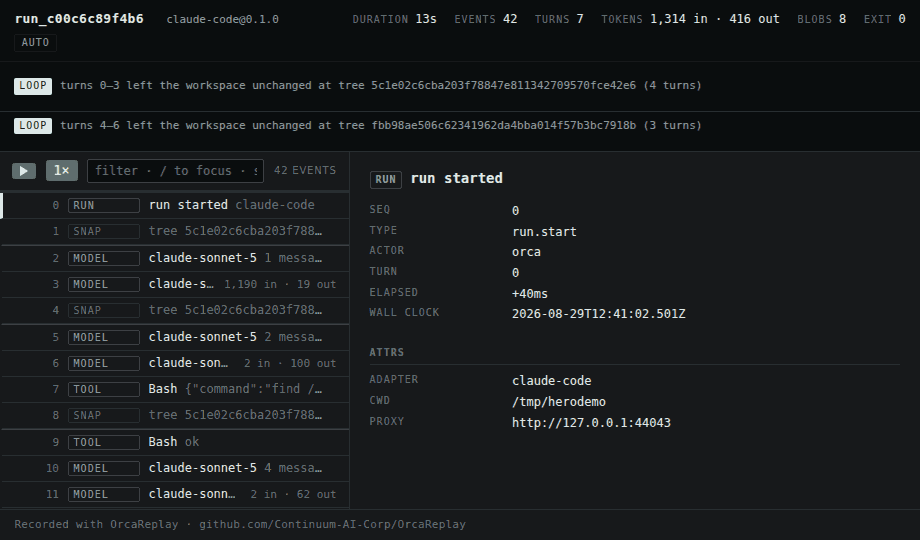
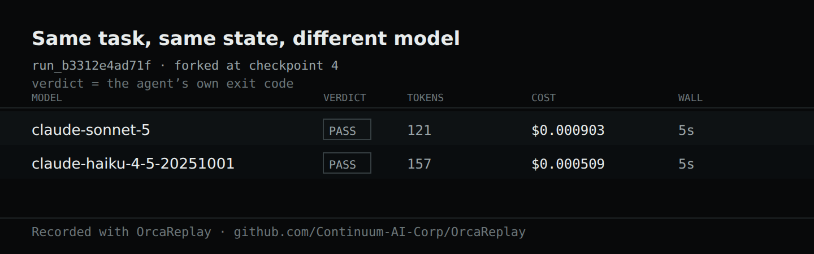

# OrcaReplay

**Time travel for AI agents.** Record an agent run, reproduce exactly what happened, and fork
execution from any step with a different model, prompt or config.


<sup>Real output from one session — a Claude Code run recorded, replayed with the network off, then
forked at checkpoint 4 onto two models and graded by `npx tsc --noEmit`. Nothing here is mocked up.</sup>

Your agent broke something. Replay exactly why.

## Why this exists

Agent debugging today is archaeology. You scroll a terminal, you re-run and get a different
failure, you add print statements to someone else's harness. The tools that exist are
observability tools: they tell you a run cost $4.12 and used 61k tokens, which is not the question
you have. The question you have is *why did it delete my migration file.*

OrcaReplay answers that by giving you the run back.

## How it works, in one paragraph

Model APIs are stateless, so on every turn an agent resends the entire conversation — including the
previous turn's tool results. A proxy sitting in front of the model therefore sees the whole loop:
each request, each streamed response, every tool call the model emitted, and every tool result the
harness produced. That means **OrcaReplay does not patch your agent**. It stands up a local
recording proxy, injects a couple of environment variables, and gets out of the way.

Three more capture layers fill the gaps: an MCP shim, a `PATH` shim for shell exit codes and
timing, and a shadow git index for filesystem diffs.

## The timeline

`orca replay last --ui` (or `orca ui`) opens the run as one self-contained HTML file — no server
to keep running, no network, nothing to install. Filter it, step it, or press space and watch the
run play back at the pace it actually happened.



Every layer lands in the same timeline, so you can read the run as one story rather than four:
the model turns and their token counts, each tool call with its arguments and result, the shell
commands with their exit codes and timing, and the filesystem changes with the tree they produced.

`orca export last -o bug.html` writes exactly that page to a single file you can attach to an
issue. It carries no external reference of any kind — CI asserts that — so it renders from a
download folder, on a plane, in five years.

## Same task, different model

`orca compare` forks one recorded run onto several models from the same checkpoint, with the same
files and the same conversation prefix, and grades each one with a command you choose. The model
is the only variable, which is what makes the answer mean anything.



```console
orca compare last --from 4 \
  --models claude-sonnet-5,claude-haiku-4-5 \
  --verify "npm test" \
  --share verdict.svg          # the card above, ready to paste into an issue
```

### Pointing it at several models

Comparing models means reaching several providers, and doing that by hand means knowing that
`--upstream-anthropic` and `--upstream-openai` exist, that one gateway can serve both wire formats,
and where the key goes. All of that is real and none of it is discoverable, so there is a command
that asks instead:

```console
$ orca setup
Gateway URL (serves the model APIs): https://router.example
API key (stored 0600; leave blank for none):
  info config.saved path=~/.config/orca/config.json mode=0600 gateway=https://router.example auth=stored

  6 models available:
    claude-haiku-4-5
    claude-opus-5
    glm-5.3-flash
    ...

$ orca models
MODEL             $/MTOK IN  $/MTOK OUT
claude-haiku-4-5  1          5
claude-opus-5     15         75
glm-5.3-flash     0.05       0.15
some-local-model  —          —
```

`orca setup` asks the gateway what it actually serves rather than just writing the file, so a wrong
URL or a dead key is an answer now instead of a 401 in the middle of a comparison. It also stores the
models you picked, so after that `orca compare last --verify "npm test"` needs no model list and no
upstream flags at all. `orca models` prices what it recognises and shows a
dash for what it does not, because inventing a number for an unknown model is how a comparison
table ends up quoting a cost that was never real.

Anything that speaks the OpenAI-compatible `/v1/models` and chat endpoints works — OrcaRouter,
another gateway, or something you run yourself. Non-interactive:
`orca setup --gateway <url> --key <k>`, or `--key-env <VAR>` to read the key from the environment
rather than keep a credential on disk.

The key never reaches a trace. It is attached to the outbound request only, while what gets
recorded is built from the *incoming* request with auth stripped — so it is invisible to the
recording by construction, not by a rule someone has to remember. It is withheld entirely if a flag
sends that traffic somewhere other than the gateway that issued it.

## When the harness will not be redirected

Base-URL injection captures every harness that reads a base-URL variable, which is most of them. A
Codex CLI signed in with a ChatGPT subscription reads none: it talks to its own backend over TLS,
and orca sees nothing. `--tls-intercept` is the answer to that, and it is deliberately a separate
decision you have to make, because it mints a certificate authority.

```console
orca record codex --tls-intercept
orca record codex --tls-intercept --tls-hosts 'api.openai.com,*.chatgpt.com'
```

The CA is unique to the run, trusted only by the agent orca launches — through that child's own
environment, never a system or browser trust store — and deleted when the run ends. Orca will not
offer to install it anywhere. Hosts outside the allowlist are tunnelled unread and recorded as an
address and a byte count, with no path and no body, because orca never held the plaintext. Asking
to intercept everything is refused rather than honoured.

It works on `orca replay --model`, `orca fork` and `orca compare` too, which launch a live agent for
the same reason.

## Status

Early. `v0` is the walking skeleton of the three commands above.

| Capability | State |
|---|---|
| Trace format v0 + JSON Schema | working |
| Anthropic / OpenAI-compatible model capture | working |
| Exact replay with divergence reporting | working — restores the recorded filesystem over your working tree, then puts it back; `--worktree` for a scratch copy, `--in-place` to restore nothing. Writes a run of its own recording what the replay *discovered* — divergences, unmatched requests — and points at the parent for what it merely repeated; `--no-trace` to skip |
| Fork replay from a checkpoint | working — a fork records its own filesystem snapshots, so it is a run you can fork again |
| Compare across models | working — `orca setup` stores a gateway, key and default model list, so `orca compare` needs no flags |
| Filesystem snapshots and diffs | working |
| Single-file HTML export | working |
| MCP call recording | working — opt in with `--mcp-config <path>`. Replay and fork re-instrument from the config the recording used, so the layer does not stop at the fork point |
| Post-hoc scrubbing (`orca scrub`) | working |
| Shell capture (`PATH` shim) | working — exit codes, duration and the stdout/stderr split. `--no-shell` to skip |
| Non-model network capture | working — opt in with `--tls-intercept`; mints a per-run CA the launched agent alone trusts, decrypts an allowlist of hosts, tunnels the rest unread, and deletes the key when the run ends |
| Subscription-auth harnesses | Claude Code works. A Codex CLI signed in with a ChatGPT subscription talks to its own backend and reads no base-URL variable, so it needs `--tls-intercept` |

## Install

Not published to npm yet — `v0` is unreleased, so install from source:

```console
git clone https://github.com/Continuum-AI-Corp/OrcaReplay && cd OrcaReplay
npm ci && npm run build
npm install -g ./packages/cli     # puts `orca` (and `orcareplay`) on PATH
orca doctor                       # checks Node, git, and which agents it can find
```

`npm install -g .` from the repository root installs nothing: the root is a workspace with no
binary of its own, and the `orca` command lives in `packages/cli`.

Once `v0` ships, `npx orcareplay --help` will be the one-liner and this section will say so.

Node 20+. No account, no signup, no API key changes.

## Privacy

Traces are local, mode `0600`, and the recorder makes no network connection of its own. Secrets are
redacted in the write path: environment capture is deny-by-default, auth headers are never written,
and known key shapes plus high-entropy strings are replaced with stable placeholders.

Redaction is best-effort mitigation, not a guarantee. **Treat a trace as sensitive** — roughly as
sensitive as a shell history plus a heap dump.

```console
orca export last -o bug.html          # prints exactly what it is about to write
orca scrub last --match my-hostname   # remove something after the fact
```

`orca scrub` rewrites `events.jsonl`, the manifest and every text blob, re-runs the standard
detectors, refreshes the integrity digest, and leaves binary blobs byte-identical.

It cannot rewrite the filesystem snapshots. Git objects are addressed by the hash of their own
contents, so editing one changes its id, which forces every tree naming it to be rewritten and
every event naming those trees after that — a history rewrite whose failure mode is a run that no
longer restores. So scrub *searches* the snapshot store and tells you when your string is still in
there, rather than reporting a clean trace it could not clean. `--drop-fs` deletes the store
outright, at the cost of being able to fork the run.

## What is open, and what is not

Always open, under Apache-2.0: the trace format, the core, the CLI, the viewer, the adapters, and
the provider interface. OrcaRouter is an optional plugin that may use only the public `Provider`
interface — no privileged API. No vendor plugin exists yet, so the CI job that enforces this
(`scripts/check-neutrality.mjs`) says so and passes as a no-op; it starts building against the
published package rather than workspace source the moment one lands. If a plugin ever needs a
capability, that capability goes into the public interface first.

## Documentation

**Start here if you have a problem right now:**

- [My agent broke something. How do I find out why?](docs/how-to/debug-a-failing-agent-run.md)
- [Why did my agent delete that file?](docs/how-to/why-did-my-agent-delete-my-file.md)
- [Would a different model have got this right?](docs/how-to/compare-models-on-the-same-failure.md)

**Reference:**

- [`spec/orca-trace-v0.md`](spec/orca-trace-v0.md) — the normative trace format
- [`docs/architecture.md`](docs/architecture.md) — how capture, replay and fork actually work
- [`docs/plugins.md`](docs/plugins.md) — writing an adapter or a provider
- [`CONTRIBUTING.md`](CONTRIBUTING.md) — five-minute dev loop
- [Good first issues](docs/good-first-issues.md) — twelve of them, with the file to start in

## License

Apache-2.0 for the code. The trace specification is CC BY 4.0, so anyone may reimplement it.
