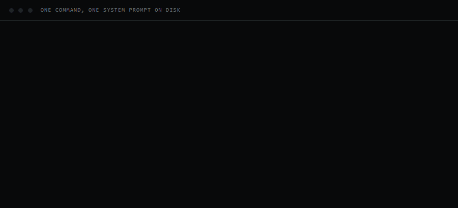
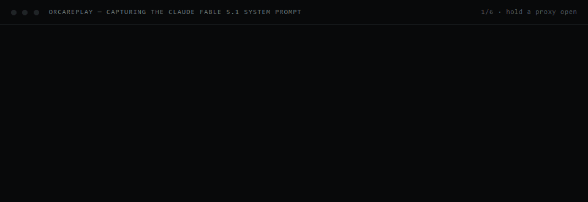

# Agent system prompt captures



<sub>A real run, 35 seconds compressed to 13. The pause after `launched pid=` is the agent starting
in its own console and sending its first turn. The two absolute paths are replaced with a
placeholder repository; nothing else is reworded.</sub>


Captured with OrcaReplay at the local proxy layer: what the harness on this machine actually sends,
not what a service returns. Everything is scrubbed except the raw traces.

Two directories, and the split is the point:

- `prompt/` is the collection. One file per capture, the prompt and nothing else, flat enough to
  browse. This is what you read and what you share.
- `capture/` is the machinery and the evidence: the script, these documents, and one folder per
  capture holding the prompt, the request body, the tool definitions, the metadata and the raw run.

The prompt exists in both, so each capture folder stands on its own. The copy under `capture/` is
the source; `--index` compares the two byte for byte and rewrites the mirror in `prompt/` when they
differ, naming what it repaired. A hand edit to a generated file therefore does not survive
quietly, which is the part that makes keeping two copies safe.

## One command

```console
node capture/capture.mjs claude                        # interactive, model from settings
node capture/capture.mjs claude --model claude-fable-5-1
node capture/capture.mjs claude --print                # the cheaper -p variant
node capture/capture.mjs codex  --model gpt-5.6-sol
node capture/capture.mjs --index                       # rebuild index.json only
```

```console
node capture/capture.mjs opencode                      # a free model, so this one costs nothing
```

All three work in one command. OpenCode is reached a different way: its provider origin lives in
`opencode.json` rather than an environment variable, so it cannot be redirected, and the capture
uses `--tls-intercept` to terminate the TLS it established itself. Its config is left untouched.
The default model is one of OpenCode's own free ones, which is what makes iterating on a capture
free. A provider of your own pointing at a plain-HTTP gateway is neither redirected nor decrypted,
and needs its own answer.

It stands up the proxy, launches the agent, waits for the request that carries the prompt, pulls
the prompt out, scrubs it, writes it to `prompt/`, and files the evidence under `capture/`.
Nothing else to run.

| flag | |
|---|---|
| `--model <id>` | model to capture. default: the harness's own |
| `--print` / `--interactive` | pick the non-default mode for that harness |
| `--upstream <url>` | where the proxy forwards. auto-detected otherwise |
| `--cwd <path>` | directory to run the agent in. default: the current one |
| `--port <n>` | proxy port for interactive capture. default 46011 |
| `--prompt <text>` | the throwaway user turn |
| `--timeout <sec>` | how long to wait for the request. default 180 |
| `--no-trace` | skip keeping the raw orca run |

## What is here

Measured on one machine, and the reason the table is here rather than in a folder listing:

| model | harness | mode | prompt as sent | tools | prefix |
|---|---|---|---|---|---|
| `claude-fable-5-1` | claude | interactive | 26,463 chars | 35 | 59,818 tok |
| `claude-fable-5-1.print` | claude | `-p` | 20,938 chars | 29 | 37,694 tok |
| `claude-opus-5` | claude | interactive | 22,760 chars | 35 | 58,938 tok |
| `claude-opus-4-8` | claude | interactive | 19,083 chars | 33 | 54,545 tok |
| `gpt-5.6-sol` | codex | `exec` | 23,377 chars | 9 | 1,689 tok |
| `gpt-5.6-luna` | codex | `exec` | 20,842 chars | 3 | - |
| `big-pickle` | opencode | `run` | 9,621 chars | 11 | 8,017 tok |
| `ling-3.0-flash-fin-free` | opencode | `run` | 9,647 chars | 11 | - |
| `mimo-v2.5-free` | opencode | `run` | 9,629 chars | 11 | 8,025 tok |
| `muse-spark-1.2-contributor-free` | opencode | `run` | 10,249 chars | 11 | - |
| `nemotron-3-ultra-free` | opencode | `run` | 9,643 chars | 11 | - |
| `nemotron-3.5-lightning-free` | opencode | `run` | 9,655 chars | 11 | - |
| `gpt-5.6-sol` | opencode | `run` | 10,413 chars | 9 | 6,327 tok |

The OpenCode rows are one harness on seven models, and they are not one prompt. Three templates
show up. Five of the free models open with *You are opencode, an interactive CLI tool that helps
users with software engineering tasks*; `muse-spark-1.2-contributor-free` opens with *You are
OpenCode, a coding agent that helps users with software engineering tasks* and is the only one on
the responses dialect rather than chat completions; `gpt-5.6-sol` through a gateway of my own gets
a third, *You are OpenCode, You and the user share the same workspace*, and is the only one with
`apply_patch` in place of `edit` and `write`. The prompt and the wire format are both chosen per
model.

Sizes are the prompt as sent. The file on disk is a few hundred characters shorter, since the
placeholders are shorter than the paths they replace; `meta.json` carries both figures.

Only the scrubbed prompts under `prompt/` are committed. A capture's own folder stays local:
`capture/.gitignore` excludes every subdirectory and `index.json`, because the request bodies carry
session and message ids and the raw runs carry account and device ids. Run the command and the
folder appears; clone the repository and you get the tool and the prompts.

Every file is prefixed with its capture's name, so a file pulled out on its own still says which
model and which mode it came from:

| file | where | scrubbed | what |
|---|---|---|---|
| `<model>-system-prompt.md` | `capture/<name>/` and `prompt/<HARNESS>/` | yes | the prompt on its own, nothing else |
| `<name>-prompt-annotated.txt` | `capture/<name>/` | yes | same text with block boundaries and char counts |
| `<name>-request.json` | `capture/<name>/` | yes | the whole request body as sent |
| `<name>-tools.json` | `capture/<name>/` | yes | tool definitions |
| `<name>-meta.json` | `capture/<name>/` | n/a | run id, sizes, token counts, tool names |
| `trace/` | `capture/<name>/` | **no** | the raw orca run. holds account and session ids |

`prompt/` groups by harness, one folder per agent, so the file inside is named for the model
alone: `prompt/CLAUDECODE/claude-fable-5-1-system-prompt.md`, and the `-p` variant beside it as
`claude-fable-5-1-print-system-prompt.md`. Two harnesses can serve the same model, which is what
the harness folder disambiguates — `prompt/CODEX/gpt-5-6-sol-system-prompt.md` and
`prompt/OPENCODE/gpt-5-6-sol-system-prompt.md` are different prompts for one model. Under
`capture/` the same collision needs `--dir`, since there is no harness level there.

Only `trace/` is unsafe to share, and `capture/.gitignore` keeps it out of commits. Everything else
runs through the scrubber, and a capture aborts rather than writing a file if anything identifying
survives the pass.

Each capture folder's own `README.md` is generated from its `meta.json`, so `node
capture/capture.mjs --index` refreshes the file tables after a rename instead of letting them
drift.

## What `-p` means

`-p` / `--print` is Claude Code's non-interactive mode: the prompt goes in as an argument, one turn
runs, the answer goes to stdout, and the process exits. No terminal UI. It is what a script or a CI
job uses, and what the Agent SDK drives.

It is a different prompt, not the same prompt in a different shape. The billing header says
`cc_entrypoint=sdk-cli` rather than `cli`, and the identity line changes from *You are Claude Code,
Anthropic's official CLI for Claude.* to *You are a Claude agent, built on Anthropic's Claude Agent
SDK.* Interactive mode then adds the `! <command>` hint, the whole Scratchpad Directory section, a
`gitStatus` block when the working directory is a repository, and four tools: `Artifact`,
`AskUserQuestion`, `EnterPlanMode`, `ExitPlanMode`. Its injected `role:"system"` turn grows from
7,585 to 11,529 characters, carrying more agent types, the artifact and design skills,
`claude-in-chrome`, and a paragraph about the active permission mode.

Both are worth keeping. Interactive is the prompt behind daily use; `-p` is the one you actually
get when you call the harness from a script.

## Scrubbing

Replacements are derived from the machine, not hard-coded, so the script is portable: home
directory, username, git name and email, the gateway host from `~/.config/orca/config.json`, the
Claude Code project slug, the OS build, then generic rules for emails, uuids and hex runs of 32 or
more. Order matters, since the memory directory sits inside the home directory.

Placeholders currently in use: `{{CWD}}`, `{{HOME}}`, `{{TMP}}`, `{{CLAUDE_HOME}}`,
`{{CLAUDE_PROJECTS}}`, `{{CODEX_HOME}}`, `{{PROJECT_SLUG}}`, `{{GIT_USER}}`, `{{OS_BUILD}}`,
`{{RECENT_COMMITS}}`, `{{EMAIL}}`, `{{UUID}}`, `{{HEX}}`, `{{USER}}`, `{{GATEWAY}}`.

## Two things the script exists to get right

**The interactive prompt is a different prompt.** A harness only assembles it when stdin is a real
console, and a pipe is not one, so a plain `orca record claude` always captures the `-p` variant.
Interactive mode holds the proxy open with `orca attach` and has PowerShell launch the agent in a
console of its own. For Claude Fable 5.1 that is the difference between 20,806 and 26,054 chars,
and between 29 tools and 35.

**The first request with a prompt in it is the wrong request.** Claude Code opens with a title
generator that ships four system blocks and a naming spec of its own. The agent turn is the one
that carries tool definitions, so that is what identifies it.

## The working directory is part of the prompt

Interactive capture refuses to start in a directory Claude Code has not been trusted in, and says
so in a tenth of a second rather than waiting out the timeout:

```
capture failed: claude has not been trusted in C:\...\scratch, so it would stop on the trust dialog.
  start it there once by hand and accept, then run this again.
  capture in a directory you actually work in: the working directory is part of the
  prompt, and a non-repository loses the gitStatus block entirely.
```

Trust is one boolean in `~/.claude.json`, so the script could set it. It deliberately does not.
Writing it makes capturing in a throwaway directory the easy path, and that produces a worse
capture: a temporary non-repository loses the whole `gitStatus` block, which cost 4,271 characters
on a measured Opus 5 run. `-p` never asks, which is why non-interactive captures work anywhere.

`--dangerously-skip-permissions` is not a way around it either. It adds a paragraph about the
active permission mode to the injected system turn, so it changes the prompt you are trying to
read.

## When the turn fails but the capture does not

A turn can come back `overloaded_error` inside a 200 stream. The prompt is still captured in full,
because it travels in the request, but there is no token count for it. The script says so rather
than just omitting the line:

```
  note: the agent's turn came back overloaded_error, so there is no token
        count for it. the prompt is unaffected - it travels in the request.
```

## Documents

- `CAPTURE-RUNBOOK.md` - the manual procedure in eight steps, with the pitfalls and how to prove a
  capture is genuine. Read it to port this to another harness or another platform.
- `capture-run.gif` - one `capture.mjs` run, rendered by `render-run.mjs`.
- `fable-capture.gif`, `fable-capture.mp4` - the manual procedure as a screencast, rendered by
  `render.mjs`.



## Not covered

Interactive capture is Windows-only for now; it depends on `Start-Process` handing a console
application a real console. On Linux and macOS a pipe sits behind a pty, so one `orca record`
should reach the interactive prompt directly, and the profile in `capture.mjs` would need a branch
for it.

Codex TUI capture works through the same path but is not run here by default: this installation
sets `approval_policy = "never"` with `sandbox_mode = "danger-full-access"`, and an interactive
session under those settings is a different risk from a `codex exec` that answers one word. Pass
`--interactive` to do it anyway.

A prompt captured this way is the one the local harness sent. A service that injects its own
prompt server-side, claude.ai for instance, is invisible to this method by construction.
