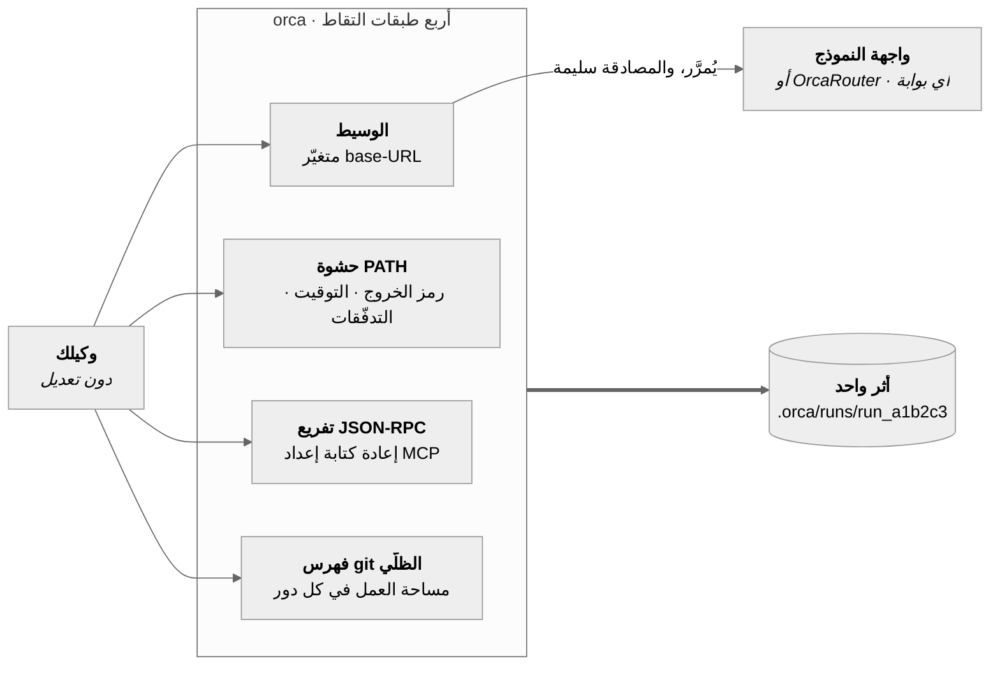
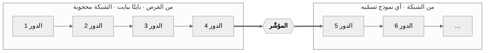

# OrcaReplay

<sub>[English](../../README.md) · [简体中文](README.zh-CN.md) · [日本語](README.ja.md) · [한국어](README.ko.md) · [Deutsch](README.de.md) · [Français](README.fr.md) · [Español](README.es.md) · **العربية**</sub>

<div dir="rtl">

### كسر وكيلك شيئًا في الثانية صباحًا. أعِد تشغيله في التاسعة — بالضبط، دون شبكة، وبقدر ما تشاء.

سجّل أي وكيل برمجي. أعِد إنتاج التشغيل بايتًا ببايت والشبكة مغلقة. تفرّع به من أي خطوة إلى نموذج
آخر وانظر من يصيب.

<a href="https://www.orcarouter.ai">
  
</a>

**من صنع الفريق الذي يبني [OrcaRouter](https://www.orcarouter.ai)** — مفتاح واحد ونقطة وصول واحدة
إلى Claude وGPT وGemini وGrok وDeepSeek وQwen وغيرها. هذا ما يشير إليه `orca setup` افتراضيًا، وهو
ما يجعل `orca compare` أمرًا واحدًا بدل أربعة حسابات لدى أربعة مزوّدين.

[كل النماذج](https://www.orcarouter.ai/models) · [OrcaCode Review](https://www.orcarouter.ai/code-review) · [X](https://x.com/OrcaRouter) · [Hugging Face](https://huggingface.co/orcarouter)

<br clear="right">

[](../../LICENSE)
[](../../spec/orca-trace-v0.md)
[](#install)
[](#install)
[](../good-first-issues.md)


<sup>مخرجات حقيقية من جلسة واحدة — تسجيل تشغيل لـ Claude Code، وإعادته والشبكة مغلقة، ثم تفريعه عند
نقطة التحقق 4 إلى نموذجين وتقييمه بـ `npx tsc --noEmit`. لا شيء هنا مُمثَّل.</sup>

## جرّبه بثلاثة أوامر

```console
orca record claude              # وكيلك، دون تعديل، يفعل ما يفعله
orca replay last                # التشغيل نفسه مرة أخرى — بلا شبكة، بلا رموز، بلا تكلفة
orca replay last --from 4 --model claude-haiku-4-5 --ui
```

السطر الثالث هو ما يجعل الناس يبقون: الملفات نفسها، وبادئة المحادثة نفسها، ونموذج مختلف ابتداءً من
الخطوة 4. النموذج هو المتغيّر الوحيد، وهذا ما يجعل للإجابة معنى.

ليس على npm بعد — [ثبّته من المصدر](#install)، يستغرق نحو دقيقة.

## لماذا وُجد هذا

تصحيح أخطاء الوكلاء اليوم أشبه بالتنقيب الأثري. تتصفح الطرفية إلى الأعلى، وتعيد التشغيل فتحصل على
عطل مختلف، وتضيف عبارات طباعة داخل مِهاد شخص آخر. الأدوات الموجودة هي أدوات رصد: تخبرك أن التشغيل
كلّف ‎4.12 دولار واستهلك 61 ألف رمز، وهذا ليس سؤالك. سؤالك هو: *لماذا حذف ملف الترحيل الخاص بي؟*

يجيب OrcaReplay عن ذلك بأن يعيد إليك التشغيل نفسه.

|  | أدوات الرصد | OrcaReplay |
|---|---|---|
| تخبرك بتكلفة التشغيل | ✅ | ✅ |
| تخبرك أي استدعاء أداة حذف الملف | أحيانًا | ✅ |
| تعيد تشغيل الوكيل فتصل إلى الإجابة نفسها | ❌ | ✅ دون شبكة، بايتًا ببايت |
| تتيح تغيير النموذج وإعادة التشغيل من الخطوة 4 | ❌ | ✅ |
| تحتاج إلى تعديل وكيلك | غالبًا غلاف SDK | ❌ متغيّرا بيئة اثنان |
| تعمل بعد إغلاق الطرفية | ❌ | ✅ لأنها ملف |

## كيف يعمل

واجهات النماذج عديمة الحالة، لذا يعيد الوكيل في كل دور إرسال المحادثة كاملة — بما فيها نتائج أدوات
الدور السابق. **وبالتالي فإن وسيطًا أمام النموذج يرى الحلقة كلها**: كل طلب، وكل استجابة متدفقة، وكل
استدعاء أداة أصدره النموذج، وكل نتيجة أداة أنتجها المِهاد. على هذه الخاصية وحدها بُنيت الأداة، وهي
سبب أن **OrcaReplay لا يعدّل وكيلك** — يشغّل وسيطًا محليًا، ويضبط متغيّري بيئة، ثم يبتعد عن الطريق.

وهناك ثلاث طبقات أخرى تلتقط ما لا يستطيع البروتوكول رؤيته: رمز الخروج، والمدة الحقيقية، ومن أي
تدفّق خرج البايت، وملف كُتب دون أن يُخبر أحدًا.



تصل الطبقات الأربع إلى الخط الزمني نفسه، مرتّبةً بحسب وقت حدوثها فعلًا لا بحسب وقت قراءة orca لها.

### الإعادة الدقيقة والتفريع والمقارنة شيء واحد

ليست ثلاثة أنظمة فرعية، بل هي الوسيط نفسه ومعه **مؤشّر**: الموضع في التدفّق المسجَّل الذي يتوقّف عنده
عن الإجابة من القرص ويبدأ الإجابة من الشبكة.



| الأمر | موضع المؤشّر | ما تحصل عليه |
|---|---|---|
| `orca replay last` | في النهاية | التشغيل كله مرة أخرى، **والشبكة محجوبة** — بلا رموز، بلا تكلفة، بلا تباين |
| `orca replay last --from 4 --model X` | عند نقطة التحقق 4 | الأدوار حتى 4 متطابقة، ثم يتولّى نموذج آخر |
| `orca compare last --from 4 --models a,b` | عند نقطة التحقق 4، عدة مرات | جدول واحد، ومتغيّر واحد — النموذج |

**نقطة التحقق** ليست مسجَّلة، بل *مُشتقّة*: أي موضع تكون فيه بادئة المحادثة مكتملة وتكون مساحة العمل
قد صُوِّرت. لذلك ينطلق كل تفريع من حالة يمكن إثبات أنها وُجدت فعلًا.

## كيف تبدو مطاردة عِلّة حقيقية

كان على وكيلك أن يصلح اختبار مصادقة فاشلًا. خرج بالرمز 0 والاختبار لا يزال فاشلًا. ابدأ بما فعله
فعلًا:

```console
$ orca show last
run_6473f858b59e  generic-openai@0.1.0  14 events  exit 0

SEQ  KIND   WHAT                                            DETAIL
0    RUN    run started                                     generic-openai
1    SNAP   tree 919d32ba037537b43814c83779963b2cc3023db7   0 changed
2    MODEL  claude-opus-5                                   1 messages
3    MODEL  claude-opus-5                                   stop: tool_use · 100 in · 20 out
4    TOOL   edit_file                                       {"path":"auth.ts",…}
5    SNAP   tree c6af62b75c0c8b8938bd6087328b5148f3dcd534   1 changed
6    FILE   auth.ts                                         modified +1 −3
7    TOOL   edit_file                                       ok
8    MODEL  claude-opus-5                                   3 messages
9    MODEL  claude-opus-5                                   stop: end_turn · 101 in · 5 out
10   SNAP   tree c6af62b75c0c8b8938bd6087328b5148f3dcd534   0 changed
11   SHELL  ["sh","-c","node --check nonexistent-file.ts"]  /tmp/hunt
12   SHELL  shell result                                    exit 1 · 43ms
13   RUN    run ended                                       exit 0

info usage input=201 output=25 cost=$0.004890
```

ثلاث حقائق لم يكن نصّ النموذج نفسه ليخبرك بها، وأخفاها رمز خروج التشغيل: الملف تغيّر فعلًا (الحدث 6،
`+1 −3`)، والفحص الذي أجراه الوكيل **فشل** (الحدث 12، `exit 1`)، ومع ذلك أنهى عمله. خرج التشغيل
بالرمز 0 لأن *الوكيل* خرج بالرمز 0.

والآن أعِد إنتاجه بقدر ما تشاء، ومجانًا:

```console
$ orca replay last
info replay.done reused=2/2 exact=2 divergences=0 unmatched=0 exit=0
```

بلا شبكة، بلا رموز، بلا تباين. ثم اسأل سؤالك الحقيقي — *هل كان نموذج آخر ليصيب؟*

```console
$ orca compare last --from 5 --models claude-opus-5,claude-haiku-4-5 --verify "npm test"
MODEL             VERDICT  TOKENS  COST       WALL  RUN
claude-opus-5     pass     201/25  $0.004890  0.3s  run_1457b35062ba
claude-haiku-4-5  pass     201/25  $0.000326  0.3s  run_b8ee08479fb6
```

كلاهما نجح. وأحدهما يكلّف **أقل بخمسة عشر ضعفًا**. الملفات نفسها، وبادئة المحادثة نفسها، ونقطة
التحقق نفسها — النموذج هو الشيء الوحيد الذي تغيّر، وهذا هو السبب الوحيد في أن لذلك الرقم معنى.

## الخط الزمني

يفتح `orca replay last --ui` (أو `orca ui`) التشغيل كملف HTML واحد قائم بذاته — لا خادم يظل يعمل،
ولا شبكة، ولا شيء تثبّته. رشّحه، أو تنقّل فيه خطوة خطوة، أو اضغط المسافة وشاهده يُعاد بالإيقاع الذي
جرى به فعلًا.


كل طبقة تصل إلى الخط الزمني نفسه، فتقرأ التشغيل قصةً واحدة لا أربعًا: أدوار النموذج وعدد رموزها، وكل
استدعاء أداة بمعطياته ونتيجته، وأوامر الصدفة برموز خروجها وتوقيتها، وتغيّرات نظام الملفات مع الشجرة
التي أنتجتها.

يكتب `orca export last -o bug.html` تلك الصفحة بالضبط في ملف واحد يمكنك إرفاقه بتذكرة. وهو لا يحمل
أي مرجع خارجي على الإطلاق — والتكامل المستمر يتحقّق من ذلك — فيُعرض من مجلد التنزيلات، وفي الطائرة،
وبعد خمس سنوات.

## المهمة نفسها، نموذج مختلف

يفرّع `orca compare` تشغيلًا مسجَّلًا واحدًا إلى عدة نماذج من نقطة التحقق نفسها، بالملفات نفسها وبادئة
المحادثة نفسها، ويقيّم كلًّا منها بأمر تختاره أنت. النموذج هو المتغيّر الوحيد، وهذا ما يجعل للإجابة
معنى.


```console
orca compare last --from 4 \
  --models claude-sonnet-5,claude-haiku-4-5 \
  --verify "npm test" \
  --share verdict.svg          # البطاقة أعلاه، جاهزة للصق في تذكرة
```

### توجيهه إلى عدة نماذج

مقارنة النماذج تعني الوصول إلى عدة مزوّدين، وفعل ذلك يدويًا يعني أن تعرف بوجود `--upstream-anthropic`
و`--upstream-openai`، وأن بوابة واحدة قد تخدم صيغتَي البروتوكول، وأين يوضع المفتاح. كل ذلك حقيقي،
ولا شيء منه قابل للاكتشاف، فكان هناك أمر يسأل بدلًا من ذلك:

```console
$ orca setup
Gateway URL (serves the model APIs) [https://api.orcarouter.ai]:
  get a key at https://www.orcarouter.ai/console/token — OrcaRouter keys start sk-orca-
API key (stored 0600; leave blank for none):
  info config.saved path=~/.config/orca/config.json mode=0600 gateway=https://api.orcarouter.ai auth=stored

  6 models available:
    anthropic/claude-opus-5
    anthropic/claude-haiku-4-5
    openai/gpt-5.2
    ...

$ orca models
MODEL                      $/MTOK IN  $/MTOK OUT
anthropic/claude-opus-5    15         75
anthropic/claude-haiku-4-5 1          5
openai/gpt-5.2             1.25       10
some-local-model           —          —
```

لا يكتفي `orca setup` بكتابة الملف، بل يسأل البوابة عمّا تخدمه فعلًا، فيصير الرابط الخاطئ أو المفتاح
الميّت إجابةً الآن بدل أن يكون خطأ 401 في منتصف مقارنة. وهو يحفظ كذلك النماذج التي اخترتها، فلا يحتاج
`orca compare last --verify "npm test"` بعدها إلى قائمة نماذج ولا إلى أي رايات upstream. أما
`orca models` فيسعّر ما يعرفه ويضع شرطة لما لا يعرفه، لأن اختلاق رقم لنموذج مجهول هو بالضبط الطريق
الذي ينتهي بجدول مقارنة يذكر تكلفة لم تكن حقيقية قط.

[**OrcaRouter**](https://www.orcarouter.ai) هو الإجابة الافتراضية عن ذلك السؤال الأول — اضغط Enter
فيصير لديك مصدر واحد ومفتاح واحد يخدمان Claude وGPT وGemini وGrok وDeepSeek وQwen وغيرها، وهو تمامًا
الشكل الذي يريده `orca compare`. ومعرّفات نماذجه مسبوقة باسم المزوّد
(`anthropic/claude-sonnet-4.6`، `openai/gpt-4o-mini`)، وorca يتعامل مع ذلك: البادئة تختار صيغة
البروتوكول ثم تُنزع قبل التسعير.

إنه *قيمة افتراضية* لا وجهة: اكتب فوقه، أو مرّر `--gateway <url>`، وسيعمل بالكفاءة نفسها أي شيء يتحدث
نقاط `‎/v1/models` والمحادثة المتوافقة مع OpenAI — بوابة مستضافة أخرى، أو شيء تشغّله بنفسك.

وهو أيضًا ليس افتراضيًا إلا لحركة **أنت** طلبت إرسالها إلى مكان ما. فمن دون بوابة مضبوطة، يمرّر
`orca record` نداءات وكيلك مباشرةً إلى المزوّد الذي كان يتحدث إليه أصلًا، وبمفتاح الوكيل نفسه. لا
يعيد orca توجيه تسجيل لم تضبطه أنت: فذلك يعني إرسال شفرتك المصدرية إلى طرف ثالث كأثر جانبي للضغط على
زر التسجيل.

بلا تفاعل: `orca setup --key <k>` يأخذ الافتراضي، و`orca setup --gateway <url> --key <k>` يسمّي غيره،
و`--key-env <VAR>` يقرأ المفتاح من البيئة بدل إبقاء بيانات اعتماد على القرص.

المفتاح لا يصل إلى أثرٍ أبدًا. فهو يُرفق بالطلب الصادر فقط، بينما يُبنى ما يُسجَّل من الطلب *الوارد*
بعد نزع المصادقة — فهو غير مرئي للتسجيل بحكم البنية، لا بحكم قاعدة على أحدهم أن يتذكّرها. ويُحجب
كليًّا إذا وجّهت رايةٌ تلك الحركة إلى مكان غير البوابة التي أصدرته.

## حين يرفض المِهاد أن يُعاد توجيهه

حقن base-URL يلتقط كل مِهاد يقرأ متغيّر base-URL، وهم الأغلبية. أما Codex CLI الموقّع باشتراك ChatGPT
فلا يقرأ أيًّا منها: إنه يتحدث إلى خادمه الخاص عبر TLS، وorca لا يرى شيئًا. `--tls-intercept` هو
الجواب على ذلك، وقد جُعل عمدًا قرارًا منفصلًا عليك أن تتخذه، لأنه يُصدر سلطة تصديق.

```console
orca record codex --tls-intercept
orca record codex --tls-intercept --tls-hosts 'api.openai.com,*.chatgpt.com'
```

سلطة التصديق خاصة بذلك التشغيل وحده، ولا يثق بها إلا الوكيل الذي يشغّله orca — عبر بيئة تلك العملية
الابنة نفسها، لا عبر مخزن ثقة النظام أو المتصفّح أبدًا — وتُحذف عند انتهاء التشغيل. ولن يعرض orca
تثبيتها في أي مكان. أما المضيفون خارج قائمة السماح فيُنفَقون دون قراءة ويُسجَّلون كعنوان وعدد بايتات،
بلا مسار وبلا متن، لأن orca لم يملك النص الصريح قط. وطلب اعتراض كل شيء يُرفض ولا يُستجاب له.

وهو يعمل مع `orca replay --model` و`orca fork` و`orca compare` أيضًا، لأنها تشغّل وكيلًا حيًّا للسبب
نفسه.

## الحالة

مبكّرة. `v0` هو الهيكل السائر للأوامر الثلاثة أعلاه.

| القدرة | الحالة |
|---|---|
| صيغة الأثر v0 ومخطّط JSON | تعمل |
| التقاط نماذج Anthropic والمتوافقة مع OpenAI | تعمل |
| إعادة دقيقة مع تقرير تباعد | تعمل — تستعيد نظام الملفات المسجَّل فوق شجرة عملك ثم تعيده كما كان؛ و`--worktree` لنسخة مؤقتة، و`--in-place` لعدم استعادة شيء. وتكتب تشغيلًا خاصًا بها يسجّل ما *اكتشفته* الإعادة — التباعدات والطلبات غير المطابَقة — وتشير إلى الأصل فيما كرّرته فحسب؛ و`--no-trace` لتخطّي ذلك |
| إعادة متفرّعة من نقطة تحقق | تعمل — التفريع يسجّل لقطات نظام ملفات خاصة به، فهو تشغيل يمكن تفريعه بدوره |
| المقارنة عبر النماذج | تعمل — يحفظ `orca setup` البوابة (OrcaRouter افتراضيًا، أو أي رابط تسمّيه)، والمفتاح، وقائمة النماذج، فلا يحتاج `orca compare` إلى أي راية |
| لقطات نظام الملفات والفروق | تعمل |
| التصدير إلى ملف HTML واحد | تعمل |
| تسجيل نداءات MCP | تعمل — فعّلها بـ `--mcp-config <path>`. وتعيد الإعادةُ والتفريعُ التجهيزَ من الإعداد الذي استعمله التسجيل، فلا تتوقّف الطبقة عند نقطة التفريع |
| التنظيف اللاحق (`orca scrub`) | تعمل |
| التقاط الصدفة (حشوة `PATH`) | تعمل — رموز الخروج، والمدة، والفصل بين stdout وstderr. و`--no-shell` لتخطّيها |
| التقاط حركة الشبكة غير النموذجية | تعمل — فعّلها بـ `--tls-intercept`؛ تُصدر سلطة تصديق لكل تشغيل لا يثق بها إلا الوكيل المُشغَّل، وتفكّ تشفير قائمة مضيفين مسموحين، وتُنفق الباقي دون قراءة، وتحذف المفتاح عند الانتهاء |
| المِهاد ذو المصادقة بالاشتراك | Claude Code يعمل. أما Codex CLI الموقّع باشتراك ChatGPT فيتحدث إلى خادمه الخاص ولا يقرأ متغيّر base-URL، فيحتاج `--tls-intercept` |

<a id="install"></a>

## التثبيت

ليس على npm بعد — الحزم مبنيّة ومُتحقَّق منها لذلك، لكن لم يُنشر شيء، فاليوم يكون التثبيت من المصدر:

```console
git clone https://github.com/Continuum-AI-Corp/OrcaReplay && cd OrcaReplay
npm ci && npm run build
npm install -g ./packages/cli     # يضع `orca` (و`orcareplay`) في PATH
orca doctor                       # يفحص node وgit وأي وكلاء يستطيع إيجادهم
```

تنفيذ `npm install -g .` من جذر المستودع لا يثبّت شيئًا: الجذر مساحة عمل بلا ملف تنفيذي خاص، و`orca`
يقيم في `packages/cli`.

ما إن يُنشر `v0` حتى يصير `npx orcareplay doctor` هو التثبيت كله، وسيقول هذا القسم ذلك عندئذ.
والإصدار سير عمل مبوَّب يُشغَّل بوسم — انظر [`RELEASING.md`](../../RELEASING.md).

**Node 20 فأعلى للتشغيل** (حقل `engines` في الـ CLI يقول `>=20.0.0`). أما المساهمة فتحتاج
`^20.19.0 || >=22.12.0` لأن سلسلة أدوات الاختبار تحتاجها؛ ويصرّح `package.json` في الجذر بذلك على
حدة، ليخبرك `npm ci` مقدّمًا. لا حساب، ولا تسجيل، ولا تغيير في مفاتيح الواجهات.

## أين تُحفظ تشغيلاتك

كل شيء يستقر في **`.orca/runs/` داخل المشروع الذي سجّلت فيه** — لكل مشروع على حدة، ولا مخزن عام
أبدًا، حتى يسافر الأثر مع النسخة التي ينتمي إليها. ودليل التشغيل الواحد شيء واحد يصف نفسه:

```
.orca/
  .gitignore          # مجرّد `*` — المخزن يستثني نفسه، فلا يمكن إيداع أثر بالخطأ
  runs/run_d0a2ee7ce615/
    manifest.json     # مَن، ومتى، وأي محوّل، وإيداع git، والأعداد، وبصمة السلامة
    events.jsonl      # الخط الزمني، كائن JSON في كل سطر، بالإلحاق فقط
    blobs/            # الحمولات التي تتجاوز 4 كيلوبايت، معنونة بالمحتوى ومنزوعة التكرار
    fs/               # فهرس git الظلّي: مساحة العمل في كل دور
    shell-frames.jsonl
    redactions.json   # ما أُزيل، بالقاعدة والعدد — لا بالقيمة أبدًا
```

للعثور على جلسة قديمة:

```console
orca list                       # كل تشغيل هنا، الأحدث أولًا، ومعه ما تفرّع عنه
orca show run_d0a2ee7ce615      # الخط الزمني في الطرفية
orca replay last                # `last` = أحدث تسجيل (يتخطّى آثار الإعادة)
orca replay run_d0a2ee7ce615    # أو سمِّ واحدًا صراحةً
orca gc --older-than 7d --dry-run   # ما الذي سيُستعاد، قبل أن يُستعاد شيء
```

يقرأ `orca list` أدلة التشغيل مباشرةً، فيعمل على أثرٍ أرسله إليك أحدهم: ضعه في `.orca/runs/` وستراه
كل الأوامر. لا فهرسة، ولا قاعدة بيانات يمكن أن تتلف.

## الخصوصية

الآثار محلية، بصلاحية `0600`، والمسجِّل لا ينشئ أي اتصال شبكي خاص به. وتُزال الأسرار في مسار الكتابة:
التقاط متغيّرات البيئة يقوم على المنع افتراضيًا، وترويسات المصادقة لا تُكتب أبدًا، وأشكال المفاتيح
المعروفة والسلاسل عالية العشوائية تُستبدل بعناصر نائبة ثابتة.

الإزالة تخفيف بأفضل جهد، لا ضمان. **عامِل الأثر على أنه حسّاس** — بقدر سجلّ الصدفة مضافًا إليه تفريغ
ذاكرة تقريبًا.

```console
orca export last -o bug.html          # يطبع بالضبط ما هو على وشك كتابته
orca scrub last --match my-hostname   # أزِل شيئًا بعد وقوعه
```

يعيد `orca scrub` كتابة `events.jsonl` والبيان وكل كتلة نصية، ويعيد تشغيل الكواشف القياسية، ويحدّث
بصمة السلامة، ويترك الكتل الثنائية متطابقة بايتًا ببايت.

لكنه لا يستطيع إعادة كتابة لقطات نظام الملفات. فكائنات git معنونة ببصمة محتواها نفسه، فتعديل واحدٍ
منها يغيّر معرّفه، وهو ما يفرض إعادة كتابة كل شجرة تسمّيه، ثم كل حدث يسمّي تلك الأشجار بعد ذلك — إعادة
كتابة للتاريخ نمط فشلها تشغيلٌ لم يعد يُستعاد. لذلك *يبحث* scrub في مخزن اللقطات ويخبرك إن كانت
سلسلتك ما تزال هناك، بدل أن يبلّغك بأثر نظيف لم يستطع تنظيفه. و`--drop-fs` يحذف المخزن كليًّا، بثمن
فقدان القدرة على تفريع ذلك التشغيل.

## ما هو مفتوح وما ليس كذلك

مفتوح دائمًا، برخصة Apache-2.0: صيغة الأثر، والنواة، وواجهة سطر الأوامر، والعارض، والمحوّلات، وواجهة
المزوّد.

يبني OrcaReplay من يبنون [OrcaRouter](https://www.orcarouter.ai)، وهذا يظهر في موضع واحد بالضبط:
يقترحه `orca setup` حين لا تسمّي بوابة. تلك قيمة افتراضية تراها ويمكنك الكتابة فوقها، في سؤال اخترت
أن تجيب عنه — لا مسار يسلكه شيء من تلقاء نفسه. وكل مسارات النماذج تبقى روابط عادية يمكنك توجيهها إلى
أي مكان، ولا يوجد مسار شفرة يعامل ذلك المصدر معاملة مختلفة عن أي مصدر آخر.

أما ما *لا* يحصل عليه المزوّد فهو الامتياز. فالإضافة — بما فيها إضافة OrcaRouter — لا يجوز لها إلا
استعمال واجهة `Provider` العامة في `@orcareplay/plugin-api`، وليس خلفها واجهة خاصة. ولا توجد بعد أي
إضافة من مزوّد، فمهمة التكامل المستمر التي تفرض ذلك (`scripts/check-neutrality.mjs`) تقول ذلك وتمرّ
بلا عمل؛ وستبدأ البناء مقابل الحزمة المنشورة بدل شفرة مساحة العمل لحظة ظهور أول إضافة. وإن احتاجت
إضافةٌ يومًا إلى قدرة، فتلك القدرة تدخل الواجهة العامة أولًا، ومعها تطبيق ثانٍ يثبت أنها ليست مفصّلة
على مقاس مزوّد بعينه.

## التوثيق

**ابدأ من هنا إن كانت لديك مشكلة الآن:**

- [كسر وكيلي شيئًا. كيف أعرف السبب؟](../how-to/debug-a-failing-agent-run.md)
- [لماذا حذف وكيلي ذلك الملف؟](../how-to/why-did-my-agent-delete-my-file.md)
- [هل كان نموذج آخر ليصيب؟](../how-to/compare-models-on-the-same-failure.md)

**المرجع:**

- [`spec/orca-trace-v0.md`](../../spec/orca-trace-v0.md) — صيغة الأثر المعيارية
- [`docs/architecture.md`](../architecture.md) — كيف يعمل الالتقاط والإعادة والتفريع فعلًا
- [`docs/plugins.md`](../plugins.md) — كتابة محوّل أو مزوّد
- [`CONTRIBUTING.md`](../../CONTRIBUTING.md) — حلقة تطوير من خمس دقائق
- [Good first issues](../good-first-issues.md) — اثنتا عشرة، ومع كل واحدة الملف الذي تبدأ منه

## المساعدة مطلوبة

الصيغة في v0 والهيكل السائر يعمل، وهذه هي اللحظة الممتعة في عمر أي مشروع: القرارات ما تزال رخيصة
التغيير، وثمة عمل واضح كثير كُتب معه الملف الذي يُبدأ منه.

- **[اثنتا عشرة good first issue](../good-first-issues.md)**، كل واحدة تسمّي الملف والاختبار.
- **اكتب محوّلًا.** ملف واحد، وتجهيزة واحدة. وإن كان مِهادك يقرأ متغيّر base-URL فهو نحو عشرين سطرًا —
  [docs/plugins.md](../plugins.md).
- **أعِد كتابة القارئ.** كون المواصفة برخصة CC BY 4.0 أمر مقصود. هناك قارئ بلغة Python بالفعل؛ وGo
  وRust ما زالتا شاغرتين.
- **اكسر الإعادة.** سلّم المطابقة هو قلب هذا كله، وأسرع طريق لتحسينه تسجيلٌ حقيقي يخطئ فيه. افتح
  تذكرة وأرفق بها `orca export last -o bug.html` — فهو ملف واحد قائم بذاته، و`orca scrub` موجود لأي
  شيء تريد إخراجه منه أولًا.

إن وفّر عليك بعد ظهيرة، فنجمة ⭐ تساعد غيرك على العثور عليه.

## الرخصة

Apache-2.0 للشفرة. ومواصفة الأثر برخصة CC BY 4.0، فيجوز لأي أحد إعادة تطبيقها.

</div>

---

<sub>
Built by the OrcaRouter team ·
<a href="https://www.orcarouter.ai">orcarouter.ai</a> ·
<a href="https://www.orcarouter.ai/models">all models</a> ·
<a href="https://www.orcarouter.ai/code-review">OrcaCode Review</a> ·
<a href="https://x.com/OrcaRouter">X</a> ·
<a href="https://huggingface.co/orcarouter">Hugging Face</a>
</sub>
