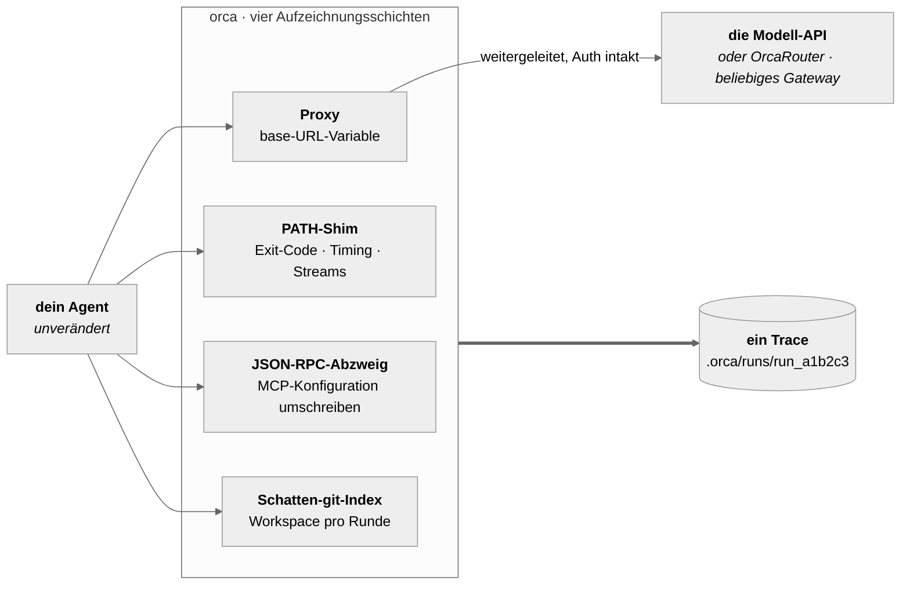
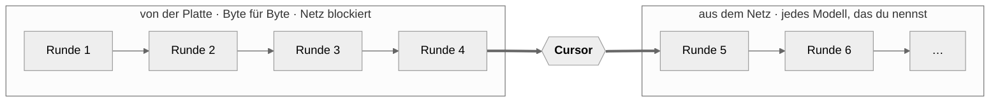

# OrcaReplay

<sub>[English](../../README.md) · [简体中文](README.zh-CN.md) · [日本語](README.ja.md) · [한국어](README.ko.md) · **Deutsch** · [Français](README.fr.md) · [Español](README.es.md) · [العربية](README.ar.md)</sub>

### Dein Agent hat um 2 Uhr nachts etwas kaputtgemacht. Spiel es um 9 Uhr ab — exakt, offline, so oft du willst.

Zeichne jeden Coding-Agenten auf. Reproduziere den Lauf Byte für Byte, mit abgeschaltetem Netz.
Zweige ihn an jedem Schritt auf ein anderes Modell ab und sieh, wer es richtig macht.

<a href="https://www.orcarouter.ai">
  
</a>

**Gebaut vom Team hinter [OrcaRouter](https://www.orcarouter.ai)** — ein API-Key und ein Endpunkt
für Claude, GPT, Gemini, Grok, DeepSeek, Qwen und den Rest. Darauf zeigt `orca setup`
standardmäßig, und deshalb ist `orca compare` ein einziger Befehl statt vier Anbieter-Konten.

[Alle Modelle](https://www.orcarouter.ai/models) · [OrcaCode Review](https://www.orcarouter.ai/code-review) · [X](https://x.com/OrcaRouter) · [Hugging Face](https://huggingface.co/orcarouter)

<br clear="left">

[](../../LICENSE)
[](../../spec/orca-trace-v0.md)
[](#install)
[](#install)
[](../good-first-issues.md)


<sup>Echte Ausgabe aus einer einzigen Sitzung — ein Claude-Code-Lauf aufgezeichnet, mit
abgeschaltetem Netz abgespielt, dann an Checkpoint 4 auf zwei Modelle abgezweigt und mit
`npx tsc --noEmit` bewertet. Nichts davon ist nachgestellt.</sup>

## In drei Befehlen ausprobieren

```console
orca record claude              # dein Agent, unverändert, bei dem was er ohnehin tut
orca replay last                # derselbe Lauf noch einmal — kein Netz, keine Tokens, keine Kosten
orca replay last --from 4 --model claude-haiku-4-5 --ui
```

Die dritte Zeile ist die, wegen der man bleibt: dieselben Dateien, dasselbe Gesprächspräfix, ab
Schritt 4 ein anderes Modell. Das Modell ist die einzige Variable — und genau das gibt der Antwort
ihre Bedeutung.

Noch nicht auf npm — [aus dem Quellcode installieren](#install), dauert etwa eine Minute.

## Warum es das gibt

Agenten zu debuggen ist heute Archäologie. Man scrollt ein Terminal hoch, startet neu und bekommt
einen anderen Fehler, baut print-Statements in fremde Harnesses ein. Die vorhandenen Werkzeuge sind
Observability-Werkzeuge: Sie sagen dir, dass ein Lauf 4,12 $ gekostet und 61k Tokens gebraucht hat
— nicht die Frage, die du hast. Deine Frage lautet: *warum hat er meine Migrationsdatei gelöscht.*

OrcaReplay beantwortet sie, indem es dir den Lauf zurückgibt.

|  | Observability-Werkzeuge | OrcaReplay |
|---|---|---|
| Sagt, was ein Lauf gekostet hat | ✅ | ✅ |
| Sagt, welcher Tool-Aufruf die Datei gelöscht hat | manchmal | ✅ |
| Führt den Agenten erneut aus und kommt zur selben Antwort | ❌ | ✅ offline, Byte für Byte |
| Lässt dich das Modell wechseln und ab Schritt 4 neu laufen | ❌ | ✅ |
| Verlangt Änderungen an deinem Agenten | meist ein SDK-Wrapper | ❌ zwei Umgebungsvariablen |
| Funktioniert, nachdem du das Terminal geschlossen hast | ❌ | ✅ es ist eine Datei |

## Wie es funktioniert

Modell-APIs sind zustandslos, also schickt ein Agent in jeder Runde das gesamte Gespräch erneut —
einschließlich der Tool-Ergebnisse der vorherigen Runde. **Ein Proxy vor dem Modell sieht deshalb
die ganze Schleife**: jede Anfrage, jede gestreamte Antwort, jeden Tool-Aufruf des Modells und jedes
Tool-Ergebnis des Harness. Auf dieser einen Eigenschaft steht das ganze Werkzeug, und sie ist der
Grund, warum **OrcaReplay deinen Agenten nicht patcht** — es stellt einen lokalen Proxy hin, setzt
zwei Umgebungsvariablen und geht aus dem Weg.

Drei weitere Schichten fangen ein, was das Protokoll nicht sehen kann: einen Exit-Code, eine echte
Laufzeit, aus welchem Stream ein Byte kam, eine Datei, die geschrieben wurde ohne es jemandem zu
sagen.



Alle vier landen in derselben Zeitleiste, geordnet danach, wann sie tatsächlich passiert sind — und
nicht danach, wann orca dazu kam, sie zu lesen.

### Exakt, Fork und Vergleich sind ein und dasselbe

Es sind keine drei Subsysteme. Es ist derselbe Proxy mit einem **Cursor** — der Stelle im
aufgezeichneten Strom, an der er aufhört von der Platte zu antworten und anfängt aus dem Netz zu
antworten.



| Befehl | wo der Cursor sitzt | was du bekommst |
|---|---|---|
| `orca replay last` | am Ende | der ganze Lauf noch einmal, **Netz blockiert** — keine Tokens, keine Kosten, keine Streuung |
| `orca replay last --from 4 --model X` | an Checkpoint 4 | Runden bis 4 identisch, danach übernimmt ein anderes Modell |
| `orca compare last --from 4 --models a,b` | an Checkpoint 4, mehrfach | eine Tabelle, eine Variable — das Modell |

Ein **Checkpoint** wird nicht aufgezeichnet, er wird *abgeleitet* — jede Stelle, an der das
Gesprächspräfix vollständig ist und vom Workspace ein Snapshot existiert. Jeder Fork startet damit
aus einem Zustand, den es nachweislich gab.

## Wie eine Fehlersuche wirklich aussieht

Dein Agent sollte einen fehlschlagenden Auth-Test reparieren. Er endete mit 0, und der Test schlägt
weiter fehl. Fang damit an, was er tatsächlich getan hat:

```console
$ orca show last
run_6473f858b59e  generic-openai@0.1.0  14 events  exit 0

SEQ  KIND   WHAT                                            DETAIL
0    RUN    run started                                     generic-openai
1    SNAP   tree 919d32ba037537b43814c83779963b2cc3023db7   0 changed
2    MODEL  claude-opus-5                                   1 messages
3    MODEL  claude-opus-5                                   stop: tool_use · 100 in · 20 out
4    TOOL   edit_file                                       {"path":"auth.ts",…}
5    SNAP   tree c6af62b75c0c8b8938bd6087328b5148f3dcd534   1 changed
6    FILE   auth.ts                                         modified +1 −3
7    TOOL   edit_file                                       ok
8    MODEL  claude-opus-5                                   3 messages
9    MODEL  claude-opus-5                                   stop: end_turn · 101 in · 5 out
10   SNAP   tree c6af62b75c0c8b8938bd6087328b5148f3dcd534   0 changed
11   SHELL  ["sh","-c","node --check nonexistent-file.ts"]  /tmp/hunt
12   SHELL  shell result                                    exit 1 · 43ms
13   RUN    run ended                                       exit 0

info usage input=201 output=25 cost=$0.004890
```

Drei Tatsachen, die das Transkript des Modells nicht hergeben konnte und die der Exit-Code des Laufs
verdeckt hat: die Datei hat sich wirklich geändert (seq 6, `+1 −3`), die Prüfung, die der Agent
ausgeführt hat, ist **fehlgeschlagen** (seq 12, `exit 1`), und er hat trotzdem aufgehört. Der Lauf
endete mit 0, weil der *Agent* mit 0 endete.

Jetzt reproduziere es so oft du willst, umsonst:

```console
$ orca replay last
info replay.done reused=2/2 exact=2 divergences=0 unmatched=0 exit=0
```

Kein Netz, keine Tokens, keine Streuung. Und dann stell die Frage, die du wirklich hast — *hätte ein
anderes Modell das hinbekommen?*

```console
$ orca compare last --from 5 --models claude-opus-5,claude-haiku-4-5 --verify "npm test"
MODEL             VERDICT  TOKENS  COST       WALL  RUN
claude-opus-5     pass     201/25  $0.004890  0.3s  run_1457b35062ba
claude-haiku-4-5  pass     201/25  $0.000326  0.3s  run_b8ee08479fb6
```

Beide bestehen. Eines kostet **15× weniger**. Dieselben Dateien, dasselbe Gesprächspräfix, derselbe
Checkpoint — das Modell ist das Einzige, was sich geändert hat, und nur deshalb bedeutet diese Zahl
etwas.

## Die Zeitleiste

`orca replay last --ui` (oder `orca ui`) öffnet den Lauf als eine einzige, in sich geschlossene
HTML-Datei — kein Server, der weiterlaufen muss, kein Netz, nichts zu installieren. Filtere sie,
geh sie Schritt für Schritt durch, oder drück die Leertaste und sieh dem Lauf im echten Tempo zu.


Jede Schicht landet in derselben Zeitleiste, du liest den Lauf also als eine Geschichte statt als
vier: die Modellrunden mit ihren Token-Zahlen, jeden Tool-Aufruf mit Argumenten und Ergebnis, die
Shell-Befehle mit Exit-Code und Dauer, und die Dateisystemänderungen mit dem Tree, den sie erzeugt
haben.

`orca export last -o bug.html` schreibt genau diese Seite in eine einzelne Datei, die du an ein
Issue hängen kannst. Sie enthält keinerlei externe Referenz — die CI prüft das — und rendert
deshalb aus dem Download-Ordner, im Flugzeug, in fünf Jahren.

## Dieselbe Aufgabe, ein anderes Modell

`orca compare` zweigt einen aufgezeichneten Lauf vom selben Checkpoint auf mehrere Modelle ab, mit
denselben Dateien und demselben Gesprächspräfix, und bewertet jedes mit einem Befehl deiner Wahl.
Das Modell ist die einzige Variable — genau das gibt der Antwort ihre Bedeutung.


```console
orca compare last --from 4 \
  --models claude-sonnet-5,claude-haiku-4-5 \
  --verify "npm test" \
  --share verdict.svg          # die Karte oben, fertig zum Einfügen in ein Issue
```

### Auf mehrere Modelle zeigen

Modelle zu vergleichen heißt, mehrere Anbieter zu erreichen, und von Hand heißt das zu wissen, dass
es `--upstream-anthropic` und `--upstream-openai` gibt, dass ein Gateway beide Wire-Formate bedienen
kann und wohin der Key gehört. Das ist alles real und nichts davon ist auffindbar — also gibt es
einen Befehl, der stattdessen fragt:

```console
$ orca setup
Gateway URL (serves the model APIs) [https://api.orcarouter.ai]:
  get a key at https://www.orcarouter.ai/console/token — OrcaRouter keys start sk-orca-
API key (stored 0600; leave blank for none):
  info config.saved path=~/.config/orca/config.json mode=0600 gateway=https://api.orcarouter.ai auth=stored

  6 models available:
    anthropic/claude-opus-5
    anthropic/claude-haiku-4-5
    openai/gpt-5.2
    ...

$ orca models
MODEL                      $/MTOK IN  $/MTOK OUT
anthropic/claude-opus-5    15         75
anthropic/claude-haiku-4-5 1          5
openai/gpt-5.2             1.25       10
some-local-model           —          —
```

`orca setup` schreibt nicht nur die Datei, sondern fragt das Gateway, was es tatsächlich bedient —
eine falsche URL oder ein toter Key ist damit jetzt eine Antwort statt eines 401 mitten in einem
Vergleich. Es speichert auch die gewählten Modelle, danach braucht
`orca compare last --verify "npm test"` weder eine Modellliste noch Upstream-Flags. `orca models`
bepreist, was es erkennt, und zeigt einen Strich für alles andere — denn sich für ein unbekanntes
Modell eine Zahl auszudenken ist genau der Weg, auf dem eine Vergleichstabelle Kosten nennt, die es
nie gab.

[**OrcaRouter**](https://www.orcarouter.ai) ist die Standardantwort auf diese erste Frage — Enter
drücken, und du hast ein Origin und einen Key für Claude, GPT, Gemini, Grok, DeepSeek, Qwen und den
Rest, also genau die Form, die `orca compare` will. Seine Modell-IDs sind nach Anbieter
namensräumig (`anthropic/claude-sonnet-4.6`, `openai/gpt-4o-mini`), und orca kommt damit klar: der
Namensraum wählt das Wire-Format und wird vor der Preisberechnung abgeschnitten.

Es ist ein *Standardwert*, kein Ziel: überschreib ihn oder übergib `--gateway <url>`, und alles, was
die OpenAI-kompatiblen `/v1/models`- und Chat-Endpunkte spricht, funktioniert genauso — ein anderes
gehostetes Gateway oder etwas, das du selbst betreibst.

Und es ist auch nur ein Standardwert für Verkehr, den **du** irgendwohin schicken wolltest. Ohne
konfiguriertes Gateway leitet `orca record` die Aufrufe deines Agenten direkt an den Anbieter weiter,
mit dem er ohnehin schon sprach, mit dem Key des Agenten. Orca leitet keine Aufzeichnung um, die du
nie konfiguriert hast: das hieße, deinen Quellcode als Nebeneffekt des Aufnahmeknopfes an Dritte zu
schicken.

Nicht-interaktiv: `orca setup --key <k>` nimmt den Standard, `orca setup --gateway <url> --key <k>`
nennt ein anderes, und `--key-env <VAR>` liest den Key aus der Umgebung, statt ein Credential auf
der Platte zu halten.

Der Key erreicht nie einen Trace. Er hängt ausschließlich an der ausgehenden Anfrage, während das
Aufgezeichnete aus der *eingehenden* Anfrage ohne Auth gebaut wird — er ist also von der Konstruktion
her unsichtbar für die Aufzeichnung, nicht wegen einer Regel, die sich jemand merken muss. Er wird
vollständig zurückgehalten, wenn ein Flag diesen Verkehr woandershin schickt als zu dem Gateway, das
ihn ausgestellt hat.

## Wenn sich das Harness nicht umlenken lässt

Base-URL-Injection erfasst jedes Harness, das eine Base-URL-Variable liest — also die meisten. Eine
Codex-CLI, die mit einem ChatGPT-Abo angemeldet ist, liest keine: sie spricht über TLS mit ihrem
eigenen Backend, und orca sieht nichts. `--tls-intercept` ist die Antwort darauf, und es ist
bewusst eine eigene Entscheidung, die du treffen musst, weil dabei eine Zertifizierungsstelle
entsteht.

```console
orca record codex --tls-intercept
orca record codex --tls-intercept --tls-hosts 'api.openai.com,*.chatgpt.com'
```

Die CA gilt nur für diesen Lauf, wird nur von dem Agenten vertraut, den orca startet — über die
Umgebung dieses Kindprozesses, nie über einen System- oder Browser-Truststore — und wird beim Ende
des Laufs gelöscht. Orca bietet nicht an, sie irgendwo zu installieren. Hosts außerhalb der
Allowlist werden ungelesen getunnelt und als Adresse plus Byte-Zahl aufgezeichnet, ohne Pfad und
ohne Body, weil orca den Klartext nie hatte. Die Bitte, alles abzufangen, wird abgelehnt statt
erfüllt.

Es funktioniert auch bei `orca replay --model`, `orca fork` und `orca compare`, die aus demselben
Grund einen echten Agenten starten.

## Status

Früh. `v0` ist das lauffähige Gerüst der drei Befehle oben.

| Fähigkeit | Stand |
|---|---|
| Trace-Format v0 + JSON Schema | funktioniert |
| Anthropic-/OpenAI-kompatible Modellaufzeichnung | funktioniert |
| Exaktes Replay mit Divergenzbericht | funktioniert — stellt das aufgezeichnete Dateisystem über deinen Arbeitsbaum wieder her und danach zurück; `--worktree` für eine Wegwerfkopie, `--in-place` stellt nichts wieder her. Schreibt einen eigenen Lauf über das, was das Replay *herausgefunden* hat — Divergenzen, nicht zugeordnete Anfragen — und zeigt für das bloß Wiederholte auf den Eltern-Lauf; `--no-trace` überspringt das |
| Fork-Replay ab einem Checkpoint | funktioniert — ein Fork zeichnet eigene Dateisystem-Snapshots auf und ist damit ein Lauf, den man erneut forken kann |
| Vergleich über Modelle hinweg | funktioniert — `orca setup` speichert Gateway (standardmäßig OrcaRouter, sonst jede URL, die du nennst), Key und Modellliste, `orca compare` braucht also keine Flags |
| Dateisystem-Snapshots und Diffs | funktioniert |
| HTML-Export als Einzeldatei | funktioniert |
| Aufzeichnung von MCP-Aufrufen | funktioniert — mit `--mcp-config <path>` aktivieren. Replay und Fork instrumentieren erneut aus der Konfiguration, die die Aufzeichnung benutzt hat, die Schicht endet also nicht am Fork-Punkt |
| Nachträgliches Bereinigen (`orca scrub`) | funktioniert |
| Shell-Aufzeichnung (`PATH`-Shim) | funktioniert — Exit-Codes, Dauer und die Trennung von stdout/stderr. `--no-shell` überspringt das |
| Aufzeichnung von Nicht-Modell-Verkehr | funktioniert — mit `--tls-intercept` aktivieren; erzeugt eine CA nur für diesen Lauf, der allein der gestartete Agent vertraut, entschlüsselt eine Allowlist von Hosts, tunnelt den Rest ungelesen und löscht den Schlüssel am Ende |
| Harnesses mit Abo-Auth | Claude Code funktioniert. Eine Codex-CLI mit ChatGPT-Abo spricht mit ihrem eigenen Backend und liest keine Base-URL-Variable, braucht also `--tls-intercept` |

<a id="install"></a>

## Installation

Noch nicht auf npm — die Pakete sind gebaut und dafür geprüft, aber nichts ist veröffentlicht, also
heute aus dem Quellcode:

```console
git clone https://github.com/Continuum-AI-Corp/OrcaReplay && cd OrcaReplay
npm ci && npm run build
npm install -g ./packages/cli     # legt `orca` (und `orcareplay`) in den PATH
orca doctor                       # prüft node, git und welche Agenten es findet
```

`npm install -g .` im Wurzelverzeichnis installiert nichts: die Wurzel ist ein Workspace ohne eigenes
Binary, und `orca` liegt in `packages/cli`.

In dem Moment, in dem `v0` veröffentlicht ist, ist `npx orcareplay doctor` die ganze Installation,
und dieser Abschnitt wird das dann auch sagen. Das Release ist ein getaggter, abgesicherter Workflow
— siehe [`RELEASING.md`](../../RELEASING.md).

**Node 20+ zum Ausführen** (die `engines` der CLI sagen `>=20.0.0`). Zum Mitentwickeln braucht es
`^20.19.0 || >=22.12.0`, weil die Test-Toolchain das tut; die `package.json` der Wurzel deklariert
das getrennt, damit `npm ci` es dir vorher sagt. Kein Account, keine Anmeldung, keine Änderung an
API-Keys.

## Wo deine Läufe liegen

Alles landet in **`.orca/runs/` innerhalb des Projekts, in dem du aufgezeichnet hast** — pro Projekt,
nie ein globaler Speicher, damit ein Lauf mit dem Checkout reist, zu dem er gehört. Ein
Lauf-Verzeichnis ist eine sich selbst beschreibende Einheit:

```
.orca/
  .gitignore          # nur `*` — der Speicher schließt sich selbst aus, ein Trace kann also nicht versehentlich committet werden
  runs/run_d0a2ee7ce615/
    manifest.json     # wer, wann, welcher Adapter, der git-Commit, Zählungen, Integritäts-Digest
    events.jsonl      # die Zeitleiste, ein JSON-Objekt pro Zeile, nur angehängt
    blobs/            # inhaltsadressierte Payloads über 4 KB, dedupliziert
    fs/               # Schatten-git-Index: der Workspace in jeder Runde
    shell-frames.jsonl
    redactions.json   # was entfernt wurde, nach Regel und Anzahl — nie nach Wert
```

Eine alte Sitzung wiederfinden:

```console
orca list                       # jeder Lauf hier, neueste zuerst, mit dem Ursprung des Forks
orca show run_d0a2ee7ce615      # die Zeitleiste im Terminal
orca replay last                # `last` = neueste Aufzeichnung (Replay-Traces werden übersprungen)
orca replay run_d0a2ee7ce615    # oder einen direkt benennen
orca gc --older-than 7d --dry-run   # was freigegeben würde, bevor irgendetwas passiert
```

`orca list` liest die Lauf-Verzeichnisse direkt, es funktioniert also mit einem Trace, den dir jemand
geschickt hat: leg ihn in `.orca/runs/` und jeder Befehl sieht ihn. Nichts indiziert, und es gibt
keine Datenbank, die kaputtgehen könnte.

## Privatsphäre

Traces sind lokal, Modus `0600`, und der Recorder baut keine eigene Netzwerkverbindung auf.
Geheimnisse werden im Schreibpfad entfernt: Umgebungsvariablen werden nur nach Allowlist erfasst,
Auth-Header werden nie geschrieben, und bekannte Key-Formen plus Zeichenketten mit hoher Entropie
werden durch stabile Platzhalter ersetzt.

Das Entfernen ist eine Best-Effort-Maßnahme, keine Garantie. **Behandle einen Trace als sensibel** —
ungefähr so sensibel wie eine Shell-History plus ein Heap-Dump.

```console
orca export last -o bug.html          # gibt genau aus, was es gleich schreiben wird
orca scrub last --match my-hostname   # etwas nachträglich entfernen
```

`orca scrub` schreibt `events.jsonl`, das Manifest und jeden Text-Blob neu, lässt die
Standarddetektoren erneut laufen, erneuert den Integritäts-Digest und lässt binäre Blobs
byteidentisch.

Die Dateisystem-Snapshots kann es nicht umschreiben. Git-Objekte werden über den Hash ihres eigenen
Inhalts adressiert; eines zu ändern ändert seine ID, was jeden Tree erzwingt, der es nennt, und
danach jedes Ereignis, das diese Trees nennt — eine Historienumschreibung, deren Fehlerfall ein Lauf
ist, der sich nicht mehr wiederherstellen lässt. Also *durchsucht* scrub den Snapshot-Speicher und
sagt dir, wenn deine Zeichenkette noch darin steht, statt einen Trace als sauber zu melden, den es
nicht säubern konnte. `--drop-fs` löscht den Speicher ganz — um den Preis, den Lauf nicht mehr forken
zu können.

## Was offen ist und was nicht

Immer offen, unter Apache-2.0: das Trace-Format, der Kern, die CLI, der Viewer, die Adapter und das
Provider-Interface.

OrcaReplay wird von den Leuten gebaut, die [OrcaRouter](https://www.orcarouter.ai) bauen, und das
zeigt sich an genau einer Stelle: `orca setup` schlägt es vor, wenn du kein Gateway nennst. Das ist
ein Standardwert, den du siehst und überschreiben kannst, bei einer Frage, die du beantworten
wolltest — keine Route, die irgendetwas von selbst nimmt. Jeder Modellpfad bleibt eine normale URL,
die du überallhin zeigen lassen kannst, und es gibt keinen Codepfad, der dieses Origin anders
behandelt als jedes andere.

Was der Anbieter *nicht* bekommt, ist ein Privileg. Ein Plugin — das von OrcaRouter eingeschlossen —
darf ausschließlich das öffentliche `Provider`-Interface in `@orcareplay/plugin-api` benutzen, ohne
private API dahinter. Es gibt noch kein Anbieter-Plugin, also sagt der CI-Job, der das durchsetzt
(`scripts/check-neutrality.mjs`), genau das und läuft als No-op durch; sobald eines auftaucht, baut
er gegen das veröffentlichte Paket statt gegen Workspace-Quellcode. Falls ein Plugin je eine
Fähigkeit braucht, geht diese Fähigkeit zuerst ins öffentliche Interface, mit einer zweiten
Implementierung als Beleg, dass sie nicht um einen Anbieter herum geformt ist.

## Dokumentation

**Fang hier an, wenn du gerade ein Problem hast:**

- [Mein Agent hat etwas kaputtgemacht. Wie finde ich heraus warum?](../how-to/debug-a-failing-agent-run.md)
- [Warum hat mein Agent diese Datei gelöscht?](../how-to/why-did-my-agent-delete-my-file.md)
- [Hätte ein anderes Modell das hinbekommen?](../how-to/compare-models-on-the-same-failure.md)

**Referenz:**

- [`spec/orca-trace-v0.md`](../../spec/orca-trace-v0.md) — das normative Trace-Format
- [`docs/architecture.md`](../architecture.md) — wie Aufzeichnung, Replay und Fork wirklich arbeiten
- [`docs/plugins.md`](../plugins.md) — einen Adapter oder Provider schreiben
- [`CONTRIBUTING.md`](../../CONTRIBUTING.md) — die Fünf-Minuten-Dev-Schleife
- [Good first issues](../good-first-issues.md) — zwölf davon, mit der Datei zum Anfangen

## Mithilfe gesucht

Das Format ist v0 und das lauffähige Gerüst funktioniert, und das ist der interessante Punkt im Leben
eines Projekts: die Entscheidungen sind noch billig zu ändern, und es gibt viel offensichtliche
Arbeit, bei der die Datei zum Anfangen schon aufgeschrieben ist.

- **[Zwölf good first issues](../good-first-issues.md)**, jedes nennt Datei und Test.
- **Schreib einen Adapter.** Eine Datei, ein Fixture. Wenn dein Harness eine Base-URL-Variable liest,
  sind es etwa zwanzig Zeilen — [docs/plugins.md](../plugins.md).
- **Implementier den Reader neu.** Dass die Spezifikation CC BY 4.0 ist, hat einen Grund. Es gibt
  bereits einen Python-Reader; Go und Rust sind offen.
- **Mach das Replay kaputt.** Die Matching-Leiter ist das Herz davon, und der schnellste Weg, sie zu
  verbessern, ist eine echte Aufzeichnung, bei der sie danebenliegt. Öffne ein Issue mit
  `orca export last -o bug.html` im Anhang — es ist eine in sich geschlossene Datei, und `orca scrub`
  ist da für alles, was vorher raus muss.

Wenn es dir einen Nachmittag gespart hat, hilft ein ⭐ anderen, es zu finden.

## Lizenz

Apache-2.0 für den Code. Die Trace-Spezifikation steht unter CC BY 4.0, damit sie jeder neu
implementieren darf.

---

<sub>
Gebaut vom OrcaRouter-Team ·
<a href="https://www.orcarouter.ai">orcarouter.ai</a> ·
<a href="https://www.orcarouter.ai/models">alle Modelle</a> ·
<a href="https://www.orcarouter.ai/code-review">OrcaCode Review</a> ·
<a href="https://x.com/OrcaRouter">X</a> ·
<a href="https://huggingface.co/orcarouter">Hugging Face</a>
</sub>
