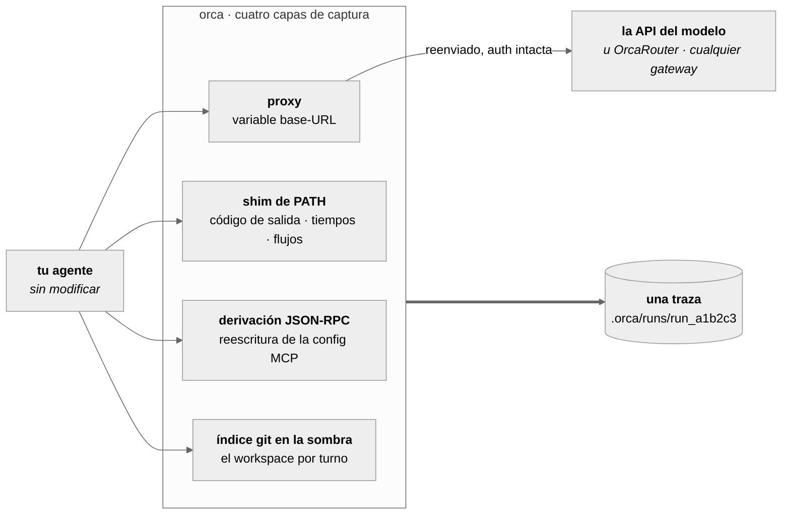
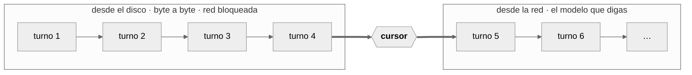

# OrcaReplay

<sub>[English](../../README.md) · [简体中文](README.zh-CN.md) · [日本語](README.ja.md) · [한국어](README.ko.md) · [Deutsch](README.de.md) · [Français](README.fr.md) · **Español** · [العربية](README.ar.md)</sub>

### Tu agente rompió algo a las 2 de la madrugada. Reprodúcelo a las 9 — exacto, sin red, tantas veces como quieras.

Graba cualquier agente de código. Reproduce la ejecución byte a byte con la red apagada. Bifúrcala
desde cualquier paso hacia otro modelo y mira quién acierta.

<a href="https://www.orcarouter.ai">
  
</a>

**Creado por el equipo detrás de [OrcaRouter](https://www.orcarouter.ai)** — una clave de API y un
único endpoint para Claude, GPT, Gemini, Grok, DeepSeek, Qwen y los demás. Es a lo que `orca setup`
apunta por defecto, y lo que convierte `orca compare` en un solo comando en lugar de cuatro cuentas
de proveedor.

[Todos los modelos](https://www.orcarouter.ai/models) · [OrcaCode Review](https://www.orcarouter.ai/code-review) · [X](https://x.com/OrcaRouter) · [Hugging Face](https://huggingface.co/orcarouter)

<br clear="left">

[](../../LICENSE)
[](../../spec/orca-trace-v0.md)
[](#install)
[](#install)
[](../good-first-issues.md)


<sup>Salida real de una sola sesión — una ejecución de Claude Code grabada, reproducida con la red
apagada y luego bifurcada en el punto de control 4 hacia dos modelos, calificada por
`npx tsc --noEmit`. Aquí no hay nada escenificado.</sup>

## Pruébalo en tres comandos

```console
orca record claude              # tu agente, sin tocar, haciendo lo que hace
orca replay last                # la misma ejecución otra vez — sin red, sin tokens, sin cobro
orca replay last --from 4 --model claude-haiku-4-5 --ui
```

La tercera línea es por la que la gente se queda: los mismos archivos, el mismo prefijo de
conversación, otro modelo a partir del paso 4. El modelo es la única variable, y eso es lo que hace
que la respuesta signifique algo.

Todavía no está en npm — [instálalo desde el código](#install), tarda cosa de un minuto.

## Por qué existe

Depurar agentes hoy es arqueología. Recorres un terminal hacia arriba, vuelves a ejecutar y obtienes
otro fallo, metes prints en el harness de otra persona. Las herramientas que existen son de
observabilidad: te dicen que una ejecución costó 4,12 $ y usó 61k tokens, que no es la pregunta que
tienes. Tu pregunta es *por qué borró mi archivo de migración.*

OrcaReplay la responde devolviéndote la ejecución.

|  | Herramientas de observabilidad | OrcaReplay |
|---|---|---|
| Te dice cuánto costó una ejecución | ✅ | ✅ |
| Te dice qué llamada a herramienta borró el archivo | a veces | ✅ |
| Vuelve a ejecutar el agente y obtiene la misma respuesta | ❌ | ✅ sin red, byte a byte |
| Te deja cambiar de modelo y repetir desde el paso 4 | ❌ | ✅ |
| Exige modificar tu agente | normalmente un wrapper de SDK | ❌ dos variables de entorno |
| Sirve después de cerrar el terminal | ❌ | ✅ es un archivo |

## Cómo funciona

Las API de modelos no tienen estado, así que en cada turno el agente reenvía la conversación entera
— incluidos los resultados de herramienta del turno anterior. **Por eso un proxy delante del modelo
ve todo el bucle**: cada petición, cada respuesta en streaming, cada llamada a herramienta que emitió
el modelo y cada resultado que produjo el harness. Sobre esa única propiedad está construida la
herramienta, y es la razón de que **OrcaReplay no parchee tu agente** — levanta un proxy local,
define dos variables de entorno y se aparta.

Otras tres capas capturan lo que el protocolo no puede ver: un código de salida, una duración real,
de qué flujo salió un byte, un archivo escrito sin avisar a nadie.



Las cuatro caen en la misma línea de tiempo, ordenadas por cuándo ocurrieron de verdad y no por
cuándo orca llegó a leerlas.

### Exacto, bifurcación y comparación son lo mismo

No son tres subsistemas. Son el mismo proxy con un **cursor**: la posición del flujo grabado en la
que deja de responder desde el disco y empieza a responder desde la red.



| comando | dónde está el cursor | qué obtienes |
|---|---|---|
| `orca replay last` | al final | la ejecución entera otra vez, **red bloqueada** — sin tokens, sin cobro, sin varianza |
| `orca replay last --from 4 --model X` | en el punto de control 4 | los turnos hasta el 4 idénticos, después toma el relevo otro modelo |
| `orca compare last --from 4 --models a,b` | en el punto de control 4, varias veces | una tabla, una variable — el modelo |

Un **punto de control** no se graba: se *deriva* — cualquier punto en el que el prefijo de
conversación está completo y del workspace hay una instantánea. Cada bifurcación arranca así de un
estado que demostrablemente existió.

## Cómo es de verdad una caza de bugs

Tu agente tenía que arreglar un test de autenticación que fallaba. Salió con 0 y el test sigue
fallando. Empieza por lo que realmente hizo:

```console
$ orca show last
run_6473f858b59e  generic-openai@0.1.0  14 events  exit 0

SEQ  KIND   WHAT                                            DETAIL
0    RUN    run started                                     generic-openai
1    SNAP   tree 919d32ba037537b43814c83779963b2cc3023db7   0 changed
2    MODEL  claude-opus-5                                   1 messages
3    MODEL  claude-opus-5                                   stop: tool_use · 100 in · 20 out
4    TOOL   edit_file                                       {"path":"auth.ts",…}
5    SNAP   tree c6af62b75c0c8b8938bd6087328b5148f3dcd534   1 changed
6    FILE   auth.ts                                         modified +1 −3
7    TOOL   edit_file                                       ok
8    MODEL  claude-opus-5                                   3 messages
9    MODEL  claude-opus-5                                   stop: end_turn · 101 in · 5 out
10   SNAP   tree c6af62b75c0c8b8938bd6087328b5148f3dcd534   0 changed
11   SHELL  ["sh","-c","node --check nonexistent-file.ts"]  /tmp/hunt
12   SHELL  shell result                                    exit 1 · 43ms
13   RUN    run ended                                       exit 0

info usage input=201 output=25 cost=$0.004890
```

Tres hechos que la propia transcripción del modelo no podía darte y que el código de salida de la
ejecución tapó: el archivo cambió de verdad (seq 6, `+1 −3`), la comprobación que lanzó el agente
**falló** (seq 12, `exit 1`), y aun así dio por terminado. La ejecución salió con 0 porque el
*agente* salió con 0.

Ahora reprodúcelo tantas veces como quieras, gratis:

```console
$ orca replay last
info replay.done reused=2/2 exact=2 divergences=0 unmatched=0 exit=0
```

Sin red, sin tokens, sin varianza. Y entonces haz la pregunta que de verdad tienes: *¿lo habría
acertado otro modelo?*

```console
$ orca compare last --from 5 --models claude-opus-5,claude-haiku-4-5 --verify "npm test"
MODEL             VERDICT  TOKENS  COST       WALL  RUN
claude-opus-5     pass     201/25  $0.004890  0.3s  run_1457b35062ba
claude-haiku-4-5  pass     201/25  $0.000326  0.3s  run_b8ee08479fb6
```

Los dos pasan. Uno cuesta **15 veces menos**. Los mismos archivos, el mismo prefijo de conversación,
el mismo punto de control — el modelo es lo único que cambió, que es la única razón por la que ese
número significa algo.

## La línea de tiempo

`orca replay last --ui` (u `orca ui`) abre la ejecución como un único archivo HTML autocontenido —
sin servidor que dejar corriendo, sin red, sin nada que instalar. Fíltrala, avanza paso a paso, o
pulsa espacio y mira cómo se reproduce al ritmo al que ocurrió.


Cada capa cae en la misma línea de tiempo, así que lees la ejecución como una historia y no como
cuatro: los turnos del modelo con sus recuentos de tokens, cada llamada a herramienta con sus
argumentos y su resultado, los comandos de shell con sus códigos de salida y sus tiempos, y los
cambios de sistema de archivos con el árbol que produjeron.

`orca export last -o bug.html` escribe exactamente esa página en un archivo que puedes adjuntar a un
issue. No lleva ninguna referencia externa — la CI lo comprueba — así que se ve desde la carpeta de
descargas, en un avión, dentro de cinco años.

## La misma tarea, otro modelo

`orca compare` bifurca una ejecución grabada hacia varios modelos desde el mismo punto de control,
con los mismos archivos y el mismo prefijo de conversación, y califica cada uno con el comando que
elijas. El modelo es la única variable, y eso es lo que hace que la respuesta signifique algo.


```console
orca compare last --from 4 \
  --models claude-sonnet-5,claude-haiku-4-5 \
  --verify "npm test" \
  --share verdict.svg          # la tarjeta de arriba, lista para pegar en un issue
```

### Apuntarlo a varios modelos

Comparar modelos significa llegar a varios proveedores, y hacerlo a mano significa saber que existen
`--upstream-anthropic` y `--upstream-openai`, que un gateway puede servir ambos formatos, y dónde va
la clave. Todo eso es real y nada de ello es descubrible, así que hay un comando que pregunta:

```console
$ orca setup
Gateway URL (serves the model APIs) [https://api.orcarouter.ai]:
  get a key at https://www.orcarouter.ai/console/token — OrcaRouter keys start sk-orca-
API key (stored 0600; leave blank for none):
  info config.saved path=~/.config/orca/config.json mode=0600 gateway=https://api.orcarouter.ai auth=stored

  6 models available:
    anthropic/claude-opus-5
    anthropic/claude-haiku-4-5
    openai/gpt-5.2
    ...

$ orca models
MODEL                      $/MTOK IN  $/MTOK OUT
anthropic/claude-opus-5    15         75
anthropic/claude-haiku-4-5 1          5
openai/gpt-5.2             1.25       10
some-local-model           —          —
```

`orca setup` no se limita a escribir el archivo: le pregunta al gateway qué sirve realmente, así que
una URL equivocada o una clave muerta es una respuesta ahora en lugar de un 401 a mitad de una
comparación. También guarda los modelos que elegiste, de modo que después
`orca compare last --verify "npm test"` no necesita ni lista de modelos ni flags de upstream.
`orca models` pone precio a lo que reconoce y un guion a lo que no, porque inventarse un número para
un modelo desconocido es justo la manera en que una tabla comparativa acaba citando un coste que
nunca fue real.

[**OrcaRouter**](https://www.orcarouter.ai) es la respuesta por defecto a esa primera pregunta:
pulsa Enter y tienes un origen y una clave sirviendo Claude, GPT, Gemini, Grok, DeepSeek, Qwen y los
demás, que es exactamente la forma que quiere `orca compare`. Sus ids de modelo llevan espacio de
nombres por proveedor (`anthropic/claude-sonnet-4.6`, `openai/gpt-4o-mini`), y orca lo maneja: el
espacio de nombres elige el formato y se retira antes de calcular el precio.

Es un *valor por defecto*, no un destino: escríbelo encima, o pasa `--gateway <url>`, y cualquier
cosa que hable los endpoints `/v1/models` y de chat compatibles con OpenAI funciona igual de bien —
otro gateway alojado, o algo que ejecutes tú mismo.

Y solo es un valor por defecto para tráfico que **tú** pediste enviar a algún sitio. Sin gateway
configurado, `orca record` proxea las llamadas del propio agente directamente al proveedor con el que
ya estaba hablando, con la clave del propio agente. Orca no redirige una grabación que nunca
configuraste: eso sería enviar tu código fuente a un tercero como efecto secundario de pulsar
grabar.

No interactivo: `orca setup --key <k>` toma el valor por defecto,
`orca setup --gateway <url> --key <k>` nombra otro, y `--key-env <VAR>` lee la clave del entorno en
vez de guardar una credencial en disco.

La clave nunca llega a una traza. Se adjunta solo a la petición saliente, mientras que lo que se
graba se construye a partir de la petición *entrante* con la auth quitada — es invisible para la
grabación por construcción, no por una regla que alguien tenga que recordar. Se retiene por completo
si algún flag envía ese tráfico a un sitio distinto del gateway que la emitió.

## Cuando el harness no se deja redirigir

La inyección de base-URL captura todo harness que lea una variable de base-URL, que son casi todos.
Un Codex CLI conectado con una suscripción de ChatGPT no lee ninguna: habla con su propio backend
por TLS, y orca no ve nada. `--tls-intercept` es la respuesta a eso, y es deliberadamente una
decisión aparte que tienes que tomar, porque emite una autoridad certificadora.

```console
orca record codex --tls-intercept
orca record codex --tls-intercept --tls-hosts 'api.openai.com,*.chatgpt.com'
```

La CA es única para esa ejecución, la confía únicamente el agente que orca lanza —a través del
entorno de ese proceso hijo, nunca de un almacén de confianza del sistema o del navegador— y se
borra al terminar. Orca no se ofrecerá a instalarla en ningún sitio. Los hosts fuera de la lista de
permitidos se tunelizan sin leerse y se graban como una dirección y un número de bytes, sin ruta y
sin cuerpo, porque orca nunca tuvo el texto en claro. Pedir interceptarlo todo se rechaza en lugar
de concederse.

Funciona también en `orca replay --model`, `orca fork` y `orca compare`, que lanzan un agente real
por el mismo motivo.

## Estado

Temprano. `v0` es el esqueleto que camina de los tres comandos de arriba.

| Capacidad | Estado |
|---|---|
| Formato de traza v0 + JSON Schema | funciona |
| Captura de modelos Anthropic / compatibles con OpenAI | funciona |
| Reproducción exacta con informe de divergencias | funciona — restaura el sistema de archivos grabado sobre tu árbol de trabajo y luego lo devuelve; `--worktree` para una copia desechable, `--in-place` para no restaurar nada. Escribe una ejecución propia con lo que la reproducción *descubrió* —divergencias, peticiones sin emparejar— y apunta al padre para lo que se limitó a repetir; `--no-trace` para omitirlo |
| Reproducción bifurcada desde un punto de control | funciona — una bifurcación graba sus propias instantáneas de sistema de archivos, así que es una ejecución que puedes volver a bifurcar |
| Comparación entre modelos | funciona — `orca setup` guarda un gateway (OrcaRouter por defecto, cualquier URL que nombres si no), una clave y una lista de modelos, así que `orca compare` no necesita flags |
| Instantáneas y diffs de sistema de archivos | funciona |
| Exportación HTML en un solo archivo | funciona |
| Grabación de llamadas MCP | funciona — actívalo con `--mcp-config <path>`. La reproducción y la bifurcación reinstrumentan desde la configuración que usó la grabación, así que la capa no se detiene en el punto de bifurcación |
| Limpieza posterior (`orca scrub`) | funciona |
| Captura de shell (shim de `PATH`) | funciona — códigos de salida, duración y la separación stdout/stderr. `--no-shell` para omitirlo |
| Captura de red no-modelo | funciona — actívalo con `--tls-intercept`; emite una CA por ejecución que solo confía el agente lanzado, descifra una lista de hosts permitidos, tuneliza el resto sin leerlo y borra la clave al terminar |
| Harness con auth por suscripción | Claude Code funciona. Un Codex CLI con suscripción de ChatGPT habla con su propio backend y no lee ninguna variable de base-URL, así que necesita `--tls-intercept` |

<a id="install"></a>

## Instalación

Todavía no está en npm — los paquetes están construidos y verificados para ello, pero no se ha
publicado nada, así que hoy es desde el código:

```console
git clone https://github.com/Continuum-AI-Corp/OrcaReplay && cd OrcaReplay
npm ci && npm run build
npm install -g ./packages/cli     # pone `orca` (y `orcareplay`) en el PATH
orca doctor                       # comprueba node, git y qué agentes encuentra
```

`npm install -g .` desde la raíz del repositorio no instala nada: la raíz es un workspace sin
binario propio, y `orca` vive en `packages/cli`.

En cuanto se publique `v0`, `npx orcareplay doctor` será toda la instalación y esta sección lo dirá
así. La publicación es un workflow con puertas y disparado por tag — ver
[`RELEASING.md`](../../RELEASING.md).

**Node 20+ para ejecutarlo** (los `engines` de la CLI dicen `>=20.0.0`). Contribuir necesita
`^20.19.0 || >=22.12.0`, porque lo necesita la cadena de tests; el `package.json` raíz lo declara
por separado para que `npm ci` te lo diga de entrada. Sin cuenta, sin registro, sin cambiar ninguna
clave de API.

## Dónde se guardan tus ejecuciones

Todo aterriza en **`.orca/runs/` dentro del proyecto en el que grabaste** — por proyecto, nunca un
almacén global, para que una ejecución viaje con el checkout al que pertenece. Un directorio de
ejecución es una sola cosa que se describe a sí misma:

```
.orca/
  .gitignore          # solo `*` — el almacén se excluye a sí mismo, así que una traza no puede commitearse por accidente
  runs/run_d0a2ee7ce615/
    manifest.json     # quién, cuándo, qué adaptador, el commit de git, recuentos, digest de integridad
    events.jsonl      # la línea de tiempo, un objeto JSON por línea, solo se añade
    blobs/            # payloads de más de 4 KB, direccionados por contenido y deduplicados
    fs/               # índice git en la sombra: el workspace en cada turno
    shell-frames.jsonl
    redactions.json   # qué se quitó, por regla y recuento — nunca por valor
```

Encontrar una sesión antigua:

```console
orca list                       # todas las ejecuciones de aquí, las más nuevas primero, con su origen
orca show run_d0a2ee7ce615      # la línea de tiempo en el terminal
orca replay last                # `last` = la grabación más reciente (se salta las trazas de reproducción)
orca replay run_d0a2ee7ce615    # o nombra una directamente
orca gc --older-than 7d --dry-run   # qué se recuperaría, antes de que se recupere nada
```

`orca list` lee los directorios de ejecución directamente, así que funciona con una traza que te
haya enviado alguien: déjala en `.orca/runs/` y todos los comandos la ven. Nada indexa, y no hay
base de datos que corromper.

## Privacidad

Las trazas son locales, con modo `0600`, y el grabador no abre ninguna conexión de red propia. Los
secretos se eliminan en la ruta de escritura: la captura de entorno es de denegación por defecto,
las cabeceras de auth nunca se escriben, y las formas de clave conocidas más las cadenas de alta
entropía se sustituyen por marcadores estables.

La eliminación es una mitigación de mejor esfuerzo, no una garantía. **Trata una traza como algo
sensible** — más o menos tan sensible como un historial de shell más un volcado de memoria.

```console
orca export last -o bug.html          # imprime exactamente lo que está a punto de escribir
orca scrub last --match my-hostname   # quitar algo a posteriori
```

`orca scrub` reescribe `events.jsonl`, el manifiesto y cada blob de texto, vuelve a pasar los
detectores estándar, refresca el digest de integridad y deja los blobs binarios idénticos byte a
byte.

Lo que no puede reescribir son las instantáneas de sistema de archivos. Los objetos de git se
direccionan por el hash de su propio contenido, así que editar uno cambia su id, lo que obliga a
reescribir cada árbol que lo nombra y después cada evento que nombra esos árboles — una reescritura
de historia cuyo modo de fallo es una ejecución que ya no se restaura. Por eso scrub *busca* en el
almacén de instantáneas y te dice si tu cadena sigue ahí, en lugar de dar por limpia una traza que
no pudo limpiar. `--drop-fs` borra el almacén entero, al precio de no poder volver a bifurcar la
ejecución.

## Qué es abierto y qué no

Siempre abierto, bajo Apache-2.0: el formato de traza, el núcleo, la CLI, el visor, los adaptadores
y la interfaz de provider.

OrcaReplay lo construye la gente que construye [OrcaRouter](https://www.orcarouter.ai), y eso se
nota exactamente en un sitio: `orca setup` lo sugiere cuando no nombras un gateway. Es un valor por
defecto que ves y puedes sobrescribir, en una pregunta que elegiste responder — no una ruta que algo
tome por su cuenta. Todos los caminos de modelo siguen siendo una URL corriente que puedes apuntar a
donde quieras, y no hay ninguna ruta de código que trate ese origen distinto de cualquier otro.

Lo que el proveedor *no* obtiene es privilegio. Un plugin —incluido el de OrcaRouter— solo puede
usar la interfaz pública `Provider` de `@orcareplay/plugin-api`, sin ninguna API privada detrás.
Todavía no existe ningún plugin de proveedor, así que el job de CI que lo hace cumplir
(`scripts/check-neutrality.mjs`) lo dice y pasa sin hacer nada; empezará a construir contra el
paquete publicado en vez de contra el código del workspace en cuanto aparezca uno. Si algún día un
plugin necesita una capacidad, esa capacidad entra primero en la interfaz pública, con una segunda
implementación que demuestre que no está moldeada alrededor de un proveedor.

## Documentación

**Empieza aquí si tienes un problema ahora mismo:**

- [Mi agente rompió algo. ¿Cómo averiguo por qué?](../how-to/debug-a-failing-agent-run.md)
- [¿Por qué borró mi agente ese archivo?](../how-to/why-did-my-agent-delete-my-file.md)
- [¿Lo habría acertado otro modelo?](../how-to/compare-models-on-the-same-failure.md)

**Referencia:**

- [`spec/orca-trace-v0.md`](../../spec/orca-trace-v0.md) — el formato de traza normativo
- [`docs/architecture.md`](../architecture.md) — cómo funcionan de verdad captura, reproducción y bifurcación
- [`docs/plugins.md`](../plugins.md) — escribir un adaptador o un provider
- [`CONTRIBUTING.md`](../../CONTRIBUTING.md) — el bucle de desarrollo de cinco minutos
- [Good first issues](../good-first-issues.md) — doce, con el archivo por el que empezar

## Se busca ayuda

El formato es v0 y el esqueleto que camina funciona, que es el punto interesante en la vida de un
proyecto: las decisiones todavía son baratas de cambiar y hay mucho trabajo evidente con el archivo
por el que empezar ya escrito.

- **[Doce good first issues](../good-first-issues.md)**, cada uno nombrando el archivo y el test.
- **Escribe un adaptador.** Un archivo, una fixture. Si tu harness lee una variable de base-URL son
  unas veinte líneas — [docs/plugins.md](../plugins.md).
- **Reimplementa el lector.** Que la especificación sea CC BY 4.0 es a propósito. Ya hay un lector en
  Python; Go y Rust están libres.
- **Rompe la reproducción.** La escalera de emparejamiento es el corazón de esto, y la forma más
  rápida de mejorarla es una grabación real en la que se equivoque. Abre un issue con
  `orca export last -o bug.html` adjunto — es un solo archivo autocontenido, y `orca scrub` está ahí
  para lo que necesites sacar antes.

Si te ahorró una tarde, una ⭐ ayuda a que otros lo encuentren.

## Licencia

Apache-2.0 para el código. La especificación de traza es CC BY 4.0, para que cualquiera pueda
reimplementarla.

---

<sub>
Construido por el equipo de OrcaRouter ·
<a href="https://www.orcarouter.ai">orcarouter.ai</a> ·
<a href="https://www.orcarouter.ai/models">todos los modelos</a> ·
<a href="https://www.orcarouter.ai/code-review">OrcaCode Review</a> ·
<a href="https://x.com/OrcaRouter">X</a> ·
<a href="https://huggingface.co/orcarouter">Hugging Face</a>
</sub>
