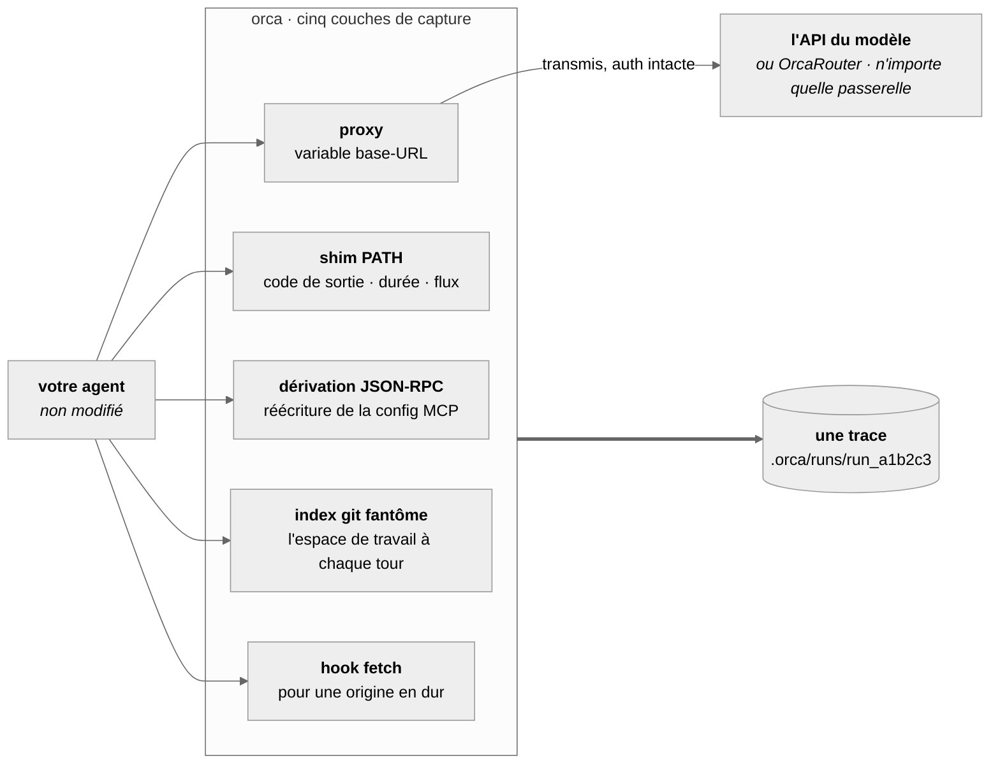
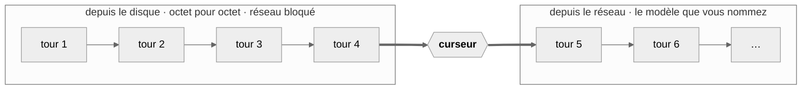

# OrcaReplay

<sub>[English](../../README.md) · [简体中文](README.zh-CN.md) · [日本語](README.ja.md) · [한국어](README.ko.md) · [Deutsch](README.de.md) · **Français** · [Español](README.es.md) · [العربية](README.ar.md)</sub>

### Votre agent a cassé quelque chose à 2 h du matin. Rejouez-le à 9 h — à l'identique, hors ligne, autant de fois que vous voulez.

Enregistrez n'importe quel agent de code. Reproduisez l'exécution octet pour octet, réseau coupé.
Bifurquez-la à n'importe quelle étape vers un autre modèle et voyez qui trouve la bonne réponse.

<a href="https://www.orcarouter.ai">
  
</a>

**Construit par l'équipe derrière [OrcaRouter](https://www.orcarouter.ai)** — une clé d'API et un
point d'entrée pour Claude, GPT, Gemini, Grok, DeepSeek, Qwen et les autres. C'est ce que
`orca setup` propose par défaut, et ce qui fait de `orca compare` une seule commande au lieu de
quatre comptes fournisseurs.

[Tous les modèles](https://www.orcarouter.ai/models) · [OrcaCode Review](https://www.orcarouter.ai/code-review) · [X](https://x.com/OrcaRouter) · [Hugging Face](https://huggingface.co/orcarouter)

<br clear="left">

[](../../LICENSE)
[](../../spec/orca-trace-v0.md)
[](#installation)
[](#installation)
[](../good-first-issues.md)


<sup>Sortie réelle d'une seule session — une exécution de Claude Code enregistrée, rejouée réseau
coupé, puis bifurquée au point de contrôle 4 vers deux modèles et notée par `npx tsc --noEmit`.
Rien ici n'est mis en scène.</sup>

## L'essayer en trois commandes

```console
orca record claude              # votre agent, tel quel, faisant ce qu'il fait
orca replay last                # la même exécution à nouveau — pas de réseau, pas de jetons, pas de facture
orca replay last --from 4 --model claude-haiku-4-5 --ui
```

C'est la troisième ligne qui retient les gens : mêmes fichiers, même préfixe de conversation, un
modèle différent à partir de l'étape 4. Le modèle est la seule variable, et c'est ce qui donne un
sens à la réponse.

Pas encore sur npm — [installez depuis les sources](#installation), il faut une minute environ.

## Pourquoi cet outil existe

Déboguer un agent aujourd'hui relève de l'archéologie. On remonte un terminal, on relance et on
obtient une autre erreur, on glisse des print dans le harnais de quelqu'un d'autre. Les outils
existants sont des outils d'observabilité : ils vous disent qu'une exécution a coûté 4,12 $ et
consommé 61 k jetons, ce qui n'est pas votre question. Votre question, c'est *pourquoi a-t-il
supprimé mon fichier de migration.*

OrcaReplay y répond en vous rendant l'exécution.

|  | Outils d'observabilité | OrcaReplay |
|---|---|---|
| Dit ce qu'a coûté une exécution | ✅ | ✅ |
| Dit quel appel d'outil a supprimé le fichier | parfois | ✅ |
| Relance l'agent et obtient la même réponse | ❌ | ✅ hors ligne, octet pour octet |
| Permet de changer de modèle et de repartir de l'étape 4 | ❌ | ✅ |
| Demande de modifier votre agent | en général un wrapper SDK | ❌ deux variables d'environnement |
| Fonctionne après la fermeture du terminal | ❌ | ✅ c'est un fichier |
| Voit au-delà de l'API du modèle — codes de sortie shell, écritures de fichiers | ❌ | ✅ à chaque tour |
| Enregistre un agent sans point d'accès API à rediriger | ❌ | ✅ opt-in `--tls-intercept` |

Les deux dernières lignes sont celles qu'un wrapper SDK ne peut structurellement pas atteindre. La
capture a lieu *en dessous* de l'agent — à la frontière des processus et des sockets — si bien qu'il
importe peu que l'agent soit le vôtre, que vous puissiez le modifier, ou même qu'il détienne une clé
d'API : un Codex CLI connecté avec un abonnement ChatGPT parle à son propre backend en TLS et n'a
aucune base URL à faire pointer ailleurs, et orca sait tout de même l'enregistrer. Voir
[quand le harnais refuse d'être redirigé](#quand-le-harnais-refuse-dêtre-redirigé).

## Comment ça marche

Les API de modèles sont sans état : à chaque tour, l'agent renvoie donc toute la conversation — y
compris les résultats d'outils du tour précédent. **Un proxy placé devant le modèle voit par
conséquent toute la boucle** : chaque requête, chaque réponse en flux, chaque appel d'outil émis par
le modèle et chaque résultat produit par le harnais. C'est sur cette seule propriété que tout
repose, et c'est pourquoi **OrcaReplay ne patche pas votre agent** — il monte un proxy local, pose
deux variables d'environnement et s'efface.

Trois autres couches attrapent ce que le protocole ne peut pas voir : un code de sortie, une durée
réelle, le flux d'où sort un octet, un fichier écrit sans le dire à personne. Une cinquième existe pour les agents qui ne lisent aucune variable de base-URL — voir
« Quels agents » plus bas.



Les quatre atterrissent dans la même chronologie, ordonnée par le moment où les choses se sont
réellement produites plutôt que par le moment où orca a fini par les lire.

### Exact, fork et comparaison ne font qu'un

Ce ne sont pas trois sous-systèmes. C'est le même proxy muni d'un **curseur** — la position dans le
flux enregistré où il cesse de répondre depuis le disque et se met à répondre depuis le réseau.



| commande | où est le curseur | ce que vous obtenez |
|---|---|---|
| `orca replay last` | à la fin | toute l'exécution à nouveau, **réseau bloqué** — pas de jetons, pas de facture, pas de variance |
| `orca replay last --from 4 --model X` | au point de contrôle 4 | les tours jusqu'à 4 identiques, puis un autre modèle prend le relais |
| `orca compare last --from 4 --models a,b` | au point de contrôle 4, plusieurs fois | un tableau, une variable — le modèle |

Un **point de contrôle** n'est pas enregistré, il est *dérivé* — tout endroit où le préfixe de
conversation est complet et où l'espace de travail a été capturé. Chaque bifurcation part donc d'un
état dont on peut prouver qu'il a existé.

## À quoi ressemble vraiment une chasse au bug

Votre agent devait réparer un test d'authentification qui échouait. Il est sorti avec 0 et le test
échoue toujours. Commencez par ce qu'il a réellement fait :

```console
$ orca show last
run_6473f858b59e  generic-openai@0.1.0  14 events  exit 0

SEQ  KIND   WHAT                                            DETAIL
0    RUN    run started                                     generic-openai
1    SNAP   tree 919d32ba037537b43814c83779963b2cc3023db7   0 changed
2    MODEL  claude-opus-5                                   1 messages
3    MODEL  claude-opus-5                                   stop: tool_use · 100 in · 20 out
4    TOOL   edit_file                                       {"path":"auth.ts",…}
5    SNAP   tree c6af62b75c0c8b8938bd6087328b5148f3dcd534   1 changed
6    FILE   auth.ts                                         modified +1 −3
7    TOOL   edit_file                                       ok
8    MODEL  claude-opus-5                                   3 messages
9    MODEL  claude-opus-5                                   stop: end_turn · 101 in · 5 out
10   SNAP   tree c6af62b75c0c8b8938bd6087328b5148f3dcd534   0 changed
11   SHELL  ["sh","-c","node --check nonexistent-file.ts"]  /tmp/hunt
12   SHELL  shell result                                    exit 1 · 43ms
13   RUN    run ended                                       exit 0

info usage input=201 output=25 cost=$0.004890
```

Trois faits que la transcription du modèle ne pouvait pas donner et que le code de sortie de
l'exécution a masqués : le fichier a bien changé (seq 6, `+1 −3`), la vérification lancée par
l'agent a **échoué** (seq 12, `exit 1`), et il s'est arrêté quand même. L'exécution est sortie avec
0 parce que l'*agent* est sorti avec 0.

Reproduisez-la maintenant autant que vous voulez, gratuitement :

```console
$ orca replay last
info replay.done reused=2/2 exact=2 divergences=0 unmatched=0 exit=0
```

Pas de réseau, pas de jetons, pas de variance. Posez ensuite la question que vous avez vraiment —
*un autre modèle aurait-il réussi ?*

```console
$ orca compare last --from 5 --models claude-opus-5,claude-haiku-4-5 --verify "npm test"
MODEL             VERDICT  TOKENS  COST       WALL  RUN
claude-opus-5     pass     201/25  $0.004890  0.3s  run_1457b35062ba
claude-haiku-4-5  pass     201/25  $0.000326  0.3s  run_b8ee08479fb6
```

Les deux passent. L'un coûte **15 fois moins**. Mêmes fichiers, même préfixe de conversation, même
point de contrôle — le modèle est la seule chose qui a changé, et c'est la seule raison pour
laquelle ce chiffre veut dire quelque chose.

## La chronologie

`orca replay last --ui` (ou `orca ui`) ouvre l'exécution sous forme d'un unique fichier HTML
autonome — pas de serveur à laisser tourner, pas de réseau, rien à installer. Filtrez-la,
avancez pas à pas, ou appuyez sur espace et regardez l'exécution se rejouer au rythme réel.


Chaque couche atterrit dans la même chronologie, si bien que vous lisez l'exécution comme une seule
histoire plutôt que quatre : les tours du modèle et leurs compteurs de jetons, chaque appel d'outil
avec ses arguments et son résultat, les commandes shell avec leurs codes de sortie et leur durée, et
les changements du système de fichiers avec l'arbre qu'ils ont produit.

`orca export last -o bug.html` écrit exactement cette page dans un fichier unique que vous pouvez
joindre à un ticket. Il ne porte aucune référence externe — la CI le vérifie — donc il s'affiche
depuis un dossier de téléchargements, dans un avion, dans cinq ans.

## Même tâche, autre modèle

`orca compare` bifurque une exécution enregistrée vers plusieurs modèles à partir du même point de
contrôle, avec les mêmes fichiers et le même préfixe de conversation, et note chacun avec une
commande de votre choix. Le modèle est la seule variable, et c'est ce qui donne un sens à la réponse.


```console
orca compare last --from 4 \
  --models claude-sonnet-5,claude-haiku-4-5 \
  --verify "npm test" \
  --share verdict.svg          # la carte ci-dessus, prête à coller dans un ticket
```

### Le pointer vers plusieurs modèles

Comparer des modèles suppose d'atteindre plusieurs fournisseurs, et le faire à la main suppose de
savoir que `--upstream-anthropic` et `--upstream-openai` existent, qu'une passerelle peut servir les
deux formats, et où va la clé. Tout cela est réel et rien n'est découvrable — d'où une commande qui
pose la question à votre place :

```console
$ orca setup
Gateway URL (serves the model APIs) [https://api.orcarouter.ai]:
  get a key at https://www.orcarouter.ai/console/token — OrcaRouter keys start sk-orca-
API key (stored 0600; leave blank for none):
  info config.saved path=~/.config/orca/config.json mode=0600 gateway=https://api.orcarouter.ai auth=stored

  6 models available:
    anthropic/claude-opus-5
    anthropic/claude-haiku-4-5
    openai/gpt-5.2
    ...

$ orca models
MODEL                      $/MTOK IN  $/MTOK OUT
anthropic/claude-opus-5    15         75
anthropic/claude-haiku-4-5 1          5
openai/gpt-5.2             1.25       10
some-local-model           —          —
```

`orca setup` ne se contente pas d'écrire le fichier : il demande à la passerelle ce qu'elle sert
réellement, si bien qu'une mauvaise URL ou une clé morte devient une réponse tout de suite au lieu
d'un 401 au milieu d'une comparaison. Il enregistre aussi les modèles choisis : ensuite,
`orca compare last --verify "npm test"` n'a besoin ni de liste de modèles ni de drapeaux amont.
`orca models` chiffre ce qu'il reconnaît et affiche un tiret pour le reste, parce qu'inventer un
nombre pour un modèle inconnu, c'est exactement ainsi qu'un tableau comparatif finit par citer un
coût qui n'a jamais existé.

[**OrcaRouter**](https://www.orcarouter.ai) est la réponse par défaut à cette première question —
appuyez sur Entrée et vous avez une origine et une clé qui servent Claude, GPT, Gemini, Grok,
DeepSeek, Qwen et les autres, ce qui est exactement la forme que veut `orca compare`. Ses
identifiants de modèles sont préfixés par fournisseur (`anthropic/claude-sonnet-4.6`,
`openai/gpt-4o-mini`), et orca sait faire : le préfixe choisit le format et il est retiré avant le
calcul du coût.

C'est un *défaut*, pas une destination : écrivez par-dessus, ou passez `--gateway <url>`, et tout ce
qui parle les points d'entrée `/v1/models` et chat compatibles OpenAI marche aussi bien — une autre
passerelle hébergée, ou quelque chose que vous faites tourner vous-même.

Et ce n'est un défaut que pour le trafic que **vous** avez demandé à envoyer quelque part. Sans
passerelle configurée, `orca record` relaie les appels de votre agent directement au fournisseur
auquel il parlait déjà, avec la clé de l'agent. Orca ne réachemine pas un enregistrement que vous
n'avez jamais configuré : ce serait envoyer votre code source à un tiers comme effet de bord d'un
appui sur le bouton d'enregistrement.

Non interactif : `orca setup --key <k>` prend le défaut, `orca setup --gateway <url> --key <k>` en
nomme une autre, et `--key-env <VAR>` lit la clé dans l'environnement plutôt que de garder un
identifiant sur le disque.

La clé n'atteint jamais une trace. Elle est attachée à la requête sortante uniquement, tandis que ce
qui est enregistré est construit à partir de la requête *entrante*, auth retirée — elle est donc
invisible pour l'enregistrement par construction, et non par une règle dont il faut se souvenir.
Elle est entièrement retenue si un drapeau envoie ce trafic ailleurs que vers la passerelle qui l'a
émise.

## Quels agents

Deux choses décident si un harnais peut être enregistré : s'il peut être pointé vers le proxy, et si
orca comprend le format qu'il parle une fois arrivé.

| Agent | Comment il est capturé | État |
|---|---|---|
| **Claude Code** | `ANTHROPIC_BASE_URL` | fonctionne — vérifié sur une vraie correction de bug, [en détail](../validation.md) |
| **Codex CLI** (clé API) | `OPENAI_BASE_URL` → API Responses | fonctionne |
| **Codex CLI** (connexion ChatGPT) | `--tls-intercept` → API Responses | fonctionne, avec une décision à prendre soi-même |
| **OpenAI Agents SDK** | `OPENAI_BASE_URL` → API Responses | fonctionne |
| **Vercel AI SDK** | hook fetch — `orca record node -- node app.mjs` | fonctionne |
| **LangGraph / LangChain** | `OPENAI_BASE_URL`, `ANTHROPIC_BASE_URL` | devrait fonctionner — il passe par les clients officiels, mais rien ici ne le teste encore |
| **grok-cli** (et son bot Telegram) | `orca record grok` — `GROK_BASE_URL`, plus le hook pour ses sous-agents | fonctionne |
| **OpenClaw** | `orca record openclaw` — le hook pour la passerelle, les variables héritées pour les agents qu'elle lance | fonctionne |
| **opencode** | `orca record opencode` | adaptateur présent, les deux origines sont redirigées |
| **Hermes** (Nous Research) | `ORCA_BASE_URL_VARS=… orca record generic-openai -- hermes …` | devrait fonctionner — il surcharge par fournisseur, voir ci-dessous |
| **tout le reste** | `orca record generic-openai -- <cmd>` | fonctionne s'il lit une variable de base-URL ; sinon `orca record node -- <cmd>` |

Seul Claude Code a été mené de bout en bout contre le vrai harnais. Le reste tient au contrat
d'adaptateur et à des fixtures qui consignent exactement les variables que chacun pose : si un
harnais renomme la variable qu'il lit, c'est une vérification qui rougit, pas un enregistrement vide
qui sort.

Deux de ces cas ont demandé plus qu'une variable d'environnement, et la différence vaut d'être connue
avant de choisir la commande.

**Un harnais qui parle l'API Responses.** L'OpenAI Agents SDK et le Codex CLI utilisent tous deux
`/v1/responses` par défaut, et non chat completions. orca la parle, rien de particulier n'est donc
nécessaire — mais sur une version antérieure, le symptôme n'était pas un enregistrement incomplet :
c'était un `404` au premier tour de l'agent.

**Un harnais qui ne lit aucune variable de base-URL.** `@ai-sdk/openai` ne prend son origine qu'en
argument de constructeur : un agent bâti sur le Vercel AI SDK tourne donc parfaitement sous
`orca record`, sort avec 0, et écrit un enregistrement vide. L'adaptateur `node` est exactement pour
ça : il écrit un petit préchargement dans le répertoire du run, y pointe `NODE_OPTIONS`, et redirige
`globalThis.fetch` pour une liste blanche d'hôtes fournisseurs et rien d'autre.

```console
orca record node -- node agent.mjs
orca record node -- npm run agent
ORCA_INSTRUMENT_HOSTS='contoso.openai.azure.com' orca record node -- node agent.mjs
```

C'est un adaptateur à part plutôt que le défaut, parce que `NODE_OPTIONS` atteint tous les processus
Node que l'agent lance — un prix qu'on paie volontiers quand on sait que son agent en a besoin, mais
qu'on n'impose pas à quelqu'un qui enregistre un harnais Python.

Bun accepte `NODE_OPTIONS` mais y ignore `--require`. `BUN_OPTIONS=--preload` est donc posé en même
temps, et un agent Bun est couvert lui aussi. C'est vérifié contre un vrai `bun`, parce que l'échec
que cela évite est le silencieux : le hook ne s'exécute pas, le trafic part chez le fournisseur, et
rien n'est enregistré.

**Et si l'enregistrement revient quand même vide**, `orca record` le dit au lieu de sortir proprement :

```console
warn capture.empty exchanges=0 cause="the agent never called the proxy — it may not read a base-URL variable" set=ANTHROPIC_BASE_URL,OPENAI_API_BASE,OPENAI_BASE_URL next="orca doctor"
```

**Une variable de base-URL dont orca n'a jamais entendu parler.** Les énumérer est sans espoir :
le seul `.env.example` de Hermes porte `NOVITA_BASE_URL`, `GLM_BASE_URL`, `KIMI_BASE_URL`,
`MINIMAX_BASE_URL`, `HF_BASE_URL`, `NEBIUS_BASE_URL` et une douzaine d'autres. Une liste figée dans
orca serait périmée la semaine suivante — alors nommez la variable :

```console
ORCA_BASE_URL_VARS='OPENROUTER_BASE_URL' orca record generic-openai -- hermes
ORCA_BASE_URL_VARS='GLM_BASE_URL,KIMI_BASE_URL' orca record generic-openai -- my-agent
```

Chaque nom pointe vers le proxy avec `/v1` ajouté, ce qu'attend une surcharge compatible OpenAI ;
`=<chemin>` remplace ce suffixe, et `=/` donne l'origine nue.

**Une passerelle qui lance l'agent de code.** OpenClaw ne code pas : elle lance Claude Code, Codex
ou opencode en sous-processus. Ses propres appels sont pris par le hook fetch ; ceux de l'agent de
code le sont par les variables ordinaires — non parce qu'OpenClaw les lit, mais parce qu'**un
processus enfant hérite de l'environnement de son parent**. C'est une propriété du système
d'exploitation, pas d'orca, et c'est pourquoi un test la surveille.

## Quand le harnais refuse d'être redirigé

L'injection de base-URL capture tout harnais qui lit une variable de base-URL, et le hook fetch
couvre les agents Node et Bun qui n'en lisent pas. Un Codex CLI connecté avec un abonnement ChatGPT
n'est ni l'un ni l'autre : il parle à son propre backend en TLS, il n'y a donc aucune origine à
réécrire et aucun `fetch` à nous qu'il puisse atteindre. `--tls-intercept` est la réponse, et c'est délibérément une
décision distincte que vous devez prendre, parce qu'elle crée une autorité de certification.

```console
orca record codex --tls-intercept
orca record codex --tls-intercept --tls-hosts 'api.openai.com,*.chatgpt.com'
```

L'autorité est propre à l'exécution, n'est approuvée que par l'agent que lance orca — via
l'environnement de ce processus fils, jamais par un magasin de confiance système ou navigateur — et
elle est supprimée à la fin. Orca ne proposera de l'installer nulle part. Les hôtes hors liste
d'autorisation sont tunnelés sans être lus et enregistrés comme une adresse et un nombre d'octets,
sans chemin ni corps, parce qu'orca n'a jamais détenu le clair. Demander à tout intercepter est
refusé plutôt qu'exaucé.

Ce qui en revient n'est pas une ligne de journal. Une requête interceptée est analysée par les mêmes
dialectes de protocole que les autres : elle se range dans la trace comme un échange ordinaire —
rejouable hors ligne et forkable vers un autre modèle, sur une exécution où aucune de vos clés
d'API n'est jamais entrée.

Cela vaut aussi pour `orca replay --model`, `orca fork` et `orca compare`, qui lancent un agent réel
pour la même raison.

## Pour un agent, un script, ou la CI

Un enregistrement est un fichier — la seule chose qu'un tableau de bord d'observabilité ne peut pas
être. La question la plus utile sur une exécution ratée est donc celle qu'un **agent** peut poser :
*rejoue ma dernière exécution et dis-moi ce qui a divergé.* Chaque commande répond en données, et
orca se propose lui-même en MCP.

```console
$ orca replay last --json
{"runId":"run_a278eea7b535","mode":"exact","traceRunId":"run_687e3f84b208","matchedExact":2,"divergences":0,"unmatched":0,"liveCalls":0,"exitCode":0}

$ orca show last --json | jq '.events[] | select(.kind == "TOOL")'
$ orca checkpoints last --json | jq '.[-1].seq'
```

Un seul document JSON sur stdout, les diagnostics sur stderr — y compris la sortie de l'agent
enregistré, pour que le document reste analysable pendant qu'une exécution parle. Les échecs
répondent aussi en JSON, avec un code de sortie non nul. `--json` couvre `list`, `show`, `events`,
`checkpoints`, `graph`, `record`, `replay`, `compare` et `doctor`.

**Comme outils.** `orca mcp` sert le magasin d'enregistrements à un agent via stdio :

```json
{ "mcpServers": { "orca": { "command": "orca", "args": ["mcp"] } } }
```

`orca_list_runs`, `orca_show_run`, `orca_checkpoints`, `orca_graph`, `orca_replay` et `orca_compare`. Le rejeu est
gratuit et hors ligne ; `orca_compare` dit dans sa propre description qu'il dépense de vrais tokens,
parce qu'un modèle qui choisit un outil lit cette chaîne et rien d'autre.

**Depuis du code**, si vous préférez ne pas passer par le shell :

```ts
import { Orca } from 'orcareplay';

const orca = new Orca({ cwd: process.cwd() });
const { unmatched, divergences } = await orca.replay('last');
const timeline = await orca.show('last');
```

Il n'écrit jamais sur votre stdout et n'appelle jamais `process.exit` — les deux sont vérifiés par
des tests, parce qu'on ne peut rien bâtir sur une bibliothèque qui fait l'un ou l'autre.

## État

Précoce. `v0` est le squelette qui marche des trois commandes ci-dessus.

| Capacité | État |
|---|---|
| Format de trace v0 + JSON Schema | fonctionne |
| Capture des modèles Anthropic / compatibles OpenAI | fonctionne |
| Capture de l'API Responses d'OpenAI | fonctionne — le format que l'OpenAI Agents SDK et le Codex CLI utilisent par défaut. Enregistrement, rejeu hors ligne et bifurcation ; une bifurcation reste sur le format que parle l'agent |
| Agents qui ne lisent aucune variable de base-URL | fonctionne — `orca record node -- <cmd>` écrit un préchargement dans le répertoire du run et redirige `globalThis.fetch` pour une liste blanche d'hôtes fournisseurs. Node et Bun, puisque Bun ignore `--require` dans `NODE_OPTIONS`. C'est ainsi qu'un agent Vercel AI SDK est capturé |
| Un appel qu'orca ne sait pas lire | fonctionne — transmis plutôt que refusé, et consigné en `net.request` / `net.response` : une preuve, pas un tour rejouable. Un enregistrement qui n'a rien capturé avertit au lieu de se terminer proprement |
| Sortie lisible par une machine (`--json`) | fonctionne — un document JSON sur stdout, les diagnostics sur stderr, les échecs aussi en JSON |
| Serveur MCP (`orca mcp`) | fonctionne — six outils sur stdio, pour qu'un agent puisse lire et rejouer ses propres runs |
| API programmatique (`Orca`) | fonctionne — les commandes affichent ce qu'elle renvoie, le terminal n'est donc qu'une vue sur une seule vérité |
| Rejeu exact avec rapport de divergence | fonctionne — restaure le système de fichiers enregistré par-dessus votre arbre de travail, puis le remet ; `--worktree` pour une copie jetable, `--in-place` pour ne rien restaurer. Écrit sa propre exécution consignant ce que le rejeu a *découvert* — divergences, requêtes non appariées — et pointe vers le parent pour ce qu'il n'a fait que répéter ; `--no-trace` pour s'en passer |
| Rejeu bifurqué depuis un point de contrôle | fonctionne — une bifurcation enregistre ses propres instantanés de système de fichiers, c'est donc une exécution que l'on peut bifurquer à son tour |
| Comparaison entre modèles | fonctionne — `orca setup` mémorise une passerelle (OrcaRouter par défaut, sinon l'URL que vous nommez), une clé et une liste de modèles, si bien que `orca compare` n'a besoin d'aucun drapeau |
| Instantanés et diffs du système de fichiers | fonctionne |
| Export HTML en fichier unique | fonctionne |
| Enregistrement des appels MCP | fonctionne — à activer avec `--mcp-config <path>`. Rejeu et bifurcation ré-instrumentent à partir de la configuration utilisée à l'enregistrement, la couche ne s'arrête donc pas au point de bifurcation |
| Nettoyage a posteriori (`orca scrub`) | fonctionne |
| Capture du shell (shim `PATH`) | fonctionne — codes de sortie, durée et séparation stdout/stderr. `--no-shell` pour s'en passer |
| Capture du réseau hors modèle | fonctionne — à activer avec `--tls-intercept` ; crée une autorité propre à l'exécution que seul l'agent lancé approuve, déchiffre une liste d'hôtes autorisés, tunnelle le reste sans le lire et supprime la clé à la fin |
| Vérifié contre un vrai agent | Claude Code corrigeant vraiment un vrai bug : enregistré, rejoué hors ligne de bout en bout, bifurqué depuis un point de contrôle et exporté. Quatre choses qu'aucune fixture n'aurait pu produire ont cassé, toutes corrigées depuis — [ce qu'un vrai agent a trouvé](../validation.md) |
| Harnais à authentification par abonnement | Claude Code fonctionne. Un Codex CLI connecté avec un abonnement ChatGPT parle à son propre backend et ne lit aucune variable de base-URL : il lui faut `--tls-intercept` |

## Installation

Pas encore sur npm — les paquets sont construits et vérifiés pour, mais rien n'est publié ;
aujourd'hui c'est donc depuis les sources :

```console
git clone https://github.com/Continuum-AI-Corp/OrcaReplay && cd OrcaReplay
npm ci && npm run build
npm install -g ./packages/cli     # met `orca` (et `orcareplay`) dans le PATH
orca doctor                       # vérifie node, git, et quels agents il trouve
```

`npm install -g .` à la racine du dépôt n'installe rien : la racine est un workspace sans binaire
propre, et `orca` vit dans `packages/cli`.

Dès que `v0` sera publié, `npx orcareplay doctor` sera toute l'installation et cette section le dira
à la place. La publication est un workflow déclenché par tag et verrouillé — voir
[`RELEASING.md`](../../RELEASING.md).

**Node 20+ pour l'exécuter** (les `engines` de la CLI disent `>=20.0.0`). Contribuer demande
`^20.19.0 || >=22.12.0`, parce que la chaîne de test l'exige ; le `package.json` racine le déclare
séparément pour que `npm ci` vous le dise d'emblée. Pas de compte, pas d'inscription, aucun
changement de clé d'API.

## Où sont conservées vos exécutions

Tout atterrit dans **`.orca/runs/` à l'intérieur du projet où vous avez enregistré** — par projet,
jamais un dépôt global, pour qu'une exécution voyage avec le checkout auquel elle appartient. Un
répertoire d'exécution est une chose qui se décrit elle-même :

```
.orca/
  .gitignore          # juste `*` — le dépôt s'exclut lui-même, une trace ne peut donc pas être commitée par accident
  runs/run_d0a2ee7ce615/
    manifest.json     # qui, quand, quel adaptateur, le commit git, les compteurs, l'empreinte d'intégrité
    events.jsonl      # la chronologie, un objet JSON par ligne, en ajout seul
    blobs/            # charges utiles de plus de 4 Ko, adressées par contenu et dédupliquées
    fs/               # index git fantôme : l'espace de travail à chaque tour
    shell-frames.jsonl
    redactions.json   # ce qui a été retiré, par règle et par nombre — jamais par valeur
```

Retrouver une ancienne session :

```console
orca list                       # toutes les exécutions ici, les plus récentes d'abord, avec leur origine
orca show run_d0a2ee7ce615      # la chronologie dans le terminal
orca replay last                # `last` = l'enregistrement le plus récent (il saute les traces de rejeu)
orca replay run_d0a2ee7ce615    # ou nommez-en une directement
orca gc --older-than 7d --dry-run   # ce qui serait récupéré, avant que quoi que ce soit ne le soit
```

`orca list` lit directement les répertoires d'exécution : cela marche donc sur une trace que
quelqu'un vous a envoyée. Déposez-la dans `.orca/runs/` et toutes les commandes la voient. Rien
n'indexe, et il n'y a pas de base de données à corrompre.

## Vie privée

Les traces sont locales, en mode `0600`, et l'enregistreur n'ouvre aucune connexion réseau propre.
Les secrets sont retirés dans le chemin d'écriture : la capture d'environnement est en refus par
défaut, les en-têtes d'authentification ne sont jamais écrits, et les formes de clés connues ainsi
que les chaînes à forte entropie sont remplacées par des marqueurs stables.

Ce retrait est une atténuation au mieux, pas une garantie. **Traitez une trace comme sensible** —
à peu près autant qu'un historique de shell plus un vidage de tas.

```console
orca export last -o bug.html          # affiche exactement ce qu'il s'apprête à écrire
orca scrub last --match my-hostname   # retirer quelque chose après coup
```

`orca scrub` réécrit `events.jsonl`, le manifeste et chaque blob texte, relance les détecteurs
standard, rafraîchit l'empreinte d'intégrité et laisse les blobs binaires identiques octet pour
octet.

Il ne peut pas réécrire les instantanés du système de fichiers. Les objets git sont adressés par le
hachage de leur propre contenu : en modifier un change son identifiant, ce qui force la réécriture
de chaque arbre qui le nomme, puis de chaque événement qui nomme ces arbres — une réécriture
d'historique dont le mode de défaillance est une exécution qui ne se restaure plus. Alors scrub
*cherche* dans le dépôt d'instantanés et vous dit si votre chaîne s'y trouve encore, plutôt que de
déclarer propre une trace qu'il n'a pas pu nettoyer. `--drop-fs` supprime le dépôt entièrement, au
prix de ne plus pouvoir bifurquer l'exécution.

## Ce qui est ouvert, et ce qui ne l'est pas

Toujours ouvert, sous Apache-2.0 : le format de trace, le cœur, la CLI, la visionneuse, les
adaptateurs et l'interface provider.

OrcaReplay est construit par les gens qui construisent [OrcaRouter](https://www.orcarouter.ai), et
cela se voit à un seul endroit : `orca setup` le suggère quand vous ne nommez pas de passerelle.
C'est un défaut que vous voyez et pouvez écraser, sur une question que vous avez choisi de répondre
— pas une route que quoi que ce soit emprunte de lui-même. Tous les chemins de modèles restent de
simples URL que vous pouvez pointer n'importe où, et aucun chemin de code ne traite cette origine
différemment d'une autre.

Ce que l'éditeur n'obtient *pas*, c'est un privilège. Un plugin — celui d'OrcaRouter compris — ne
peut utiliser que l'interface publique `Provider` de `@orcareplay/plugin-api`, sans API privée
derrière. Aucun plugin éditeur n'existe encore, donc le job CI qui applique cette règle
(`scripts/check-neutrality.mjs`) le dit et passe sans rien faire ; il se mettra à construire contre
le paquet publié plutôt que contre les sources du workspace dès qu'il en apparaîtra un. Si un plugin
a un jour besoin d'une capacité, cette capacité entre d'abord dans l'interface publique, avec une
seconde implémentation qui montre qu'elle n'est pas taillée pour un éditeur.

## Documentation

**Commencez ici si vous avez un problème maintenant :**

- [Mon agent a cassé quelque chose. Comment savoir pourquoi ?](../how-to/debug-a-failing-agent-run.md)
- [Pourquoi mon agent a-t-il supprimé ce fichier ?](../how-to/why-did-my-agent-delete-my-file.md)
- [Un autre modèle aurait-il réussi ?](../how-to/compare-models-on-the-same-failure.md)

**Référence :**

- [`spec/orca-trace-v0.md`](../../spec/orca-trace-v0.md) — le format de trace normatif
- [`docs/architecture.md`](../architecture.md) — comment capture, rejeu et bifurcation marchent vraiment
- [`docs/validation.md`](../validation.md) — ce qui a cassé la première fois face à un vrai agent
- [`docs/launch-path.md`](../launch-path.md) — ce qui est fait, ce qui ne l'est pas, et la suite
- [`docs/plugins.md`](../plugins.md) — écrire un adaptateur ou un provider
- [`CONTRIBUTING.md`](../../CONTRIBUTING.md) — la boucle de dev en cinq minutes
- [Good first issues](../good-first-issues.md) — douze, avec le fichier par lequel commencer

## Coups de main bienvenus

Le format est en v0 et le squelette marche, ce qui est le moment intéressant dans la vie d'un
projet : les décisions sont encore peu coûteuses à changer et il y a beaucoup de travail évident
dont le fichier de départ est déjà écrit.

- **[Douze good first issues](../good-first-issues.md)**, chacune nommant le fichier et le test.
- **Écrivez un adaptateur.** Un fichier, une fixture. Si votre harnais lit une variable de base-URL,
  cela fait une vingtaine de lignes — [docs/plugins.md](../plugins.md).
- **Réimplémentez le lecteur.** Si la spécification est en CC BY 4.0, c'est exprès. Un lecteur Python
  existe déjà ; Go et Rust sont libres.
- **Cassez le rejeu.** L'échelle d'appariement en est le cœur, et le moyen le plus rapide de
  l'améliorer est un enregistrement réel qu'elle rate. Ouvrez un ticket avec
  `orca export last -o bug.html` en pièce jointe — c'est un fichier autonome, et `orca scrub` est là
  pour tout ce que vous voulez en retirer d'abord.

Si cela vous a épargné un après-midi, une ⭐ aide les autres à le trouver.

## Licence

Apache-2.0 pour le code. La spécification de trace est en CC BY 4.0, pour que chacun puisse la
réimplémenter.

---

<sub>
Construit par l'équipe OrcaRouter ·
<a href="https://www.orcarouter.ai">orcarouter.ai</a> ·
<a href="https://www.orcarouter.ai/models">tous les modèles</a> ·
<a href="https://www.orcarouter.ai/code-review">OrcaCode Review</a> ·
<a href="https://x.com/OrcaRouter">X</a> ·
<a href="https://huggingface.co/orcarouter">Hugging Face</a>
</sub>
