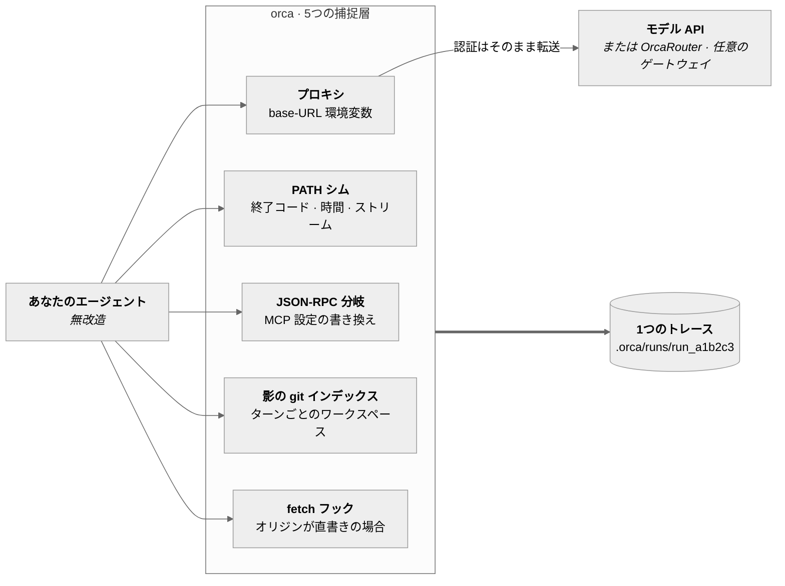
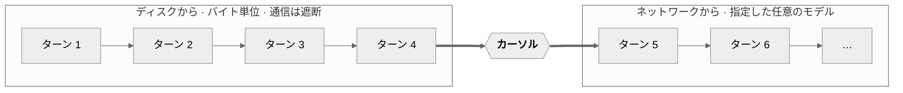

# OrcaReplay

<sub>[English](../../README.md) · [简体中文](README.zh-CN.md) · **日本語** · [한국어](README.ko.md) · [Deutsch](README.de.md) · [Français](README.fr.md) · [Español](README.es.md) · [العربية](README.ar.md)</sub>

### 午前2時、エージェントが何かを壊した。午前9時、そのまま再生する——完全に、オフラインで、何度でも。

あらゆるコーディングエージェントを記録する。ネットワークを切ったままバイト単位で再現する。任意のステップから
別のモデルへ分岐させ、どちらが正解にたどり着くかを見る。

<a href="https://www.orcarouter.ai">
  
</a>

**[OrcaRouter](https://www.orcarouter.ai) を作っているチームによる開発**——APIキー1つ、エンドポイント1つで
Claude、GPT、Gemini、Grok、DeepSeek、Qwen ほかに届く。`orca setup` が既定で指すのがこれで、
`orca compare` がプロバイダ4社のアカウントではなくコマンド1本で済む理由でもある。

[全モデル](https://www.orcarouter.ai/models) · [OrcaCode Review](https://www.orcarouter.ai/code-review) · [X](https://x.com/OrcaRouter) · [Hugging Face](https://huggingface.co/orcarouter)

<br clear="left">

[](../../LICENSE)
[](../../spec/orca-trace-v0.md)
[](#インストール)
[](#インストール)
[](../good-first-issues.md)


<sup>ひとつのセッションから採った実際の出力——Claude Code の実行を記録し、ネットワークを切って再生し、
チェックポイント4から2つのモデルへ分岐させ、`npx tsc --noEmit` で採点した。演出は一切ない。</sup>

## 3つのコマンドで試す

```console
orca record claude              # あなたのエージェントを、そのまま、いつもどおりに
orca replay last                # 同じ実行をもう一度——通信なし、トークンなし、課金なし
orca replay last --from 4 --model claude-haiku-4-5 --ui
```

人が留まる理由は3行目にある。同じファイル、同じ会話の前半、ステップ4から先だけ別のモデル。
変数はモデルだけ——だからこそ答えに意味が出る。

npm 未公開——[ソースからインストール](#インストール)、1分ほど。

## なぜ作ったのか

いまのエージェントのデバッグは考古学に近い。ターミナルをさかのぼり、再実行すると別の失敗が出て、
他人のハーネスに print を足す。既存のツールはオブザーバビリティのツールだ。この実行は 4.12 ドルで
61k トークンでした、と教えてくれる——だがそれは知りたいことではない。知りたいのは
*なぜマイグレーションファイルを消したのか* だ。

OrcaReplay の答えは、その実行そのものを返すことだ。

|  | オブザーバビリティ製品 | OrcaReplay |
|---|---|---|
| 実行のコストを教える | ✅ | ✅ |
| どのツール呼び出しがファイルを消したか教える | ときどき | ✅ |
| もう一度実行して同じ答えを出す | ❌ | ✅ オフラインでバイト単位に |
| モデルを変えてステップ4からやり直せる | ❌ | ✅ |
| エージェントの改造が必要 | たいてい SDK でラップ | ❌ 環境変数2つ |
| ターミナルを閉じたあとも使える | ❌ | ✅ ファイルだから |
| モデル API の外側まで見える——シェルの終了コード、ファイル書き込み | ❌ | ✅ 毎ターン |
| 向き先の API エンドポイントを持たないエージェントを記録できる | ❌ | ✅ 明示的に `--tls-intercept` |

最後の2行は、SDK でラップする方式では構造上たどり着けない。捕捉はエージェントの**下**——プロセスと
ソケットの境界——で起きるので、そのエージェントが自分のものかどうか、書き換えられるかどうか、そもそも
API キーを持っているかどうかは関係ない。ChatGPT サブスクリプションでサインインした Codex CLI は自前の
バックエンドと TLS で話し、向き先にできる base URL を持たないが、orca はそれでも記録できる。
[ハーネスが向きを変えてくれないとき](#ハーネスが向きを変えてくれないとき)を参照。

## 仕組み

モデル API はステートレスなので、エージェントは毎ターン会話全体を送り直す——前のターンのツール結果も含めて。
**したがってモデルの手前に置いたプロキシはループ全体を見ている**——各リクエスト、各ストリーミング応答、
モデルが発したすべてのツール呼び出し、そしてハーネスが返したすべてのツール結果を。
この性質ひとつの上にツール全体が乗っており、**OrcaReplay がエージェントに手を入れない**理由でもある。
ローカルプロキシを立て、環境変数を2つ設定し、あとは道を空ける。

プロトコルからは見えないものを捕まえる層があと3つある。終了コード、実際の所要時間、
どちらのストリームから出たバイトか、そして誰にも告げずに書かれたファイル。5つ目は、base-URL 変数を
まったく読まないエージェントのためにある——下の「どのエージェントが使えるか」を参照。



4層はすべて同じタイムラインに落ちる。並び順は orca が読んだ順ではなく、実際に起きた順だ。

### 完全再生・分岐・比較は同じひとつのもの

3つのサブシステムではない。**カーソル**を持ったひとつのプロキシだ。カーソルとは、
記録されたストリーム上で、ディスクから答えるのをやめてネットワークから答え始める位置のこと。



| コマンド | カーソルの位置 | 得られるもの |
|---|---|---|
| `orca replay last` | 末尾 | 実行まるごともう一度、**通信は遮断**——トークンも課金もばらつきもなし |
| `orca replay last --from 4 --model X` | チェックポイント4 | 4までは同一、その先は別のモデルが引き継ぐ |
| `orca compare last --from 4 --models a,b` | チェックポイント4を複数回 | 1枚の表、変数はひとつ——モデル |

**チェックポイント**は記録されるものではなく*導出*される。会話の前半が揃っていて、かつワークスペースの
スナップショットがある位置のことだ。だからどの分岐も、確かに存在した状態から始まる。

## 実際のバグ追跡はこう見える

エージェントは失敗する認証テストを直すはずだった。終了コードは0、なのにテストはまだ落ちている。
まずは実際に何をしたのかを見る:

```console
$ orca show last
run_6473f858b59e  generic-openai@0.1.0  14 events  exit 0

SEQ  KIND   WHAT                                            DETAIL
0    RUN    run started                                     generic-openai
1    SNAP   tree 919d32ba037537b43814c83779963b2cc3023db7   0 changed
2    MODEL  claude-opus-5                                   1 messages
3    MODEL  claude-opus-5                                   stop: tool_use · 100 in · 20 out
4    TOOL   edit_file                                       {"path":"auth.ts",…}
5    SNAP   tree c6af62b75c0c8b8938bd6087328b5148f3dcd534   1 changed
6    FILE   auth.ts                                         modified +1 −3
7    TOOL   edit_file                                       ok
8    MODEL  claude-opus-5                                   3 messages
9    MODEL  claude-opus-5                                   stop: end_turn · 101 in · 5 out
10   SNAP   tree c6af62b75c0c8b8938bd6087328b5148f3dcd534   0 changed
11   SHELL  ["sh","-c","node --check nonexistent-file.ts"]  /tmp/hunt
12   SHELL  shell result                                    exit 1 · 43ms
13   RUN    run ended                                       exit 0

info usage input=201 output=25 cost=$0.004890
```

モデル自身の記録では分からず、実行の終了コードが覆い隠していた事実が3つ。ファイルは確かに変わった
（seq 6、`+1 −3`）、エージェントが走らせた確認は**失敗していた**（seq 12、`exit 1`）、
それでも終わりにした。実行が0で終わったのは、*エージェント*が0で終わったからにすぎない。

この最後の事実は、それ専用のコマンドに値します。`orca show` は物事が起きた順序を示し、
`orca graph` は何が何を生んだかを示します。

```console
$ orca graph last
FROM              TO               KIND      WHY
3 model.response  4 tool.call      recorded  tool_use block in the response
4 tool.call       6 fs.change      inferred  changed path appears in tool input, same or previous turn
4 tool.call       7 tool.result    recorded  tool result answers its call
7 tool.result     8 model.request  recorded  tool_result block in the request

  1 inferred — derived from this trace, not recorded in it
```

辺には二種類あり、その違いが重要です。**recorded** の辺は実行時に書かれたもので、`tool_use`
ブロックはそれを発行したレスポンスの中に物理的に入っているからです。**inferred** の辺は、
名前の付いた規則によって今この場で導出されたものです——ファイルシステムのスナップショットは
ツール呼び出しごとではなくターンごとに一度取られるので、ファイル変更を*特定の*呼び出しに
帰属させるのは、良い推測ではあっても事実ではありません。推論された辺が trace に書き戻される
ことは決してありません。チェックポイントが導出され記録されないのと同じです。

`orca export last --card bug.svg` はその連鎖を issue に貼れる絵として描き、`--graph-card` は
実行全体をその連鎖を強調して描きます。

SVG は GitHub の issue では表示されますが、それ以外の重要な場所ではほとんど表示されません——
X はアップロードとして受け付けず、Slack や Discord はプレビューを出しません。ですからファイル名を
`.png` にすれば PNG が、`.gif` にすれば一ホップずつ組み上がる GIF が得られます。この経路には
ブラウザが必要ですが、orca はブラウザに依存しません。`docs/media/README.md` は描画ツールを
`package.json` の外に置いており、`npm ci` を実行する人が Chromium のダウンロードを負担しないため
です。無い場合、orca はそれを直す一行を提示します。`orca doctor` はいずれにせよ報告し、`.svg`
は何も必要としません。

```console
orca export last --card bug.png       # the chain, ready to post
orca export last --card bug.gif       # the same chain, one hop per frame
npm i --no-save playwright-core pngjs gifenc   # only needed for the two above
```

あとは好きなだけ、無料で再現できる:

```console
$ orca replay last
info replay.done reused=2/2 exact=2 divergences=0 unmatched=0 exit=0
```

通信なし、トークンなし、ばらつきなし。そのうえで本当に訊きたいことを訊く——
*別のモデルなら正解できたのか？*

```console
$ orca compare last --from 5 --models claude-opus-5,claude-haiku-4-5 --verify "npm test"
MODEL             VERDICT  TOKENS  COST       WALL  RUN
claude-opus-5     pass     201/25  $0.004890  0.3s  run_1457b35062ba
claude-haiku-4-5  pass     201/25  $0.000326  0.3s  run_b8ee08479fb6
```

どちらも通った。片方は **15分の1** の費用で。同じファイル、同じ会話の前半、同じチェックポイント——
変わったのはモデルだけで、だからこそその数字に意味がある。

## タイムライン

`orca replay last --ui`（または `orca ui`）は、実行を自己完結した1つの HTML ファイルとして開く。
常駐サーバも、通信も、インストールも要らない。絞り込み、ステップ実行、あるいはスペースキーを押せば
当時の速度で再生される。


すべての層が同じタイムラインに乗るので、実行を4つではなく1つの物語として読める。モデルの各ターンと
トークン数、各ツール呼び出しの引数と結果、シェルコマンドの終了コードと所要時間、
そしてファイルシステムの変更と、そこから生まれたツリー。

`orca export last -o bug.html` はそのページを1ファイルに書き出し、issue に添付できる。
外部参照を一切含まない——CI がそれを検証している——ので、ダウンロードフォルダでも、機内でも、
5年後でも開く。

## 同じ課題、違うモデル

`orca compare` は記録された1つの実行を、同じチェックポイントから、同じファイルと同じ会話の前半のまま
複数モデルへ分岐させ、指定したコマンドでそれぞれを採点する。変数はモデルだけ——だから答えに意味が出る。


```console
orca compare last --from 4 \
  --models claude-sonnet-5,claude-haiku-4-5 \
  --verify "npm test" \
  --share verdict.svg          # 上のカード、issue にそのまま貼れる
```

### 複数モデルへ向ける

モデルを比べるとは複数のプロバイダに届くということで、それを手でやるには `--upstream-anthropic` と
`--upstream-openai` の存在、1つのゲートウェイが両方の形式を扱えること、キーをどこに置くかを
知っている必要がある。どれも実在するが、どれも発見しようがない。だから訊いてくれるコマンドがある:

```console
$ orca setup
Gateway URL (serves the model APIs) [https://api.orcarouter.ai]:
  get a key at https://www.orcarouter.ai/console/token — OrcaRouter keys start sk-orca-
API key (stored 0600; leave blank for none):
  info config.saved path=~/.config/orca/config.json mode=0600 gateway=https://api.orcarouter.ai auth=stored

  6 models available:
    anthropic/claude-opus-5
    anthropic/claude-haiku-4-5
    openai/gpt-5.2
    ...

$ orca models
MODEL                      $/MTOK IN  $/MTOK OUT
anthropic/claude-opus-5    15         75
anthropic/claude-haiku-4-5 1          5
openai/gpt-5.2             1.25       10
some-local-model           —          —
```

`orca setup` はファイルを書くだけでなく、そのゲートウェイが実際に何を提供しているかを訊く。
URL の間違いや失効したキーは、比較の途中で 401 になるのではなく、その場で答えが出る。
選んだモデルも保存するので、以降 `orca compare last --verify "npm test"` にはモデル一覧も
上流フラグも要らない。`orca models` は認識できたモデルにだけ価格を付け、そうでないものにはダッシュを置く。
未知のモデルに数字をでっち上げることこそ、比較表が実在しないコストを載せてしまう経路だからだ。

[**OrcaRouter**](https://www.orcarouter.ai) は最初の問いの既定の答えだ——Enter を押せば、
origin 1つとキー1つで Claude、GPT、Gemini、Grok、DeepSeek、Qwen ほかに届く。`orca compare` が
求めている形そのものだ。モデル id はプロバイダで名前空間が付く
（`anthropic/claude-sonnet-4.6`、`openai/gpt-4o-mini`）が、orca はそれを扱える。
名前空間が通信形式を選び、価格計算の前に取り除かれる。

これは*既定値*であって目的地ではない。上書きするか `--gateway <url>` を渡せば、
OpenAI 互換の `/v1/models` とチャットエンドポイントを話すものなら何でも同じように動く——
別のホスト型ゲートウェイでも、自分で動かしているものでも。

そして既定値であるのは、**あなたが**どこかへ送ると決めたトラフィックに対してだけだ。ゲートウェイ未設定なら
`orca record` はエージェント自身の通信を、もともと話していた相手へ、エージェント自身のキーで
そのまま中継する。設定していない記録を orca が勝手に迂回させることはない。
それは録画ボタンを押した副作用としてソースコードを第三者へ送ることになるからだ。

非対話: `orca setup --key <k>` は既定を採り、`orca setup --gateway <url> --key <k>` は別を指定し、
`--key-env <VAR>` は資格情報をディスクに置かず環境変数から読む。

キーがトレースに入ることはない。付くのは送信リクエストだけで、記録される内容は**受信**リクエストから
認証を取り除いて構成される。つまり誰かが規則を覚えているからではなく、構造上、記録には見えない。
フラグによって発行元以外のゲートウェイへ送られる場合は、キーは完全に差し止められる。

## どのエージェントが使えるか

ハーネスを記録できるかどうかは二つで決まります。プロキシに向けられるかどうかと、届いた通信の
ワイヤ形式を orca が理解できるかどうかです。

| エージェント | 捕捉の仕方 | 状態 |
|---|---|---|
| **Claude Code** | `ANTHROPIC_BASE_URL` | 動作——実際のバグ修正で検証済み。[詳細](../validation.md) |
| **Codex CLI**（API キー） | `OPENAI_BASE_URL` → Responses API | 動作 |
| **Codex CLI**（ChatGPT ログイン） | `--tls-intercept` → Responses API | 動作。ただし自分で決めることがひとつあります |
| **OpenAI Agents SDK** | `OPENAI_BASE_URL` → Responses API | 動作 |
| **Vercel AI SDK** | fetch フック——`orca record node -- node app.mjs` | 動作 |
| **LangGraph / LangChain** | `OPENAI_BASE_URL`、`ANTHROPIC_BASE_URL` | 動くはず——公式クライアント経由だが、ここにはまだテストがない |
| **grok-cli**（Telegram bot も） | `orca record grok`——`GROK_BASE_URL` に加えてサブエージェント用の fetch フック | 動作 |
| **OpenClaw** | `orca record openclaw`——ゲートウェイ自身はフック、起動される側は継承した変数 | 動作 |
| **opencode** | `orca record opencode` | アダプタあり。両方のオリジンを向け替える |
| **Hermes**（Nous Research） | `ORCA_BASE_URL_VARS=… orca record generic-openai -- hermes …` | 動くはず——プロバイダごとに上書きする。下記参照 |
| **それ以外** | `orca record generic-openai -- <cmd>` | base-URL 変数を読むなら動作。読まないなら `orca record node -- <cmd>` |

実際のハーネスに対して端から端まで走らせたのは Claude Code だけです。ほかはアダプタ契約と
フィクスチャで担保しています。フィクスチャは各アダプタが実際にどの変数を設定するかを記録するので、
ハーネスが読む変数名を変えたときに赤くなるのはチェックであって、空の trace ではありません。

このうち二つは環境変数だけでは足りません。コマンドを選ぶ前に知っておく価値があります。

**Responses API を話すハーネス。** OpenAI Agents SDK と Codex CLI はどちらも chat completions では
なく `/v1/responses` を既定で使います。orca はこれを理解するので特別な操作は要りません——ただし
それ以前のビルドを使っている場合、症状は「trace が足りない」ではなく、エージェントが最初のターンで
`404` を受け取ることでした。

**base-URL 変数をまったく読まないハーネス。** `@ai-sdk/openai` はコンストラクタ引数でしかオリジンを
受け取らないので、Vercel AI SDK 製のエージェントは `orca record` の下で問題なく走り、終了コード 0 で
終わり、trace は空になります。`node` アダプタはまさにそのためのものです。実行ディレクトリに小さな
プリロードを書き、`NODE_OPTIONS` をそこに向け、許可リストにあるプロバイダのホストにだけ
`globalThis.fetch` を向け替えます。

```console
orca record node -- node agent.mjs
orca record node -- npm run agent
ORCA_INSTRUMENT_HOSTS='contoso.openai.azure.com' orca record node -- node agent.mjs
```

既定ではなく別のアダプタにしてあるのは、`NODE_OPTIONS` がエージェントの起こすすべての Node
プロセスに伝わるからです。必要だと分かっているときには払う価値のある代償ですが、Python の
ハーネスを記録している人に押し付けるものではありません。

Bun は `NODE_OPTIONS` を受け取りますが、その中の `--require` は無視します。そこで
`BUN_OPTIONS=--preload` も併せて設定してあり、Bun 製のエージェントも同じように捕捉できます。これは
実際の `bun` で確かめてあります。防いでいるのが「フックが動かず、通信がそのままプロバイダへ行き、
何も記録されない」という声を上げない失敗だからです。

**それでも trace が空だったときは**、`orca record` はきれいに終了せず、はっきりそう言います。

```console
warn capture.empty exchanges=0 cause="the agent never called the proxy — it may not read a base-URL variable" set=ANTHROPIC_BASE_URL,OPENAI_API_BASE,OPENAI_BASE_URL next="orca doctor"
```

**orca が知らない base-URL 変数。** 列挙は不可能です。Hermes 一つの `.env.example` にすら
`NOVITA_BASE_URL`、`GLM_BASE_URL`、`KIMI_BASE_URL`、`MINIMAX_BASE_URL`、`HF_BASE_URL`、
`NEBIUS_BASE_URL` ほか十数個があります。orca に焼き込んだ一覧は翌週には古びるので、代わりに変数名を
渡してください。

```console
ORCA_BASE_URL_VARS='OPENROUTER_BASE_URL' orca record generic-openai -- hermes
ORCA_BASE_URL_VARS='GLM_BASE_URL,KIMI_BASE_URL' orca record generic-openai -- my-agent
```

各名前はプロキシに `/v1` を付けて向けられます。OpenAI 互換の上書きが求める形です。`=<path>` で
変更でき、`=/` なら素のオリジンになります。

**コーディングエージェントを起動するゲートウェイ。** OpenClaw 自身はコードを書かず、Claude Code や
Codex、opencode を子プロセスとして起動します。ゲートウェイ自身の通信は fetch フックが、起動された
エージェントの通信は通常の環境変数が捕まえます——OpenClaw がそれを読むからではなく、**子プロセスが
親の環境を継承する**からです。これは orca ではなく OS の性質なので、テストが見張っています。

## ハーネスが向きを変えてくれないとき

base-URL の注入は、base-URL 変数を読むあらゆるハーネスを捕捉する——ほとんどがそうだ。ChatGPT サブスクリプションで
サインインした Codex CLI はどれも読まない。自前のバックエンドと TLS で話すので、orca には何も見えない。
`--tls-intercept` がその答えであり、認証局を発行する以上、意図的に別個の判断として切り出してある。

```console
orca record codex --tls-intercept
orca record codex --tls-intercept --tls-hosts 'api.openai.com,*.chatgpt.com'
```

CA はその実行だけのもので、orca が起動したエージェントだけが——その子プロセス自身の環境を通して、
システムやブラウザのトラストストアには決して触れず——信頼し、実行の終了時に削除される。
orca がどこかへインストールしようと申し出ることはない。許可リスト外のホストは読まずにトンネルされ、
アドレスとバイト数だけが記録される。パスも本文もない。orca が平文を持たなかったからだ。
すべてを傍受せよという要求は、応えるのではなく拒否される。

そこから返ってくるのはログの1行ではない。傍受されたリクエストは他と同じ wire dialect で解析され、
ごく普通の交換としてトレースに収まる——オフラインで再生でき、別のモデルに分岐でき、しかもその実行に
あなたの API キーは一度も入っていない。

`orca replay --model`、`orca fork`、`orca compare` でも同じように働く。同じ理由で実際のエージェントを
起動するからだ。

## エージェント、スクリプト、CI のために

trace はファイルです——これは observability のダッシュボードにはできない唯一のことです。だから失敗した
実行についていちばん役に立つ問いは、**エージェント**が発せる問いです。*直前の実行を再生して、どこが
ずれたか教えて。* すべてのコマンドがデータで答え、orca は自分自身を MCP で提供します。

```console
$ orca replay last --json
{"runId":"run_a278eea7b535","mode":"exact","traceRunId":"run_687e3f84b208","matchedExact":2,"divergences":0,"unmatched":0,"liveCalls":0,"exitCode":0}

$ orca show last --json | jq '.events[] | select(.kind == "TOOL")'
$ orca checkpoints last --json | jq '.[-1].seq'
```

stdout には JSON ドキュメントがひとつだけ、診断は stderr——記録中のエージェント自身の出力も stderr に
回すので、実行が喋っている間もドキュメントは壊れません。失敗も JSON で返り、終了コードは非ゼロです。
`--json` は `list`、`show`、`events`、`checkpoints`、`graph`、`record`、`replay`、`compare`、`doctor` に対応します。

**ツールとして。** `orca mcp` は stdio 経由で trace ストアをエージェントに渡します。

```json
{ "mcpServers": { "orca": { "command": "orca", "args": ["mcp"] } } }
```

`orca_list_runs`、`orca_show_run`、`orca_checkpoints`、`orca_graph`、`orca_replay`、`orca_compare`。再生は無料で
オフラインです。`orca_compare` は自分の説明文の中で「実際にトークンを使う」と明言しています。ツールを
選ぶモデルが読むのはその文字列だけだからです。

**コードから**、シェルを経由したくない場合は：

```ts
import { Orca } from 'orcareplay';

const orca = new Orca({ cwd: process.cwd() });
const { unmatched, divergences } = await orca.replay('last');
const timeline = await orca.show('last');
```

あなたの stdout には決して書きませんし、`process.exit` も呼びません——どちらもテストで守っています。
そのどちらかをするライブラリは、誰もその上に何かを build できないからです。

## 現状

まだ初期段階。`v0` は上の3コマンドの「歩ける骨格」だ。

| 機能 | 状態 |
|---|---|
| トレース形式 v0 + JSON Schema | 動作 |
| Anthropic / OpenAI 互換のモデル捕捉 | 動作 |
| OpenAI Responses API の捕捉 | 動作——OpenAI Agents SDK と Codex CLI が既定で使う形式。記録・オフライン再生・分岐に対応し、分岐はエージェントが話すワイヤ形式のまま |
| base-URL 変数を読まないエージェント | 動作——`orca record node -- <cmd>` が実行ディレクトリにプリロードを書き、許可リストのプロバイダホストにだけ `globalThis.fetch` を向け替える。Bun は `NODE_OPTIONS` の `--require` を無視するので Node と Bun の両方に対応。Vercel AI SDK のエージェントはこれで捕捉する |
| orca が読めない呼び出し | 動作——拒否せず転送し、`net.request` / `net.response` として記録する。証拠であって、再生できるターンではない。何も捕捉できなかった記録は、きれいに終了せず警告する |
| 機械可読な出力（`--json`） | 動作——stdout に JSON ドキュメント一つ、診断は stderr、失敗も JSON |
| 因果グラフ（`orca graph`） | 動作——何が何を生んだかを、表または JSON で。各辺は trace が記録したものか orca が今導出したものかを述べ、どちらの場合も規則を名指しする。`--to N` である事象を生んだ連鎖に絞る |
| 共有できるカード | 動作——`orca export --card` は一本の因果連鎖を、`--graph-card` は実行全体をその連鎖を強調して、`compare --share` は判定表を描く。`.svg` は常に、`.png` と `.gif` は任意の描画ツールがあるとき。`orca doctor` が報告し、`npm ci` は決して入れない |
| MCP サーバ（`orca mcp`） | 動作——stdio で六つのツール。エージェントが自分の実行記録を読んで再生できる |
| プログラム API（`Orca`） | 動作——コマンドはこれが返すものを描画するだけなので、端末は唯一の事実のひとつのビュー |
| 差分報告つきの完全再生 | 動作——記録されたファイルシステムを作業ツリーに復元し、終了後に戻す。`--worktree` で使い捨てコピー、`--in-place` で復元なし。再生が*発見*したこと（差分、未一致リクエスト）を記録する自前の run を書き、単に繰り返しただけの部分は親を指す。`--no-trace` で省略 |
| チェックポイントからの分岐再生 | 動作——分岐は自身のファイルシステムスナップショットを記録するので、それ自体をさらに分岐できる |
| モデル横断の比較 | 動作——`orca setup` がゲートウェイ（既定は OrcaRouter、指定すれば任意の URL）、キー、モデル一覧を保存するので `orca compare` にフラグは要らない |
| ファイルシステムのスナップショットと差分 | 動作 |
| 単一ファイル HTML 書き出し | 動作 |
| MCP 呼び出しの記録 | 動作——`--mcp-config <path>` で有効化。再生と分岐は記録時に使った設定から再度計測するので、この層は分岐点で止まらない |
| 事後の除去（`orca scrub`） | 動作 |
| シェル捕捉（`PATH` シム） | 動作——終了コード、所要時間、stdout/stderr の分離。`--no-shell` で省略 |
| モデル以外の通信捕捉 | 動作——`--tls-intercept` で有効化。起動したエージェントだけが信頼する実行ごとの CA を発行し、許可リストのホストを復号し、残りは読まずにトンネルし、終了時に鍵を削除 |
| 実在のエージェントで検証済み | Claude Code が実際のバグを実際に直した一本を、録画し、完全にオフラインで再生し、チェックポイントから分岐させ、書き出した。その過程で四つのバグが見つかり、すべて修正済み————[実在のエージェントが見つけたもの](../validation.md) |
| サブスクリプション認証のハーネス | Claude Code は動作。ChatGPT サブスクリプションの Codex CLI は自前のバックエンドと話し base-URL 変数を読まないので `--tls-intercept` が要る |

## インストール

npm 未公開——パッケージはビルドも検証も済んでいるが公開はしていないので、今日のところはソースから:

```console
git clone https://github.com/Continuum-AI-Corp/OrcaReplay && cd OrcaReplay
npm ci && npm run build
npm install -g ./packages/cli     # `orca`（と `orcareplay`）を PATH に置く
orca doctor                       # node、git、見つかるエージェントを確認する
```

リポジトリのルートで `npm install -g .` しても何も入らない。ルートは自前のバイナリを持たない
workspace で、`orca` は `packages/cli` にある。

`v0` が公開された瞬間、インストールは `npx orcareplay doctor` だけになり、この節もそう書き換わる。
リリースはタグ起動のゲート付きワークフローだ——[`RELEASING.md`](../../RELEASING.md) を参照。

**実行には Node 20+**（CLI 自身の `engines` は `>=20.0.0`）。開発に参加するには
`^20.19.0 || >=22.12.0` が要る。テスト用ツールチェーンがそうだからで、ルートの `package.json` が
それを別途宣言しているので `npm ci` が先に教えてくれる。アカウントもサインアップも、
API キーの変更も不要。

## 記録はどこに保存されるか

すべては**記録したプロジェクトの中の `.orca/runs/`** に落ちる。プロジェクトごとで、グローバルな
保管場所は決して使わない。だからトレースは、それが属するチェックアウトと一緒に移動する。
1つの run ディレクトリは、それだけで自分を説明する:

```
.orca/
  .gitignore          # 中身は `*` だけ——保管場所が自分を除外するので、トレースを誤ってコミットできない
  runs/run_d0a2ee7ce615/
    manifest.json     # 誰が、いつ、どのアダプタで、git コミット、各種の数、完全性ダイジェスト
    events.jsonl      # タイムライン、1行1 JSON オブジェクト、追記のみ
    blobs/            # 4 KB を超えるペイロードを内容アドレスで保存、重複排除つき
    fs/               # 影の git インデックス：各ターンのワークスペース
    shell-frames.jsonl
    redactions.json   # 何が取り除かれたかを規則と件数で——値そのものは決して残さない
```

過去のセッションを探す:

```console
orca list                       # ここにあるすべての run、新しい順、分岐元つき
orca show run_d0a2ee7ce615      # ターミナルでのタイムライン
orca replay last                # `last` = 最新の記録（再生トレースは飛ばす）
orca replay run_d0a2ee7ce615    # あるいは名指しで
orca gc --older-than 7d --dry-run   # 何が回収されるかを、実行の前に
```

`orca list` は run ディレクトリを直接読むので、誰かから送られてきたトレースでも動く。
`.orca/runs/` に置けばすべてのコマンドから見える。索引はなく、壊れるデータベースもない。

## プライバシー

トレースはローカル、モード `0600`、レコーダ自身はネットワーク接続を一切しない。秘密情報は書き込み経路で
除去される。環境変数の捕捉は既定で拒否、認証ヘッダは決して書かず、既知の鍵の形と高エントロピー文字列は
安定したプレースホルダに置き換わる。

除去はベストエフォートの緩和策であって保証ではない。**トレースは機微なものとして扱うこと**——
だいたいシェル履歴とヒープダンプを足したくらいだと思えばよい。

```console
orca export last -o bug.html          # 何を書き出そうとしているか、先に表示する
orca scrub last --match my-hostname   # 事後に何かを取り除く
```

`orca scrub` は `events.jsonl`、manifest、すべてのテキスト blob を書き換え、標準の検出器を再実行し、
完全性ダイジェストを更新し、バイナリ blob はバイト単位で不変のまま残す。

ファイルシステムのスナップショットは書き換えられない。git オブジェクトは自身の内容のハッシュで
アドレスされるので、1つ直せば id が変わり、それを指すすべてのツリーが書き換わり、
さらにそのツリーを指すすべてのイベントも書き換わる——失敗すれば復元できない run が残る、歴史の改変だ。
だから scrub はスナップショット保管庫を*検索*し、あなたの文字列がまだそこにあるなら、そう伝える。
掃除できなかったトレースを「きれい」と報告することはしない。`--drop-fs` は保管庫ごと削除する。
代償はその run を分岐できなくなることだ。

## 何が開かれていて、何がそうでないか

常に開いていて Apache-2.0：トレース形式、core、CLI、ビューア、アダプタ、そして provider インターフェース。

OrcaReplay は [OrcaRouter](https://www.orcarouter.ai) を作っている人たちの手によるもので、
それが表に出るのはただ1か所——ゲートウェイを指定しなかったとき `orca setup` がそれを提案する。
これはあなたが答えると決めた問いに対する、見えて上書きできる既定値であって、
何かが勝手に取る経路ではない。モデルへの経路はどれも、どこへでも向けられるただの URL のままで、
その origin を他と違う扱いにするコード経路は存在しない。

ベンダーが得られないのは**特権**だ。プラグインは——OrcaRouter のものも含めて——
`@orcareplay/plugin-api` の公開 `Provider` インターフェースしか使えず、その裏に私的 API はない。
ベンダー製プラグインはまだ存在しないので、これを強制する CI ジョブ（`scripts/check-neutrality.mjs`）は
その旨を述べて no-op として通る。ひとつ現れた瞬間から、workspace のソースではなく公開パッケージに対して
ビルドし始める。将来プラグインが何らかの機能を必要とするなら、その機能はまず公開インターフェースに入り、
特定ベンダーの形に合わせていないことを示す2つ目の実装が伴う。

## ドキュメント

**いま問題を抱えているなら、ここから:**

- [エージェントが何かを壊した。原因をどう突き止める？](../how-to/debug-a-failing-agent-run.md)
- [なぜエージェントはあのファイルを消したのか？](../how-to/why-did-my-agent-delete-my-file.md)
- [別のモデルなら正解できたのか？](../how-to/compare-models-on-the-same-failure.md)

**リファレンス:**

- [`spec/orca-trace-v0.md`](../../spec/orca-trace-v0.md) — 規範としてのトレース形式
- [`docs/architecture.md`](../architecture.md) — 捕捉・再生・分岐の実際の動き
- [`docs/validation.md`](../validation.md) — 実在のエージェントに初めて当てたとき何が壊れたか
- [`docs/launch-path.md`](../launch-path.md) — できていること、できていないこと、次にやること
- [`docs/plugins.md`](../plugins.md) — アダプタや provider の書き方
- [`CONTRIBUTING.md`](../../CONTRIBUTING.md) — 5分の開発ループ
- [Good first issues](../good-first-issues.md) — 12件、着手するファイル付き

## 手を貸してほしいこと

形式は v0、歩ける骨格は動く——プロジェクトの人生でいちばん面白い時点だ。決定はまだ安く変えられ、
着手するファイルまで書き出された明らかな作業が山ほどある。

- **[12件の good first issue](../good-first-issues.md)**、それぞれファイルとテストを名指ししてある。
- **アダプタを書く。** 1ファイル、1フィクスチャ。ハーネスが base-URL 変数を読むなら20行ほど——
  [docs/plugins.md](../plugins.md)。
- **リーダーを別言語で実装する。** 仕様が CC BY 4.0 なのは意図的。Python のリーダーはもうある。
  Go と Rust は空いている。
- **再生を壊す。** マッチングの梯子がこのツールの心臓で、それを改善する最短経路は、
  それが取り違える実際の記録だ。`orca export last -o bug.html` を添えて issue を立ててほしい——
  自己完結した1ファイルで、先に抜いておきたいものには `orca scrub` がある。

午後をひとつ節約できたなら、⭐ が他の人に見つけてもらう助けになる。

## ライセンス

コードは Apache-2.0。トレース仕様は CC BY 4.0 なので、誰でも再実装してよい。

---

<sub>
OrcaRouter チーム製 ·
<a href="https://www.orcarouter.ai">orcarouter.ai</a> ·
<a href="https://www.orcarouter.ai/models">全モデル</a> ·
<a href="https://www.orcarouter.ai/code-review">OrcaCode Review</a> ·
<a href="https://x.com/OrcaRouter">X</a> ·
<a href="https://huggingface.co/orcarouter">Hugging Face</a>
</sub>
