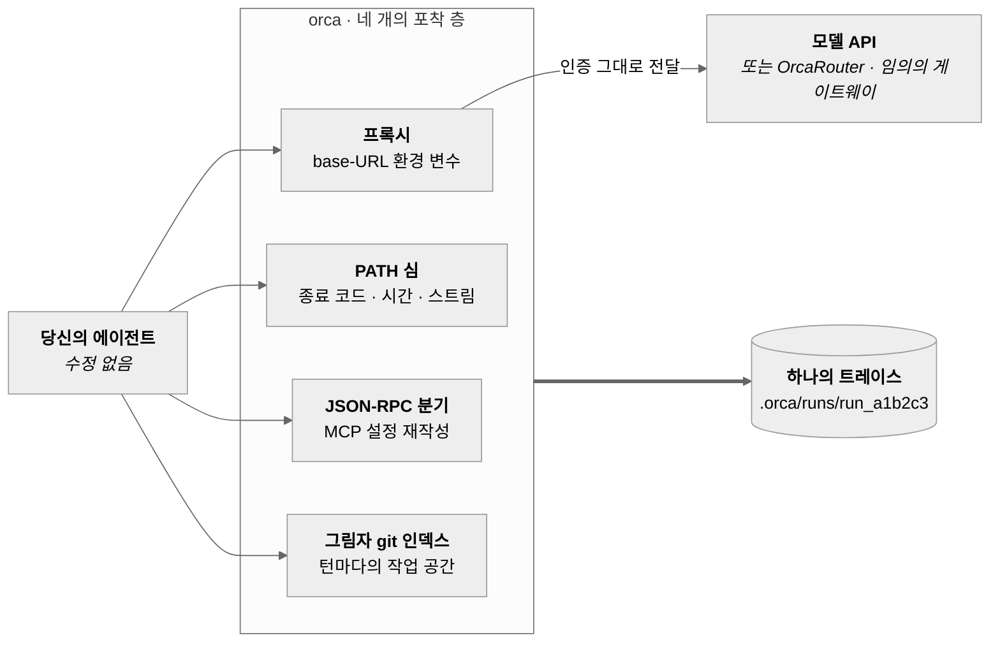
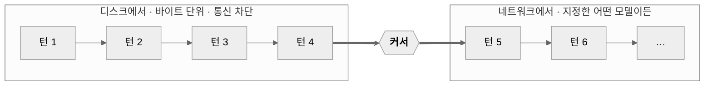

# OrcaReplay

<sub>[English](../../README.md) · [简体中文](README.zh-CN.md) · [日本語](README.ja.md) · **한국어** · [Deutsch](README.de.md) · [Français](README.fr.md) · [Español](README.es.md) · [العربية](README.ar.md)</sub>

### 새벽 2시에 에이전트가 뭔가를 망가뜨렸다. 아침 9시에 그대로 재생하라 — 정확하게, 오프라인으로, 몇 번이든.

어떤 코딩 에이전트든 기록한다. 네트워크를 끈 채 바이트 단위로 재현한다. 임의의 단계에서 다른 모델로
분기시켜 누가 맞히는지 본다.

<a href="https://www.orcarouter.ai">
  
</a>

**[OrcaRouter](https://www.orcarouter.ai)를 만드는 팀이 만들었다** — API 키 하나, 엔드포인트 하나로
Claude, GPT, Gemini, Grok, DeepSeek, Qwen 등에 닿는다. `orca setup`이 기본으로 가리키는 곳이고,
`orca compare`가 공급자 계정 네 개가 아니라 명령 하나면 되는 이유다.

[전체 모델](https://www.orcarouter.ai/models) · [OrcaCode Review](https://www.orcarouter.ai/code-review) · [X](https://x.com/OrcaRouter) · [Hugging Face](https://huggingface.co/orcarouter)

<br clear="left">

[](../../LICENSE)
[](../../spec/orca-trace-v0.md)
[](#install)
[](#install)
[](../good-first-issues.md)


<sup>한 세션에서 나온 실제 출력 — Claude Code 실행을 기록하고, 네트워크를 끄고 재생한 뒤,
체크포인트 4에서 두 모델로 분기시켜 `npx tsc --noEmit`로 채점했다. 연출은 하나도 없다.</sup>

## 세 개의 명령으로 시작하기

```console
orca record claude              # 당신의 에이전트를, 손대지 않은 채, 하던 대로
orca replay last                # 같은 실행을 한 번 더 — 통신 없음, 토큰 없음, 과금 없음
orca replay last --from 4 --model claude-haiku-4-5 --ui
```

사람들이 머무는 이유는 세 번째 줄이다. 같은 파일, 같은 대화 앞부분, 4단계부터만 다른 모델.
변수는 모델 하나뿐이고, 그래서 답에 의미가 생긴다.

아직 npm에 없다 — [소스에서 설치](#install), 1분쯤 걸린다.

## 왜 만들었나

오늘날 에이전트 디버깅은 고고학에 가깝다. 터미널을 거슬러 올라가고, 다시 돌리면 다른 실패가 나오고,
남의 하네스에 print를 끼워 넣는다. 존재하는 도구들은 관측 도구다. 이번 실행이 4.12달러가 들었고
61k 토큰을 썼다고 알려준다 — 그건 당신의 질문이 아니다. 당신의 질문은
*왜 내 마이그레이션 파일을 지웠는가*이다.

OrcaReplay의 답은 그 실행 자체를 돌려주는 것이다.

|  | 관측 도구 | OrcaReplay |
|---|---|---|
| 실행 비용을 알려준다 | ✅ | ✅ |
| 어느 도구 호출이 파일을 지웠는지 알려준다 | 가끔 | ✅ |
| 에이전트를 다시 돌려 같은 답을 낸다 | ❌ | ✅ 오프라인, 바이트 단위 |
| 모델을 바꿔 4단계부터 다시 돌린다 | ❌ | ✅ |
| 에이전트 개조가 필요하다 | 보통 SDK 래퍼 | ❌ 환경 변수 두 개 |
| 터미널을 닫은 뒤에도 쓸 수 있다 | ❌ | ✅ 파일이니까 |

## 어떻게 작동하나

모델 API는 상태를 갖지 않으므로, 에이전트는 매 턴 대화 전체를 다시 보낸다 — 직전 턴의 도구 결과까지.
**따라서 모델 앞에 놓인 프록시는 루프 전체를 본다**: 각 요청, 각 스트리밍 응답, 모델이 낸 모든 도구 호출,
하네스가 만든 모든 도구 결과. 도구 전체가 이 성질 하나 위에 서 있고, 그래서
**OrcaReplay는 당신의 에이전트에 손대지 않는다** — 로컬 프록시를 띄우고, 환경 변수 두 개를 설정하고,
비켜선다.

프로토콜이 볼 수 없는 것을 잡는 층이 셋 더 있다. 종료 코드, 실제 소요 시간, 어느 스트림에서 나온
바이트인지, 그리고 아무에게도 알리지 않고 쓰인 파일.



넷 모두 같은 타임라인에 놓이며, 순서는 orca가 읽은 시점이 아니라 실제로 일어난 시점을 따른다.

### 정확 재생, 분기, 비교는 하나다

세 개의 서브시스템이 아니다. **커서**를 가진 같은 프록시다. 커서란 기록된 스트림에서
디스크로 답하기를 멈추고 네트워크로 답하기 시작하는 지점이다.



| 명령 | 커서 위치 | 얻는 것 |
|---|---|---|
| `orca replay last` | 끝 | 실행 전체를 한 번 더, **통신 차단** — 토큰도 과금도 변동도 없음 |
| `orca replay last --from 4 --model X` | 체크포인트 4 | 4까지는 동일, 이후에는 다른 모델이 이어받음 |
| `orca compare last --from 4 --models a,b` | 체크포인트 4에서 여러 번 | 표 하나, 변수 하나 — 모델 |

**체크포인트**는 기록되는 것이 아니라 *도출*된다. 대화 앞부분이 온전하고 작업 공간 스냅숏이 있는
모든 지점이 그것이다. 그래서 모든 분기는 실제로 존재했음이 증명된 상태에서 시작한다.

## 실제 버그 추적은 이렇게 생겼다

에이전트는 실패하는 인증 테스트를 고쳐야 했다. 종료 코드는 0인데 테스트는 여전히 빨갛다.
먼저 실제로 무엇을 했는지 본다:

```console
$ orca show last
run_6473f858b59e  generic-openai@0.1.0  14 events  exit 0

SEQ  KIND   WHAT                                            DETAIL
0    RUN    run started                                     generic-openai
1    SNAP   tree 919d32ba037537b43814c83779963b2cc3023db7   0 changed
2    MODEL  claude-opus-5                                   1 messages
3    MODEL  claude-opus-5                                   stop: tool_use · 100 in · 20 out
4    TOOL   edit_file                                       {"path":"auth.ts",…}
5    SNAP   tree c6af62b75c0c8b8938bd6087328b5148f3dcd534   1 changed
6    FILE   auth.ts                                         modified +1 −3
7    TOOL   edit_file                                       ok
8    MODEL  claude-opus-5                                   3 messages
9    MODEL  claude-opus-5                                   stop: end_turn · 101 in · 5 out
10   SNAP   tree c6af62b75c0c8b8938bd6087328b5148f3dcd534   0 changed
11   SHELL  ["sh","-c","node --check nonexistent-file.ts"]  /tmp/hunt
12   SHELL  shell result                                    exit 1 · 43ms
13   RUN    run ended                                       exit 0

info usage input=201 output=25 cost=$0.004890
```

모델 자신의 기록으로는 알 수 없고 실행의 종료 코드가 감춰버린 사실 셋: 파일은 실제로 바뀌었고
(seq 6, `+1 −3`), 에이전트가 돌린 확인은 **실패했으며** (seq 12, `exit 1`), 그런데도 끝냈다.
실행이 0으로 끝난 건 *에이전트*가 0으로 끝났기 때문일 뿐이다.

이제 원하는 만큼, 공짜로 재현한다:

```console
$ orca replay last
info replay.done reused=2/2 exact=2 divergences=0 unmatched=0 exit=0
```

통신 없음, 토큰 없음, 변동 없음. 그다음 진짜 궁금한 것을 묻는다 — *다른 모델이었다면 맞혔을까?*

```console
$ orca compare last --from 5 --models claude-opus-5,claude-haiku-4-5 --verify "npm test"
MODEL             VERDICT  TOKENS  COST       WALL  RUN
claude-opus-5     pass     201/25  $0.004890  0.3s  run_1457b35062ba
claude-haiku-4-5  pass     201/25  $0.000326  0.3s  run_b8ee08479fb6
```

둘 다 통과했다. 하나는 **15배** 싸다. 같은 파일, 같은 대화 앞부분, 같은 체크포인트 —
바뀐 것은 모델뿐이고, 그것이 저 숫자에 의미를 주는 유일한 이유다.

## 타임라인

`orca replay last --ui`(또는 `orca ui`)는 실행을 자기 완결적인 HTML 파일 하나로 연다. 계속 띄워둘
서버도, 네트워크도, 설치할 것도 없다. 걸러 보고, 한 단계씩 넘기고, 스페이스를 누르면 당시의 속도로
재생된다.


모든 층이 같은 타임라인에 놓이므로 실행을 넷이 아니라 하나의 이야기로 읽을 수 있다. 모델의 각 턴과
토큰 수, 각 도구 호출의 인자와 결과, 셸 명령의 종료 코드와 소요 시간, 그리고 파일시스템 변경과
그것이 만들어낸 트리.

`orca export last -o bug.html`은 그 페이지를 이슈에 첨부할 수 있는 파일 하나로 쓴다. 외부 참조가
전혀 없고 — CI가 그것을 검증한다 — 그래서 다운로드 폴더에서도, 비행기 안에서도, 5년 뒤에도 열린다.

## 같은 과제, 다른 모델

`orca compare`는 기록된 실행 하나를 같은 체크포인트에서, 같은 파일과 같은 대화 앞부분으로 여러
모델에 분기시키고, 당신이 고른 명령으로 각각을 채점한다. 변수는 모델뿐이고, 그래서 답에 의미가 생긴다.


```console
orca compare last --from 4 \
  --models claude-sonnet-5,claude-haiku-4-5 \
  --verify "npm test" \
  --share verdict.svg          # 위의 카드, 이슈에 바로 붙일 수 있다
```

### 여러 모델로 향하게 하기

모델을 비교한다는 건 여러 공급자에 닿는다는 뜻이고, 그걸 손으로 하려면 `--upstream-anthropic`과
`--upstream-openai`가 있다는 것, 게이트웨이 하나가 두 형식을 다 다룰 수 있다는 것, 키를 어디에 두는지를
알아야 한다. 모두 실재하지만 어느 것도 스스로 발견할 수 없다. 그래서 대신 물어보는 명령이 있다:

```console
$ orca setup
Gateway URL (serves the model APIs) [https://api.orcarouter.ai]:
  get a key at https://www.orcarouter.ai/console/token — OrcaRouter keys start sk-orca-
API key (stored 0600; leave blank for none):
  info config.saved path=~/.config/orca/config.json mode=0600 gateway=https://api.orcarouter.ai auth=stored

  6 models available:
    anthropic/claude-opus-5
    anthropic/claude-haiku-4-5
    openai/gpt-5.2
    ...

$ orca models
MODEL                      $/MTOK IN  $/MTOK OUT
anthropic/claude-opus-5    15         75
anthropic/claude-haiku-4-5 1          5
openai/gpt-5.2             1.25       10
some-local-model           —          —
```

`orca setup`은 파일만 쓰는 게 아니라 그 게이트웨이가 실제로 무엇을 제공하는지 묻는다. 그래서 잘못된
URL이나 죽은 키는 비교 도중의 401이 아니라 지금 여기서의 답이 된다. 고른 모델도 저장하므로 그 뒤로는
`orca compare last --verify "npm test"`에 모델 목록도 업스트림 플래그도 필요 없다. `orca models`는
알아본 모델에만 가격을 매기고 모르는 것에는 대시를 둔다. 모르는 모델에 숫자를 지어내는 것이야말로
비교표가 존재한 적 없는 비용을 인용하게 되는 경로이기 때문이다.

[**OrcaRouter**](https://www.orcarouter.ai)는 그 첫 질문의 기본 답이다 — Enter만 누르면 origin 하나와
키 하나로 Claude, GPT, Gemini, Grok, DeepSeek, Qwen 등이 서빙된다. `orca compare`가 원하는 모양
그대로다. 모델 id는 공급자로 네임스페이스가 붙지만(`anthropic/claude-sonnet-4.6`,
`openai/gpt-4o-mini`) orca가 처리한다. 네임스페이스가 통신 형식을 고르고, 가격 계산 전에 떼어진다.

이건 *기본값*이지 목적지가 아니다. 덮어 쓰거나 `--gateway <url>`을 넘기면 OpenAI 호환 `/v1/models`와
채팅 엔드포인트를 말하는 것이라면 무엇이든 똑같이 동작한다 — 다른 호스팅 게이트웨이든,
직접 돌리는 것이든.

그리고 그것은 **당신이** 어딘가로 보내달라고 한 트래픽에 대해서만 기본값이다. 게이트웨이를 설정하지
않으면 `orca record`는 에이전트 자신의 호출을 원래 말하던 그 공급자에게, 에이전트 자신의 키로 그대로
중계한다. orca는 당신이 설정한 적 없는 기록의 경로를 바꾸지 않는다. 그건 녹화 버튼을 누른 부작용으로
소스 코드를 제3자에게 보내는 일이 될 테니까.

비대화식: `orca setup --key <k>`는 기본값을 쓰고, `orca setup --gateway <url> --key <k>`는 다른 것을
지정하며, `--key-env <VAR>`는 자격 증명을 디스크에 두는 대신 환경 변수에서 읽는다.

키는 결코 트레이스에 닿지 않는다. 키는 나가는 요청에만 붙고, 기록되는 것은 **들어온** 요청에서 인증을
떼어내어 구성한다. 누가 규칙을 기억하기 때문이 아니라 구조상 기록에 보이지 않는다는 뜻이다.
플래그가 그 트래픽을 발급한 게이트웨이가 아닌 곳으로 보내면 키는 통째로 보류된다.

## 하네스가 방향을 바꾸지 않을 때

base-URL 주입은 base-URL 변수를 읽는 모든 하네스를 포착하며, 대부분이 그렇다. ChatGPT 구독으로
로그인한 Codex CLI는 하나도 읽지 않는다. 자기 백엔드와 TLS로 말하므로 orca에게는 아무것도 보이지
않는다. `--tls-intercept`가 그 답이고, 인증 기관을 발급하는 일이므로 일부러 따로 내려야 하는 결정으로
두었다.

```console
orca record codex --tls-intercept
orca record codex --tls-intercept --tls-hosts 'api.openai.com,*.chatgpt.com'
```

CA는 그 실행에만 고유하며, orca가 띄운 에이전트만이 — 그 자식 프로세스 자신의 환경을 통해, 시스템이나
브라우저 신뢰 저장소는 결코 건드리지 않고 — 신뢰하고, 실행이 끝나면 삭제된다. orca가 어딘가에 설치하자고
제안하는 일은 없다. 허용 목록 밖의 호스트는 읽지 않고 터널링되어 주소와 바이트 수로만 기록된다.
경로도 본문도 없다. orca가 평문을 가진 적이 없기 때문이다. 전부 가로채 달라는 요청은 들어주는 대신
거절된다.

`orca replay --model`, `orca fork`, `orca compare`에서도 동작한다. 같은 이유로 실제 에이전트를 띄우기
때문이다.

## 현재 상태

초기 단계다. `v0`는 위 세 명령의 걸어 다니는 골격이다.

| 기능 | 상태 |
|---|---|
| 트레이스 형식 v0 + JSON Schema | 동작 |
| Anthropic / OpenAI 호환 모델 포착 | 동작 |
| 발산 보고가 붙은 정확 재생 | 동작 — 기록된 파일시스템을 작업 트리 위에 복원하고 끝나면 되돌린다. `--worktree`는 임시 사본, `--in-place`는 아무것도 복원하지 않음. 재생이 *발견한* 것(발산, 미일치 요청)을 담은 자기 자신의 run을 쓰고, 단지 되풀이한 부분은 부모를 가리킨다. `--no-trace`로 생략 |
| 체크포인트에서의 분기 재생 | 동작 — 분기는 자신의 파일시스템 스냅숏을 기록하므로, 그것 자체를 다시 분기할 수 있다 |
| 모델 간 비교 | 동작 — `orca setup`이 게이트웨이(기본 OrcaRouter, 원하면 임의의 URL), 키, 모델 목록을 저장하므로 `orca compare`에 플래그가 필요 없다 |
| 파일시스템 스냅숏과 diff | 동작 |
| 단일 파일 HTML 내보내기 | 동작 |
| MCP 호출 기록 | 동작 — `--mcp-config <path>`로 켠다. 재생과 분기는 기록이 쓴 설정에서 다시 계측하므로 이 층이 분기점에서 끊기지 않는다 |
| 사후 제거(`orca scrub`) | 동작 |
| 셸 포착(`PATH` 심) | 동작 — 종료 코드, 소요 시간, stdout/stderr 분리. `--no-shell`로 생략 |
| 모델 외 네트워크 포착 | 동작 — `--tls-intercept`로 켠다. 띄운 에이전트만 신뢰하는 실행별 CA를 발급하고, 허용 목록 호스트를 복호화하고, 나머지는 읽지 않고 터널링하며, 끝나면 키를 지운다 |
| 진짜 에이전트로 검증됨 | Claude Code가 진짜 버그를 진짜로 고친 실행 하나를 기록하고, 처음부터 끝까지 오프라인으로 재생하고, 체크포인트에서 분기하고, 내보냈다. 그 과정에서 버그 네 개를 찾아 모두 고쳤다 — 아래 참고 |
| 구독 인증 하네스 | Claude Code는 동작. ChatGPT 구독의 Codex CLI는 자기 백엔드와 말하고 base-URL 변수를 읽지 않으므로 `--tls-intercept`가 필요하다 |

### 진짜 에이전트가 찾아낸 것

여기까지는 전부 픽스처를 상대로 만든 것이었다. 실제 Claude Code 실행을 처음 기록해 보자 네 가지가
한꺼번에 깨졌고, 넷 다 픽스처로는 만들어낼 수 없는 종류였다.

- **열여섯 글자의 흔들림이 217,568로 채점됐다.** 거리는 요청 본문 전체의 공통 접두·접미로 쟀는데,
  Claude Code는 시스템 프롬프트에 세션 id를, 어느 도구 설명에 또 하나를 담고 있다 — 그래서 그 사이의
  200 KB가 통째로 바뀐 것으로 세어졌고 어떤 요청도 2단에 닿을 수 없었다. 이제 거리는 필드별로,
  필드 안에서는 줄별로 더한다.
- **가림 처리 때문에 정확한 일치가 구조적으로 불가능했다.** 자리표시자 다이제스트는 설계상 실행마다
  소금을 치므로, 기록된 요청이 자기 자신과 다시 같아질 수 없다. 이제 매처는 들어오는 요청도 같은
  방식으로 가리고, 다이제스트가 아니라 비밀의 *종류*를 비교한다 — 그리고 그 접기를 보고한다.
  근사이기 때문이다.
- **가림 처리는 모든 분기도 깨뜨리고 있었다.** `tool_use` id와 thinking 블록 서명은 고엔트로피
  문자열이라 훑기에 걸려 대체됐다. 분기는 그 턴들을 재생하고, 에이전트가 그대로 돌려보내고, API는
  `400`으로 답한다. 그대로 왕복해야 하는 프로토콜 값은 이제 그 *추측*에서 제외된다 — 자격 증명
  규칙에서는 결코 아니다.
- **재생은 도구를 진짜로 다시 돌린다.** orca는 도구 실행을 가로채지 않으므로 에이전트는 정말로
  `npm test`를 다시 돌리고, 그것은 정말로 자기 소요 시간을 다시 찍는다. 차이가 도구 출력 안에만
  있는 요청은 이제 재생을 멈추는 대신 기록에서 답하고 `major` 발산으로 남긴다.

그 실행은 이제 처음부터 끝까지 오프라인으로 재생된다 — `reused=7/7 exact=2 divergences=5
unmatched=0 exit=0`, 모든 근사에 이름이 붙는다 — 그리고 그것의 분기는 기록과 같은 트리에 도달했다.
아직도 틀리는 기록을 가지고 있다면, 그게 보내줄 수 있는 가장 유용한 것이다.

<a id="install"></a>

## 설치

아직 npm에 없다 — 패키지는 빌드와 검증까지 끝났지만 게시하지 않았으므로 오늘은 소스에서:

```console
git clone https://github.com/Continuum-AI-Corp/OrcaReplay && cd OrcaReplay
npm ci && npm run build
npm install -g ./packages/cli     # `orca`(그리고 `orcareplay`)를 PATH에 올린다
orca doctor                       # node, git, 그리고 찾을 수 있는 에이전트를 확인한다
```

저장소 루트에서 `npm install -g .`을 해도 아무것도 설치되지 않는다. 루트는 자기 바이너리가 없는
workspace이고 `orca`는 `packages/cli`에 있다.

`v0`가 게시되는 순간 설치는 `npx orcareplay doctor` 하나가 되고 이 절도 그렇게 바뀐다. 릴리스는 태그로
열리는 게이트 워크플로다 — [`RELEASING.md`](../../RELEASING.md) 참고.

**실행에는 Node 20+**(CLI 자체의 `engines`는 `>=20.0.0`). 기여에는 `^20.19.0 || >=22.12.0`이 필요하다.
테스트 툴체인이 그렇기 때문이고, 루트 `package.json`이 그것을 따로 선언해 두어 `npm ci`가 먼저
알려준다. 계정도, 가입도, API 키 변경도 필요 없다.

## 기록은 어디에 저장되나

모든 것은 **기록한 프로젝트 안의 `.orca/runs/`**에 남는다. 프로젝트별이며 전역 저장소를 결코 쓰지 않으므로
트레이스는 그것이 속한 체크아웃과 함께 다닌다. run 디렉터리 하나가 스스로를 설명하는 하나의 단위다:

```
.orca/
  .gitignore          # 내용은 `*` 하나 — 저장소가 스스로를 제외하므로 트레이스를 실수로 커밋할 수 없다
  runs/run_d0a2ee7ce615/
    manifest.json     # 누가, 언제, 어떤 어댑터로, git 커밋, 각종 개수, 무결성 다이제스트
    events.jsonl      # 타임라인, 한 줄에 JSON 객체 하나, 추가 전용
    blobs/            # 4 KB를 넘는 페이로드를 내용 주소로 저장, 중복 제거
    fs/               # 그림자 git 인덱스: 매 턴의 작업 공간
    shell-frames.jsonl
    redactions.json   # 무엇이 제거되었는지 규칙과 개수로 — 값 자체는 결코 남기지 않음
```

예전 세션 찾기:

```console
orca list                       # 여기의 모든 run, 최신순, 무엇에서 분기했는지와 함께
orca show run_d0a2ee7ce615      # 터미널에서 보는 타임라인
orca replay last                # `last` = 가장 최근 기록(재생 트레이스는 건너뛴다)
orca replay run_d0a2ee7ce615    # 또는 직접 지목
orca gc --older-than 7d --dry-run   # 무엇이 회수될지, 실행하기 전에
```

`orca list`는 run 디렉터리를 직접 읽으므로 누군가 보내준 트레이스에서도 동작한다. `.orca/runs/`에
넣으면 모든 명령이 본다. 색인도 없고, 망가질 데이터베이스도 없다.

## 프라이버시

트레이스는 로컬이고 모드 `0600`이며, 레코더는 자체 네트워크 연결을 하지 않는다. 비밀은 쓰기 경로에서
제거된다. 환경 변수 포착은 기본 거부, 인증 헤더는 결코 쓰지 않으며, 알려진 키 모양과 고엔트로피
문자열은 안정적인 자리표시자로 대체된다.

제거는 최선의 완화이지 보장이 아니다. **트레이스는 민감한 것으로 다뤄라** — 대략 셸 히스토리에
힙 덤프를 더한 정도다.

```console
orca export last -o bug.html          # 무엇을 쓰려는지 먼저 출력한다
orca scrub last --match my-hostname   # 사후에 무언가를 제거한다
```

`orca scrub`은 `events.jsonl`, manifest, 모든 텍스트 blob을 다시 쓰고, 표준 탐지기를 다시 돌리고,
무결성 다이제스트를 갱신하며, 바이너리 blob은 바이트 단위로 그대로 둔다.

파일시스템 스냅숏은 다시 쓸 수 없다. git 객체는 자기 내용의 해시로 주소가 매겨지므로 하나를 고치면
id가 바뀌고, 그것을 가리키는 모든 트리가 다시 쓰여야 하고, 그 트리를 가리키는 이후의 모든 이벤트도
그래야 한다 — 실패하면 더 이상 복원되지 않는 run이 남는 역사 재작성이다. 그래서 scrub은 스냅숏
저장소를 *검색*하고, 당신의 문자열이 아직 거기 있으면 그렇다고 말한다. 청소하지 못한 트레이스를
깨끗하다고 보고하지 않는다. `--drop-fs`는 저장소를 통째로 지운다. 대가는 그 run을 더 이상 분기할 수
없게 되는 것이다.

## 무엇이 열려 있고 무엇이 아닌가

언제나 열려 있고 Apache-2.0: 트레이스 형식, core, CLI, 뷰어, 어댑터, 그리고 provider 인터페이스.

OrcaReplay는 [OrcaRouter](https://www.orcarouter.ai)를 만드는 사람들이 만들었고, 그 사실이 드러나는
곳은 딱 하나다 — 게이트웨이를 지정하지 않으면 `orca setup`이 그것을 제안한다. 그것은 당신이 답하기로
한 질문에 대해 눈에 보이고 덮어 쓸 수 있는 기본값이지, 무엇인가가 스스로 타는 경로가 아니다. 모든 모델
경로는 어디로든 향하게 할 수 있는 평범한 URL 그대로이며, 그 origin을 다르게 다루는 코드 경로는 없다.

벤더가 얻지 못하는 것은 **특권**이다. 플러그인은 — OrcaRouter의 것을 포함해 —
`@orcareplay/plugin-api`의 공개 `Provider` 인터페이스만 쓸 수 있고 그 뒤에 사적 API는 없다.
아직 벤더 플러그인이 없으므로 이를 강제하는 CI 작업(`scripts/check-neutrality.mjs`)은 그렇다고 말하고
no-op으로 통과한다. 하나가 등장하는 순간부터는 workspace 소스가 아니라 게시된 패키지를 상대로 빌드하기
시작한다. 언젠가 플러그인이 어떤 능력을 필요로 한다면, 그 능력은 먼저 공개 인터페이스에 들어가고,
한 벤더의 모양에 맞춰진 것이 아님을 보이는 두 번째 구현이 함께 온다.

## 문서

**지금 문제가 있다면 여기서 시작:**

- [에이전트가 뭔가를 망가뜨렸다. 원인을 어떻게 찾나?](../how-to/debug-a-failing-agent-run.md)
- [내 에이전트는 왜 그 파일을 지웠나?](../how-to/why-did-my-agent-delete-my-file.md)
- [다른 모델이었다면 맞혔을까?](../how-to/compare-models-on-the-same-failure.md)

**레퍼런스:**

- [`spec/orca-trace-v0.md`](../../spec/orca-trace-v0.md) — 규범으로서의 트레이스 형식
- [`docs/architecture.md`](../architecture.md) — 포착, 재생, 분기가 실제로 동작하는 방식
- [`docs/plugins.md`](../plugins.md) — 어댑터나 provider 작성하기
- [`CONTRIBUTING.md`](../../CONTRIBUTING.md) — 5분 개발 루프
- [Good first issues](../good-first-issues.md) — 12개, 시작할 파일과 함께

## 도움이 필요한 곳

형식은 v0이고 걸어 다니는 골격은 동작한다. 프로젝트 생애에서 가장 흥미로운 지점이다. 결정을 바꾸는
비용이 아직 싸고, 시작할 파일까지 적혀 있는 명백한 일이 많다.

- **[good first issue 12개](../good-first-issues.md)**, 각각 파일과 테스트를 지목해 두었다.
- **어댑터를 써라.** 파일 하나, 픽스처 하나. 하네스가 base-URL 변수를 읽는다면 스무 줄쯤이다 —
  [docs/plugins.md](../plugins.md).
- **리더를 다시 구현하라.** 명세가 CC BY 4.0인 것은 의도적이다. Python 리더는 이미 있다. Go와 Rust는
  비어 있다.
- **재생을 깨뜨려라.** 매칭 사다리가 이것의 심장이고, 그것을 개선하는 가장 빠른 길은 그것이 틀리는
  실제 기록이다. `orca export last -o bug.html`을 붙여 이슈를 열어라 — 자기 완결적인 파일 하나이고,
  먼저 빼내고 싶은 것이 있다면 `orca scrub`이 있다.

오후 하나를 아꼈다면, ⭐ 하나가 다른 사람들이 찾는 데 도움이 된다.

## 라이선스

코드는 Apache-2.0. 트레이스 명세는 CC BY 4.0이므로 누구든 다시 구현해도 된다.

---

<sub>
OrcaRouter 팀이 만듦 ·
<a href="https://www.orcarouter.ai">orcarouter.ai</a> ·
<a href="https://www.orcarouter.ai/models">전체 모델</a> ·
<a href="https://www.orcarouter.ai/code-review">OrcaCode Review</a> ·
<a href="https://x.com/OrcaRouter">X</a> ·
<a href="https://huggingface.co/orcarouter">Hugging Face</a>
</sub>
