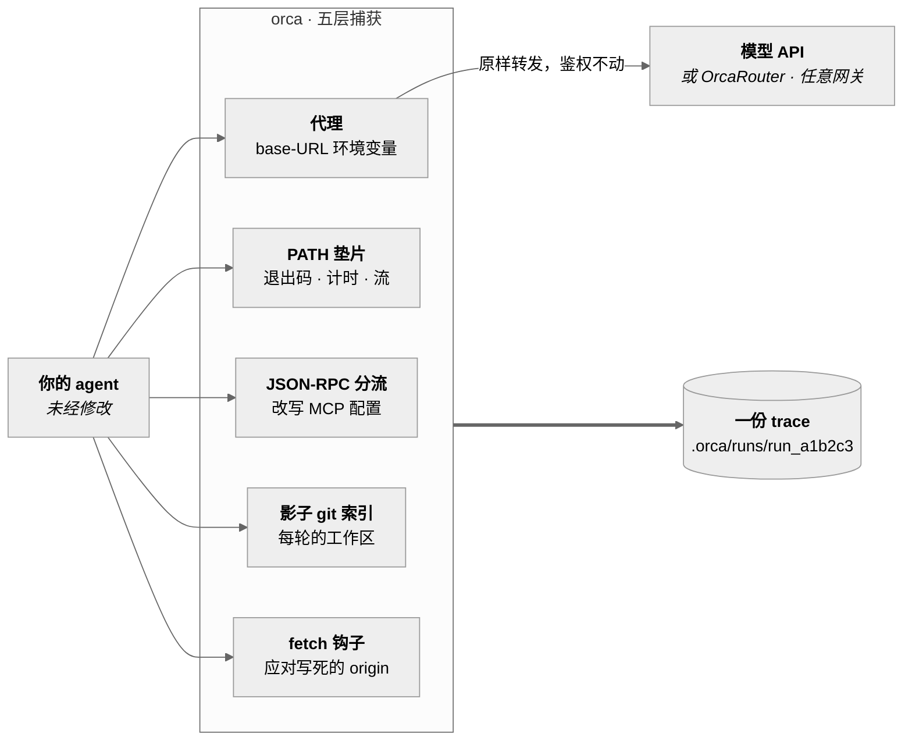
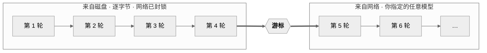

# OrcaReplay

<sub>[English](../../README.md) · **简体中文** · [日本語](README.ja.md) · [한국어](README.ko.md) · [Deutsch](README.de.md) · [Français](README.fr.md) · [Español](README.es.md) · [العربية](README.ar.md)</sub>

### 凌晨两点，你的 agent 弄坏了什么。早上九点，把它原样重放——离线、精确、想跑几遍就跑几遍。

录制任意编程 agent。断网后逐字节复现整个过程。从任意一步分叉到别的模型上，看谁做对了。

<a href="https://www.orcarouter.ai">
  
</a>

**由 [OrcaRouter](https://www.orcarouter.ai) 团队打造**——一把 API key、一个 endpoint，覆盖 Claude、GPT、
Gemini、Grok、DeepSeek、Qwen 等等。它是 `orca setup` 的默认网关，也是 `orca compare` 只需一条命令、
而不是四个厂商账号的原因。

[全部模型](https://www.orcarouter.ai/models) · [OrcaCode Review](https://www.orcarouter.ai/code-review) · [X](https://x.com/OrcaRouter) · [Hugging Face](https://huggingface.co/orcarouter)

<br clear="left">

[](../../LICENSE)
[](../../spec/orca-trace-v0.md)
[](#安装)
[](#安装)
[](../good-first-issues.md)


<sup>来自同一次会话的真实输出——录制一次 Claude Code 运行，断网重放，再从检查点 4 分叉到两个模型，
由 `npx tsc --noEmit` 打分。这里没有任何一处是摆拍的。</sup>

## 三条命令上手

```console
orca record claude              # 你的 agent，原封不动，该干嘛干嘛
orca replay last                # 同一次运行再来一遍——不联网、不耗 token、不花钱
orca replay last --from 4 --model claude-haiku-4-5 --ui
```

第三行才是让人留下来的那条：同样的文件、同样的对话前缀，从第 4 步起换一个模型。模型是唯一的变量，
这正是答案有意义的原因。

还没发到 npm——请[从源码安装](#安装)，大约一分钟。

## 为什么会有这个东西

今天调试 agent 更像考古。你翻终端、重跑一遍却得到另一种失败、往别人的 harness 里加打印语句。
现有的工具是可观测性工具：它们告诉你这次运行花了 4.12 美元、用了 61k token——而这并不是你的问题。
你的问题是*它为什么删了我的迁移文件*。

OrcaReplay 的回答方式，是把那次运行还给你。

|  | 可观测性工具 | OrcaReplay |
|---|---|---|
| 告诉你一次运行花了多少钱 | ✅ | ✅ |
| 告诉你是哪一次工具调用删了文件 | 有时候 | ✅ |
| 再跑一遍 agent 并得到同样的答案 | ❌ | ✅ 离线、逐字节 |
| 让你换个模型、从第 4 步重跑 | ❌ | ✅ |
| 需要你改造 agent | 通常要套一层 SDK | ❌ 两个环境变量 |
| 关掉终端之后还能用 | ❌ | ✅ 它就是个文件 |

## 它是怎么工作的

模型 API 是无状态的，所以每一轮 agent 都会把整段对话重新发一遍——上一轮的工具结果也在里面。
**因此，模型前面的一个代理能看见整个循环**：每个请求、每段流式响应、模型发出的每次工具调用，
以及 harness 产出的每个工具结果。整个工具就建立在这一条性质上，这也是**OrcaReplay 不需要改你的
agent** 的原因——它起一个本地代理、设两个环境变量，然后就让开。

另外三层负责抓协议看不见的东西：退出码、真实耗时、某个字节来自哪条流、悄悄写下的一个文件。
还有第五层，专门对付那些根本不读 base-URL 变量的 agent——见下面的“支持哪些 agent”。



它们最终汇入同一条时间线，按事情**真正发生**的先后排序，而不是按 orca 什么时候读到它们。

### 精确重放、分叉、对比，其实是一件事

它们不是三个子系统，而是同一个代理加上一个**游标**——录制流中的某个位置，代理在此之前从磁盘作答，
在此之后转为向网络作答。



| 命令 | 游标位置 | 你得到什么 |
|---|---|---|
| `orca replay last` | 末尾 | 整次运行重来一遍，**网络封锁**——不耗 token、不花钱、没有波动 |
| `orca replay last --from 4 --model X` | 检查点 4 | 前 4 轮完全一致，之后换一个模型接手 |
| `orca compare last --from 4 --models a,b` | 检查点 4，跑多次 | 一张表，一个变量——模型 |

**检查点**不是录下来的，而是*推导*出来的——任何一个对话前缀完整、且工作区已有快照的位置。
因此每一次分叉都从一个被证明存在过的状态出发。

## 一次真实的排查长什么样

你的 agent 本该修好一个失败的鉴权测试。它以 0 退出了，而测试依然是红的。先看它到底做了什么：

```console
$ orca show last
run_6473f858b59e  generic-openai@0.1.0  14 events  exit 0

SEQ  KIND   WHAT                                            DETAIL
0    RUN    run started                                     generic-openai
1    SNAP   tree 919d32ba037537b43814c83779963b2cc3023db7   0 changed
2    MODEL  claude-opus-5                                   1 messages
3    MODEL  claude-opus-5                                   stop: tool_use · 100 in · 20 out
4    TOOL   edit_file                                       {"path":"auth.ts",…}
5    SNAP   tree c6af62b75c0c8b8938bd6087328b5148f3dcd534   1 changed
6    FILE   auth.ts                                         modified +1 −3
7    TOOL   edit_file                                       ok
8    MODEL  claude-opus-5                                   3 messages
9    MODEL  claude-opus-5                                   stop: end_turn · 101 in · 5 out
10   SNAP   tree c6af62b75c0c8b8938bd6087328b5148f3dcd534   0 changed
11   SHELL  ["sh","-c","node --check nonexistent-file.ts"]  /tmp/hunt
12   SHELL  shell result                                    exit 1 · 43ms
13   RUN    run ended                                       exit 0

info usage input=201 output=25 cost=$0.004890
```

三个事实：模型自己的对话记录说不出来，而这次运行的退出码把它们藏了起来——文件确实变了（seq 6，`+1 −3`）、
agent 跑的那次检查**失败了**（seq 12，`exit 1`），然后它照样收工。整次运行退出码是 0，
只因为那个 *agent* 退出码是 0。

现在你想复现多少遍都行，而且不花钱：

```console
$ orca replay last
info replay.done reused=2/2 exact=2 divergences=0 unmatched=0 exit=0
```

不联网、不耗 token、没有波动。然后再问你真正想问的那个问题——*换个模型会不会做对？*

```console
$ orca compare last --from 5 --models claude-opus-5,claude-haiku-4-5 --verify "npm test"
MODEL             VERDICT  TOKENS  COST       WALL  RUN
claude-opus-5     pass     201/25  $0.004890  0.3s  run_1457b35062ba
claude-haiku-4-5  pass     201/25  $0.000326  0.3s  run_b8ee08479fb6
```

两个都过了。其中一个便宜 **15 倍**。同样的文件、同样的对话前缀、同样的检查点——模型是唯一变化的东西，
这也是那个数字唯一有意义的理由。

## 时间线

`orca replay last --ui`（或 `orca ui`）会把这次运行打开成一个自包含的 HTML 文件——不用常驻服务、
不用联网、不用装任何东西。可以过滤、单步，或者按下空格，看它按当初真实的节奏回放。


每一层都落在同一条时间线上，所以你可以把这次运行当成一个故事来读，而不是四个：模型的每一轮和它的
token 计数、每次工具调用的参数与结果、shell 命令的退出码与耗时，以及文件系统的变化和它产生的那棵树。

`orca export last -o bug.html` 把这个页面写成单个文件，可以直接附到 issue 上。它不含任何外部引用
——这一点由 CI 断言——所以它在下载文件夹里、在飞机上、在五年之后都照样能打开。

## 同一个任务，不同的模型

`orca compare` 把一次录制从同一个检查点分叉到多个模型上，文件一样、对话前缀一样，再用你指定的命令
给每个结果打分。模型是唯一的变量，这正是答案有意义的原因。


```console
orca compare last --from 4 \
  --models claude-sonnet-5,claude-haiku-4-5 \
  --verify "npm test" \
  --share verdict.svg          # 上面那张卡片，可直接贴进 issue
```

### 让它连上多个模型

对比模型意味着要接触多个厂商，手动做这件事意味着你得知道 `--upstream-anthropic` 和 `--upstream-openai`
的存在、知道一个网关可以同时服务两种协议格式、还得知道 key 放哪儿。这些都是真的，但没有一条是能被发现的，
所以有一条命令直接问你：

```console
$ orca setup
Gateway URL (serves the model APIs) [https://api.orcarouter.ai]:
  get a key at https://www.orcarouter.ai/console/token — OrcaRouter keys start sk-orca-
API key (stored 0600; leave blank for none):
  info config.saved path=~/.config/orca/config.json mode=0600 gateway=https://api.orcarouter.ai auth=stored

  6 models available:
    anthropic/claude-opus-5
    anthropic/claude-haiku-4-5
    openai/gpt-5.2
    ...

$ orca models
MODEL                      $/MTOK IN  $/MTOK OUT
anthropic/claude-opus-5    15         75
anthropic/claude-haiku-4-5 1          5
openai/gpt-5.2             1.25       10
some-local-model           —          —
```

`orca setup` 不只是把配置写进文件，它还会问网关到底提供了什么，所以写错 URL 或者 key 已经失效，
你当场就知道，而不是在一次对比跑到一半时收到 401。它还会记住你选的模型，之后
`orca compare last --verify "npm test"` 就不需要模型列表，也不需要任何上游参数了。`orca models`
只给它认识的模型标价，不认识的就打一个破折号——因为给未知模型编一个价格，正是一张对比表最后报出
一个从未存在过的成本的方式。

[**OrcaRouter**](https://www.orcarouter.ai) 是上面第一个问题的默认答案——直接回车，你就有了一个 origin、
一把 key，服务 Claude、GPT、Gemini、Grok、DeepSeek、Qwen 等等，而这正是 `orca compare` 想要的形状。
它的模型 id 按厂商加了命名空间（`anthropic/claude-sonnet-4.6`、`openai/gpt-4o-mini`），orca 会处理好：
命名空间决定用哪种协议格式，并在计价前被剥掉。

它是个*默认值*，不是终点：直接覆写它，或者传 `--gateway <url>`，任何提供 OpenAI 兼容的 `/v1/models`
和 chat 端点的服务都同样能用——另一家托管网关，或者你自己跑的东西。

而且它也只对**你主动要求发出去的**流量才是默认值。如果没有配置网关，`orca record` 会把你 agent 自己的
请求直接代理到它本来就在对话的那个厂商，用 agent 自己的 key。orca 不会给一次你从未配置过的录制改道：
那等于按下录制键就顺手把你的源码发给了第三方。

非交互式：`orca setup --key <k>` 采用默认网关，`orca setup --gateway <url> --key <k>` 指定另一个，
`--key-env <VAR>` 则从环境变量读 key，而不是把凭据留在磁盘上。

这把 key 永远不会进入 trace。它只挂在出站请求上，而被记录下来的内容是用**入站**请求、去掉鉴权之后
构造的——所以它对录制是**结构上**不可见的，而不是靠谁记得一条规则。如果某个参数把这部分流量发去了
签发它的网关之外的地方，这把 key 会被完全扣下。

## 支持哪些 agent

一个 harness 能不能被录下来，取决于两件事：能不能把它指向代理，以及流量到了以后 orca 认不认得
它说的那套线协议。

| Agent | 怎么抓 | 状态 |
|---|---|---|
| **Claude Code** | `ANTHROPIC_BASE_URL` | 可用——已对着真实的修 bug 过程验证过 |
| **Codex CLI**（API key） | `OPENAI_BASE_URL` → Responses API | 可用 |
| **Codex CLI**（ChatGPT 登录） | `--tls-intercept` → Responses API | 可用，但需要你自己做一个决定 |
| **OpenAI Agents SDK** | `OPENAI_BASE_URL` → Responses API | 可用 |
| **Vercel AI SDK** | fetch 钩子——`orca record node -- node app.mjs` | 可用 |
| **LangGraph / LangChain** | `OPENAI_BASE_URL`、`ANTHROPIC_BASE_URL` | 应该可用——它走的是官方客户端，但这里还没有测试覆盖 |
| **opencode** | `orca record opencode` | 已有适配器，两个 origin 都改道 |
| **其它任何东西** | `orca record generic-openai -- <cmd>` | 只要它读 base-URL 变量就行；不读的话用 `orca record node -- <cmd>` |

只有 Claude Code 是对着真实 harness 端到端跑通过的。其余的靠适配器契约和 fixture 保证：fixture
记下每个适配器到底设了哪些变量，所以某个 harness 改了它读的变量名时，红的是检查，而不是变成一份
空 trace。

其中两种情况光靠环境变量是不够的，选命令之前值得先知道。

**说 Responses API 的 harness。** OpenAI Agents SDK 和 Codex CLI 默认都用 `/v1/responses`，而不是
chat completions。orca 认得这套协议，所以不需要额外做什么——但如果你用的是这之前的版本，症状不是
trace 缺东西，而是 agent 第一轮就收到 `404`。

**根本不读 base-URL 变量的 harness。** `@ai-sdk/openai` 只接受构造函数参数里的 origin，别的都不看，
所以基于 Vercel AI SDK 的 agent 在 `orca record` 下跑得好好的、退出码 0、trace 却是空的。`node`
适配器就是干这个的：它往运行目录里写一个很小的预加载文件，用 `NODE_OPTIONS` 指过去，只对白名单里的
provider 主机改道 `globalThis.fetch`，别的一概不动。

```console
orca record node -- node agent.mjs
orca record node -- npm run agent
ORCA_INSTRUMENT_HOSTS='contoso.openai.azure.com' orca record node -- node agent.mjs
```

它是一个单独的适配器、而不是默认行为，因为 `NODE_OPTIONS` 会传给 agent 起的每一个 Node 进程——
你知道自己需要时这个代价值得付，但不该强加给一个在录 Python harness 的人。

Bun 认 `NODE_OPTIONS`，却会忽略里面的 `--require`，所以这里同时设了 `BUN_OPTIONS=--preload`，基于
Bun 的 agent 也一样能覆盖到。这一条是拿真的 `bun` 验过的，因为它防的正是那种不出声的失败：钩子没跑，
流量直接去了 provider，什么都没录下。

**万一 trace 最后还是空的**，`orca record` 会明说，而不是干干净净地退出：

```console
warn capture.empty exchanges=0 cause="the agent never called the proxy — it may not read a base-URL variable" set=ANTHROPIC_BASE_URL,OPENAI_API_BASE,OPENAI_BASE_URL next="orca doctor"
```

**还没有人录过的 agent。** 这几个经常有人问，答案对它们都一样：orca instrument 的是一个**进程**，
不是某个产品，而它设下的环境会被这个进程派生出的一切继承。所以问题只剩一个——你的 agent 属于下面
三种形态里的哪一种。

| | 形态 | 试试 |
|---|---|---|
| **grok-cli** | Bun，xAI 的 OpenAI 兼容端点 | `ORCA_INSTRUMENT_HOSTS='api.x.ai' orca record node -- grok` |
| **Hermes**（Nous Research） | 常驻守护进程，模型端点写在它自己的配置里 | 把它指向 `orca record` 打印出来的代理地址，或者录那次 CLI 调用 |
| **OpenClaw** | 一个网关，会把 Claude Code、Codex 或 opencode 作为子进程拉起来 | `orca record generic-openai -- openclaw …`——子进程会继承改道 |

这三个这里都没有测试、也都没有适配器。如果你录成功了，最有用的东西就是那份 trace：
`orca export last -o run.html`。

## 当 harness 不肯被改道时

base-URL 注入能捕获所有读 base-URL 变量的 harness，fetch 钩子又补上了那些不读的 Node 与 Bun
agent。用 ChatGPT 订阅登录的 Codex CLI 两者都不是：它通过 TLS 直接和自家后端对话，既没有 origin
可改，也没有我们够得着的 `fetch`。`--tls-intercept` 就是为此存在的，而它被刻意做成一个你必须单独
作出的决定，因为它会签发一个证书颁发机构。

```console
orca record codex --tls-intercept
orca record codex --tls-intercept --tls-hosts 'api.openai.com,*.chatgpt.com'
```

这个 CA 每次运行独有，只被 orca 启动的那个 agent 信任——通过那个子进程自己的环境，绝不写入系统或浏览器
信任库——并在运行结束时删除。orca 不会主动提出把它装到任何地方。白名单之外的主机会被原样隧道转发、
不被读取，只记录一个地址和一个字节数，没有路径也没有 body，因为 orca 从未持有过明文。要求拦截一切
会被拒绝，而不是被满足。

它在 `orca replay --model`、`orca fork` 和 `orca compare` 上同样有效——它们出于同样的原因会启动一个
真实的 agent。

## 给 agent、脚本和 CI 用

一份 trace 就是一个文件——这恰恰是 observability 面板做不到的事。所以关于一次失败运行，最有用的
问题是一个 **agent** 能问出来的那个：*把我上一次运行重放一遍，告诉我哪里发生了偏离。* 每条命令都能
以数据形式作答，orca 也把自己作为 MCP 服务暴露出去。

```console
$ orca replay last --json
{"runId":"run_a278eea7b535","mode":"exact","traceRunId":"run_687e3f84b208","matchedExact":2,"divergences":0,"unmatched":0,"liveCalls":0,"exitCode":0}

$ orca show last --json | jq '.events[] | select(.kind == "TOOL")'
$ orca checkpoints last --json | jq '.[-1].seq'
```

stdout 上只有一份 JSON 文档，诊断信息全走 stderr——包括被录制 agent 自己的输出，所以哪怕运行过程中
一直在打印，那份文档也始终是可解析的。失败同样以 JSON 返回，并带非零退出码。`--json` 覆盖 `list`、
`show`、`events`、`checkpoints`、`record`、`replay`、`compare` 和 `doctor`。

**作为工具。** `orca mcp` 通过 stdio 把 trace 仓库交给 agent：

```json
{ "mcpServers": { "orca": { "command": "orca", "args": ["mcp"] } } }
```

`orca_list_runs`、`orca_show_run`、`orca_checkpoints`、`orca_replay` 和 `orca_compare`。重放是免费且
离线的；`orca_compare` 在自己的描述里就写明它会花掉真金白银的 token，因为模型挑工具时读的就是那段
字符串，别的都不看。

**从代码里调用**，如果你不想走命令行：

```ts
import { Orca } from 'orcareplay';

const orca = new Orca({ cwd: process.cwd() });
const { unmatched, divergences } = await orca.replay('last');
const timeline = await orca.show('last');
```

它从不往你的 stdout 里写东西，也从不调用 `process.exit`——两条都有测试守着，因为一个会做这两件事的
库，别人没法在上面搭东西。

## 现状

早期阶段。`v0` 是上面三条命令的可行走骨架。下面的每一项都由 1248 个测试、trace 格式一致性检查
和插件 API 中立性检查覆盖，Node 20 和 22 都跑。

| 能力 | 状态 |
|---|---|
| Trace 格式 v0 + JSON Schema | 可用 |
| Anthropic / OpenAI 兼容的模型捕获 | 可用 |
| OpenAI Responses API 捕获 | 可用——OpenAI Agents SDK 和 Codex CLI 默认用的就是这套格式。录制、离线重放、分叉都支持；分叉会留在 agent 自己说的那套线协议上 |
| 不读 base-URL 变量的 agent | 可用——`orca record node -- <cmd>` 往运行目录写一个预加载文件，只对白名单里的 provider 主机改道 `globalThis.fetch`。Node 和 Bun 都覆盖，因为 Bun 会忽略 `NODE_OPTIONS` 里的 `--require`。Vercel AI SDK 的 agent 就是这么抓到的 |
| orca 读不懂的调用 | 可用——转发而不是拒绝，并记成 `net.request` / `net.response`：是证据，不是可重放的一轮。什么都没抓到的录制会告警，而不是干净退出 |
| 机器可读输出（`--json`） | 可用——stdout 上一份 JSON 文档，诊断信息走 stderr，失败也是 JSON |
| MCP 服务端（`orca mcp`） | 可用——stdio 上五个工具，让 agent 能读取和重放自己的运行记录 |
| 编程接口（`Orca`） | 可用——命令渲染它返回的东西，所以终端只是同一份事实的一个视图 |
| 带分歧报告的精确重放 | 可用——把录制下来的文件系统还原到你的工作区之上，结束后再放回去；`--worktree` 用临时副本，`--in-place` 则什么都不还原。它会为重放本身写一份自己的 run，记录这次重放*发现*了什么——分歧、未匹配的请求——而单纯重复的部分则指向父 run；`--no-trace` 可跳过 |
| 从检查点分叉重放 | 可用——分叉会记录自己的文件系统快照，所以它本身也是一次可以再被分叉的 run |
| 跨模型对比 | 可用——`orca setup` 会存下网关（默认 OrcaRouter，也可以是你指定的任意 URL）、key 和模型列表，所以 `orca compare` 不需要任何参数 |
| 文件系统快照与 diff | 可用 |
| 单文件 HTML 导出 | 可用 |
| MCP 调用录制 | 可用——用 `--mcp-config <path>` 选择开启。重放和分叉会依据录制时用的那份配置重新注入，所以这一层不会停在分叉点上 |
| 事后擦除（`orca scrub`） | 可用 |
| Shell 捕获（`PATH` 垫片） | 可用——退出码、耗时，以及 stdout/stderr 的分离。`--no-shell` 可跳过 |
| 非模型网络捕获 | 可用——用 `--tls-intercept` 开启；签发一个只有被启动的 agent 信任的单次 CA，解密白名单主机，其余原样隧道转发，运行结束即删除密钥 |
| 已在真实 agent 上验证 | Claude Code，一次对真实 bug 的真实修复：录制、完整离线重放、从检查点分叉、并导出。做这件事时发现了四个 bug，都已修复——见下文 |
| 订阅制鉴权的 harness | Claude Code 可用。用 ChatGPT 订阅登录的 Codex CLI 和自家后端对话，没有 origin 可改，所以需要 `--tls-intercept`。用 API key 的话不需要任何特别处理 |

### 一个真实的 agent 发现了什么

上面这些都是对着 fixture 造出来的。第一次真正录制 Claude Code 的运行，就一次打破了四件事，
而每一件都是 fixture 造不出来的：

- **十六个字符的漂移被算成了 217,568。** 距离取的是整个请求体的公共前缀和后缀，而 Claude Code
  在系统提示里带着一个会话 id、在某个工具描述里又带着另一个——于是夹在中间的 200 KB 全被算作变化，
  没有任何请求能够到达第 2 级。现在距离按字段求和，字段内部再按行求和。
- **脱敏让「完全一致」在结构上不可能达到。** 占位符摘要按设计是每次运行加盐的，
  所以一个录制下来的请求永远不可能再次等于它自己。匹配器现在用同样的策略对入站请求脱敏，
  并比较秘密的*种类*而不是它的摘要——而且会把这次折叠报告出来，因为那确实是一次近似。
- **脱敏还让每一次分叉都失败。** `tool_use` 的 id 和 thinking 块的签名都是高熵字符串，
  会被扫描替换掉；分叉会重放这些轮次，agent 把它们原样回传，于是 API 返回 `400`。
  必须原样往返的协议值现在被排除在这条*猜测*之外——但绝不排除在凭据规则之外。
- **重放会真的再跑一遍工具。** orca 不拦截工具执行，所以 agent 真的会再跑一次 `npm test`，
  而它真的会重新打印自己的耗时。如果一个请求的唯一差异落在工具输出里，现在会从录制中作答，
  并记为一次 `major` 分歧，而不是让重放停下来。

那次运行现在可以完整离线重放——`reused=7/7 exact=2 divergences=5 unmatched=0 exit=0`，
每一处近似都有名字——而它的一次分叉最终到达了与录制相同的那棵树。如果你手上有一份它仍然搞错的录制，
那就是你能寄来的最有用的东西。

<a id="install"></a>

## 安装

还没上 npm——包已经构建并验证过了，但还没有发布，所以今天只能从源码装：

```console
git clone https://github.com/Continuum-AI-Corp/OrcaReplay && cd OrcaReplay
npm ci && npm run build
npm install -g ./packages/cli     # 把 `orca`（以及 `orcareplay`）放上 PATH
orca doctor                       # 检查 node、git，以及它能找到哪些 agent
```

在仓库根目录执行 `npm install -g .` 什么也装不上：根目录是一个没有自己二进制的 workspace，
`orca` 在 `packages/cli` 里。

`v0` 一旦发布，`npx orcareplay doctor` 就是全部的安装步骤，本节届时会改成那样。发布走的是一条打了
tag、带门禁的工作流——见 [`RELEASING.md`](../../RELEASING.md)。

**运行需要 Node 20+**（CLI 自己的 `engines` 写的是 `>=20.0.0`）。参与开发需要
`^20.19.0 || >=22.12.0`，因为测试工具链要求如此；根 `package.json` 单独声明了这一点，
所以 `npm ci` 会提前告诉你。不需要账号、不需要注册，也不用改任何 API key。

## 你的运行记录存在哪

一切都落在**你录制时所在项目里的 `.orca/runs/`**——按项目存放，从不放进全局目录，所以一份 trace
跟着它所属的那份 checkout 走。一个 run 目录就是一个自我描述的整体：

```
.orca/
  .gitignore          # 只有一行 `*`——存储区把自己排除掉，所以 trace 不会被误提交
  runs/run_d0a2ee7ce615/
    manifest.json     # 谁、什么时候、哪个 adapter、git commit、各类计数、完整性摘要
    events.jsonl      # 时间线，一行一个 JSON 对象，只追加
    blobs/            # 超过 4 KB 的内容按内容寻址存放，自动去重
    fs/               # 影子 git 索引：每一轮的工作区
    shell-frames.jsonl
    redactions.json   # 被移除了什么，按规则和数量记录——绝不记录值本身
```

找回一次旧会话：

```console
orca list                       # 这里的所有 run，最新在前，并标出它分叉自哪里
orca show run_d0a2ee7ce615      # 终端里的时间线
orca replay last                # `last` = 最新的一次录制（会跳过重放产生的 trace）
orca replay run_d0a2ee7ce615    # 或者直接点名
orca gc --older-than 7d --dry-run   # 先看会回收哪些，再动手
```

`orca list` 直接读 run 目录，所以别人发给你的 trace 也一样能用：把它丢进 `.orca/runs/`，
所有命令都能看见它。没有索引，也没有数据库可以损坏。

## 隐私

Trace 都在本地，权限 `0600`，录制器自身不发起任何网络连接。密钥在写入路径上就被脱敏：环境变量捕获
默认拒绝，鉴权头永远不写入，已知形状的 key 加上高熵字符串会被替换成稳定的占位符。

脱敏是尽力而为的缓解措施，不是保证。**请把 trace 当作敏感数据**——大致相当于一份 shell history
加上一份堆转储。

```console
orca export last -o bug.html          # 会先打印它即将写出什么
orca scrub last --match my-hostname   # 事后移除某个东西
```

`orca scrub` 会重写 `events.jsonl`、manifest 和每一个文本 blob，重跑标准检测器，刷新完整性摘要，
并让二进制 blob 保持逐字节不变。

它无法重写文件系统快照。Git 对象是按自身内容的哈希寻址的，所以改一个就会改变它的 id，进而迫使每一棵
引用它的树被重写、以及此后每一个引用这些树的事件被重写——这是一次历史重写，而它的失败模式是一个再也
还原不回去的 run。所以 scrub 会去*搜索*快照存储，并在你的字符串仍然留在里面时告诉你，而不是把一份
它清理不了的 trace 报告成干净的。`--drop-fs` 会直接删掉这个存储，代价是这次 run 不能再被分叉。

## 什么是开放的，什么不是

永远开放，Apache-2.0：trace 格式、core、CLI、viewer、adapter，以及 provider 接口。

OrcaReplay 由做 [OrcaRouter](https://www.orcarouter.ai) 的这群人打造，而这一点只体现在一个地方：
当你没有指定网关时，`orca setup` 会建议它。那是一个你看得见、也能覆写的默认值，出现在一个你自己选择
回答的问题里——而不是某个东西自己走的路由。所有模型路径都仍然是你可以指向任何地方的普通 URL，
并且没有任何代码路径会对那个 origin 区别对待。

厂商拿不到的东西是**特权**。一个插件——包括 OrcaRouter 自己的——只能使用 `@orcareplay/plugin-api`
里的公开 `Provider` 接口，背后没有私有 API。目前还没有任何厂商插件，所以执行这条规则的 CI 任务
（`scripts/check-neutrality.mjs`）会如实说明并作为空操作通过；一旦有插件落地，它就会开始针对已发布的
包而不是 workspace 源码来构建。如果某个插件将来需要一项能力，那项能力要先进入公开接口，
并且要有第二个实现证明它不是围着某一家厂商的形状设计的。

## 文档

**如果你现在就有问题，从这里开始：**

- [我的 agent 弄坏了东西。怎么查清原因？](../how-to/debug-a-failing-agent-run.md)
- [我的 agent 为什么删了那个文件？](../how-to/why-did-my-agent-delete-my-file.md)
- [换个模型会不会做对？](../how-to/compare-models-on-the-same-failure.md)

**参考：**

- [`spec/orca-trace-v0.md`](../../spec/orca-trace-v0.md) —— 规范性的 trace 格式
- [`docs/architecture.md`](../architecture.md) —— 捕获、重放和分叉的实际工作方式
- [`docs/launch-path.md`](../launch-path.md) —— 哪些做完了、哪些还没有、接下来是什么
- [`docs/plugins.md`](../plugins.md) —— 编写 adapter 或 provider
- [`CONTRIBUTING.md`](../../CONTRIBUTING.md) —— 五分钟开发循环
- [Good first issues](../good-first-issues.md) —— 十二个，每个都写明了从哪个文件开始

## 招人一起做

格式还是 v0，可行走骨架已经跑通，这是一个项目生命里最有意思的时刻：各种决定改起来还很便宜，
而且有大量显而易见的活儿，连从哪个文件动手都已经写好了。

- **[十二个 good first issue](../good-first-issues.md)**，每个都点名了文件和测试。
- **写一个 adapter。** 一个文件，一个 fixture。如果你的 harness 读 base-URL 变量，大概二十行
  ——[docs/plugins.md](../plugins.md)。
- **重新实现 reader。** 规范用 CC BY 4.0 是有意为之。Python reader 已经有了；Go 和 Rust 还空着。
- **把重放搞坏。** 匹配阶梯是这里的核心，而改进它最快的方式，就是一份它会搞错的真实录制。
  开一个 issue，附上 `orca export last -o bug.html`——它是单个自包含文件，
  而 `orca scrub` 就是为你想先拿掉的东西准备的。

如果它帮你省下了一个下午，点个 ⭐ 能让更多人找到它。

## 许可证

代码采用 Apache-2.0。Trace 规范采用 CC BY 4.0，所以任何人都可以重新实现它。

---

<sub>
由 OrcaRouter 团队打造 ·
<a href="https://www.orcarouter.ai">orcarouter.ai</a> ·
<a href="https://www.orcarouter.ai/models">全部模型</a> ·
<a href="https://www.orcarouter.ai/code-review">OrcaCode Review</a> ·
<a href="https://x.com/OrcaRouter">X</a> ·
<a href="https://huggingface.co/orcarouter">Hugging Face</a>
</sub>
